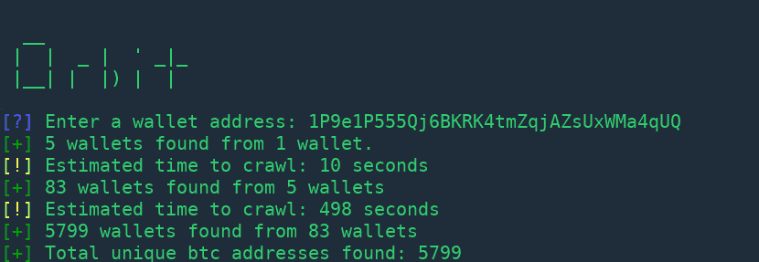
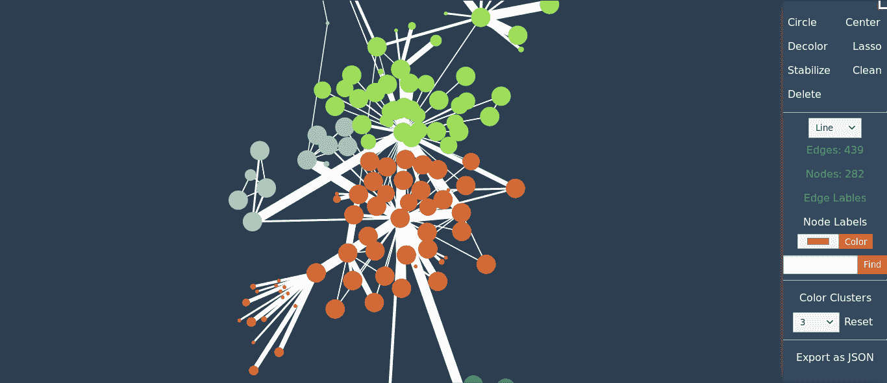

# orbit–使用递归搜索绘制加密钱包之间的关系

> 原文：<https://kalilinuxtutorials.com/orbit-crypto-wallets/>

**轨道**使用递归爬行绘制加密钱包之间的关系。给它一个基于区块链的加密钱包地址，它将在交易数据中爬行 3 级深度，以绘制出信息图表。 





## **轨道用途**

**用 python3 运行 orbit.py，如下所示**

`**python3 orbit.py**`

**输入钱包地址**

```
 **`__         
 |  |  _ |  ' _|_
 |__| |  |) |  | 

Enter a wallet address: xxxxxxxxxxxxxxx`** 
```

现在，orbit 将通过区块链 API 抓取钱包，一旦完成，就会生成一个 json 文件。接下来的事情是绘制一个图表，我们将使用[夸克框架](https://github.com/s0md3v/Quark)。

克隆 Quark 并导航到 Quark 目录，然后将 json 文件馈送到 quark.py，如下所示:

`**python quark.py /path/to/file.json**`

就是这样！你的工作已经完成，打开`**quark.html**`查看你的图表。

**也读 [后知后觉——分析网页神器的工具 Chrome 浏览器&基于 Chrome 的应用](https://kalilinuxtutorials.com/hindsight-chrome-chromium-applications/)**

## **警告**

节点(点)和边(线)的大小取决于该地址对作用域中其他成员进行的事务。
所以节点的大小可以大得离谱，但不要害怕，只需点击侧边栏中的`stabilize`选项，剩下的交给 quark。
同样，如果节点标签正在运行，点击`Node Lables`选项将其关闭。
最后一点是，将会有许多节点不像只进行过一次交易的钱包那样有趣。这样的节点只会让你的图形难看。要解决这个问题，点击`clean`选项将删除这些无关紧要的节点。关于如何与图形交互的更多信息可以在 Quark 的自述文件中找到。

[](https://github.com/s0md3v/Orbit)