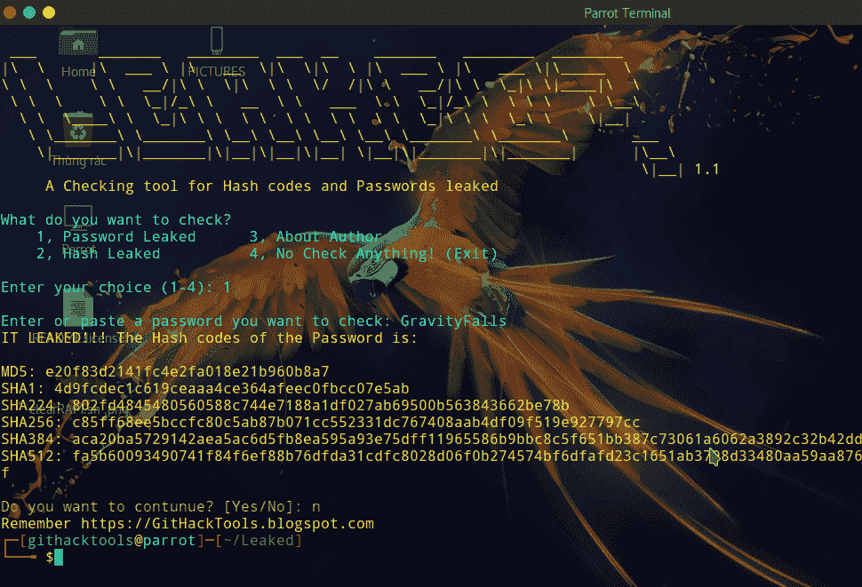
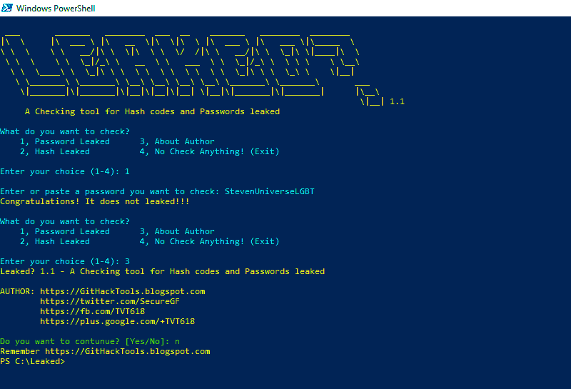

# 泄露——一个检查哈希代码和密码泄露的工具

> 原文：<https://kalilinuxtutorials.com/leaked-tool-hash-codes-passwords-leaked/>

一个哈希码和密码泄露的检查工具。如果他们支持 Python 3，它可以在任何操作系统中工作。

## **泄露特征**

*   检查密码
*   检查哈希代码
*   出口

## **安装**

### **Linux**

```
**sudo apt update && apt install python3 python3-pip
git clone https://github.com/GitHackTools/Leaked
cd Leaked
pip3 install requests
python3 leaked.py**
```

### **窗户**

从 Python.org 下载并运行 Python 3 安装文件。在**安装 Python 3** 中，启用**为所有用户添加 Python 3.7 到路径**和

 **从 Git-scm.com 下载并运行 Git 安装文件，从 Windows 命令 Propmt 中选择**使用 Git。**

之后，运行命令 Propmt 或 PowerShell 并输入以下命令:

```
**`git clone https://github.com/GitHackTools/Leaked
cd Leaked
pip install requests
python leaked.py`** 
```

**亦作[ghost tunnel——可以在隔离环境下使用的后门传输方式](https://kalilinuxtutorials.com/ghosttunnel/)**

## **截图**



[ ](https://github.com/GitHackTools/Leaked) **信用: [@webtobesocial](https://twitter.com/webtobesocial)****