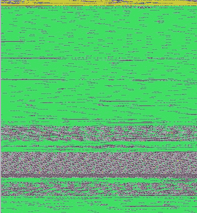

# drl trace——一个为 Windows 和 Linux 应用程序调用 Tracer 的库

> 原文：<https://kalilinuxtutorials.com/drltrace-windows-linux-applications/>

Drltrace 是一个动态 API 调用跟踪器，用于 Windows 和 Linux 应用程序，主要用于恶意软件分析。Drltrace 构建在 DynamoRIO 动态二进制工具框架之上。

发布版本可以从[这里](https://github.com/mxmssh/drltrace/releases)下载。

## 为什么是 Drltrace Rock？

*   足够快速地执行恶意样本分析，而不会被基于时间的反研究技术检测到。
*   支持 x86 和 x64(将来支持 ARM)。
*   支持 Windows 和 Linux(将来支持 macOS)。
*   支持自修改代码。
*   支持所有类型的库链接(静态和动态)。
*   标准反研究方法(反挂钩、反调试和反仿真)无法检测到。
*   用户可以很容易地添加一个新的函数原型来告诉 drltrace 如何打印关于以前未知的 API 调用(甚至关于非系统 dll)的更多细节。使用外部配置文件。
*   易于使用和修改(没有额外的包需求，没有笨重的 GUI 界面)。
*   开源，代码清晰，有据可查。您可以在 drltrace 上自由构建和使用自己的高级解决方案。

**也读作 [奇点——一个 DNS 重新绑定攻击框架](https://kalilinuxtutorials.com/singularity-dns-rebinding-attack/)**

## **用途**

drltrace 的用法非常简单。用户需要以如下方式指定日志目录和目标进程的名称:

```
drltrace -logdir . -- calc.exe
```

仅此而已，该工具将在目标进程中注入所需的 dll，启动检测，并同时记录在目标进程中执行的所有库调用的相关信息:

```
~~43600~~ msvcrt.dll!__wgetmainargs
    arg 0: 0x010d2364
    arg 1: 0x010d2368
    and return to module id:0, offset:0x193a
~~43600~~ ntdll.dll!EtwEventRegister
    arg 0: 0x002ff994
    arg 1: 0x010d1490
    and return to module id:0, offset:0x157e
~~43600~~ ntdll.dll!EtwEventSetInformation
    arg 0: 0x007b4b40
    arg 1: 0x00000033
    and return to module id:0, offset:0x15a1
~~43600~~ SHELL32.dll!ShellExecuteW
    arg 0: <null> (type=<unknown>, size=0x0)
    arg 1: <null> (type=wchar_t*, size=0x0)
    arg 2: calculator:// (type=wchar_t*, size=0x0)
    arg 3: <null> (type=wchar_t*, size=0x0)
    arg 4: <null> (type=wchar_t*, size=0x0)
    arg 5: 0x1 (type=int, size=0x4)
    and return to module id:0, offset:0x167d
```

输出的格式很简单，可以通过外部脚本轻松解析:

```
~~[thread id]~~ [dll name]![api call name]
arg [arg #]: [value] (type=[Windows type name], size=[size of arg])
and return to module id:[module unique id], offset:[offset in memory]
```

模块唯一标识符表打印在日志文件的末尾:

```
Module Table: version 3, count 70
Columns: id, containing_id, start, end, entry, checksum, timestamp, path
  0,   0, 0x010d0000, 0x010da000, 0x010d1b80, 0x0000f752, 0xb5fe3575,  C:\Windows\SysWOW64\calc.exe
  1,   1, 0x6d4c0000, 0x6d621000, 0x6d563940, 0x00136d65, 0x59ce1b0b,  C:\Users\Max\Downloads\drltrace\drltrace\dynamorio\lib32\release\dynamorio.dll
  2,   2, 0x73800000, 0x73975000, 0x7380dbf7, 0x00000000, 0x59ce1b0f,  C:\Users\Max\Downloads\drltrace\drltrace\bin\release/drltracelib.dll
  3,   3, 0x742f0000, 0x742fa000, 0x742f2a00, 0x0000c877, 0x0adc52c1,  C:\Windows\System32\CRYPTBASE.dll
  4,   4, 0x74300000, 0x74320000, 0x7430c9b0, 0x0002c617, 0x245970b4,  C:\Windows\System32\SspiCli.dll
  5,   5, 0x74410000, 0x74431000, 0x74416900, 0x0002a940, 0x88a53c1d,  C:\Windows\System32\GDI32.dll
  6,   6, 0x74440000, 0x74500000, 0x7446fb20, 0x000cc410, 0xd343d532,  C:\Windows\System32\RPCRT4.dll
  7,   7, 0x74500000, 0x74525000, 0x745047d0, 0x00026737, 0xa39c8991,  C:\Windows\System32\IMM32.DLL
  8,   8, 0x74550000, 0x745c7000, 0x7456e8a0, 0x00081857, 0x73b971e1,  C:\Windows\System32\advapi32.dll
  9,   9, 0x748f0000, 0x74929000, 0x748febd0, 0x00045303, 0xa58be652,  C:\Windows\System32\cfgmgr32.dll
 10,  10, 0x74930000, 0x75c78000, 0x74aa09d0, 0x01377aa6, 0x4b39926b,  C:\Windows\System32\SHELL32.dll
```

通过指定`-only_from_app`选项，Drltrace 可以很容易地过滤掉库间调用，只打印从目标应用程序的主模块(或堆)执行的 API 调用，这对于生成大量日志的应用程序非常有用。Drltrace 还有几个有用的外部脚本来过滤特定库的 API 调用，只打印可能感兴趣的 API 调用和字符串。

## **命令行选项**

```
 **-logdir              [     .]  Log directory to print library call data
 -only_from_app       [ false]  Reports only library calls from the app
 -follow_children     [  true]  Trace child processes
 -print_ret_addr      [ false]  Print library call's return address
 -num_unknown_args    [     2]  Number of unknown libcall args to print
 -num_max_args        [     6]  Maximum number of arguments to print
 -default_config      [  true]  Use default config file.
 -config              [    ""]  The path to custom config file.
 -ignore_underscore   [ false]  Ignores library routine names starting with "_".
 -only_to_lib         [    ""]  Only reports calls to the library <lib_name>.
 -help                [ false]  Print this message.
 -version             [ false]  Print version number.
 -verbose             [     1]  Change verbosity.
 -use_config          [  true]  Use config file
```

## **配置文件语法**

Drltrace 支持外部配置文件，用户可以在这些文件中描述 drltrace 应该如何打印某些 API 调用的参数。

```
HANDLE|CreateRemoteThread|HANDLE|SECURITY_ATTRIBUTES*|size_t|THREAD_START_ROUTINE*|VOID*|DWORD|__out DWORD*
```

每个函数参数都要用`|`隔开。第一个参数是返回类型，第二个参数是函数名本身，其余的是函数参数。令牌`__out`用于标记输出参数，`___inout`用于标记输入+输出参数。

## **日志可视化**

为了使日志文件的工作更容易，我们实现了一个名为`api_calls_viz.py`的脚本，它可以用来生成 RGB 图像，其中每个像素颜色代表唯一的 API 调用。例如，下图代表 WannaCry 恶意软件的日志文件。



图片上的大块绿色区域代表 API 调用(`wcscmp/wcsicmp`)，用于选择有兴趣扩展名的文件(如 docx、xls、py)进行加密。紫色区域代表 API 调用(`FindFirstFile/FindNextFile/CryptEncrypt`)，用于枚举和加密磁盘上的文件和文件夹。

该脚本还可以生成生成的 RGB 图像的 HTML 表示，其中可以选择每个元素来显示 API 调用的名称。


[](https://github.com/mxmssh/drltrace)