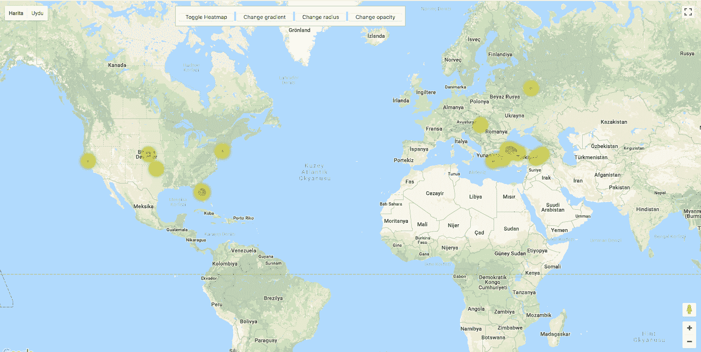
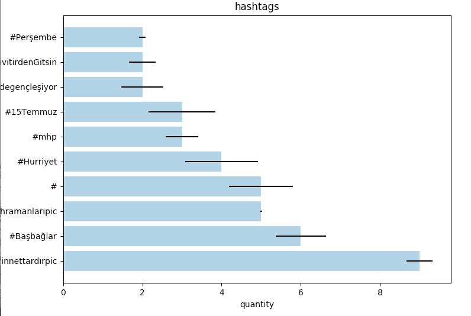

# Twitter-Intelligence : OSINT 项目对 Twitter 进行跟踪和分析

> 原文：<https://kalilinuxtutorials.com/twitter-intelligence/>

Twitter-Intelligence 是一个用 Python 编写的项目，用于 Twitter 跟踪和分析，不使用 Twitter API。

*   这个项目是 Python 3.x 应用程序。
*   包依赖项在 requirements.txt 文件中，运行该命令来安装依赖项。

```
pip3 install -r requirements.txt
```

*   数据库采用 SQLite。
*   Tweet 数据存储在 Tweet、User、Location、Hashtag、HashtagTweet 表中。
*   数据库是自动创建的。

**又读 [Libssh-Scanner:识别易受 CVE 攻击的主机的脚本-2018-10933](https://kalilinuxtutorials.com/libssh-scanner-vulnerable-cve-2018-10933/)**

## **Twitter-智能使用示例**

**应用工作视图:**


*   寻求帮助

```
 python3 tracking.py -h 
```

*   按用户名获取推文

```
 python3 tracking.py --username "HaberSau" 
```

*   通过查询获取推文

```
 python3 tracking.py --query "sakarya" 
```

*   在特定日期范围内获取推文

```
 python3 tracking.py --username "HaberSau" --since 2015-09-10 --until 2015-09-12 --maxtweets 10 
```

*   如果您获得了 tweets 的位置，添加-location“True”参数，但由于新的响应时间，应用程序将会变慢。

    ```
     python3 tracking.py --query "sakarya" --location "True"
    ```

## **分析**

analysis.py 执行分析处理。执行用户、标签和位置分析。

*   获取帮助:

```
python3 analysis.py -h
```

*   用于位置分析

```
python3 analysis py --location
```



位置分析通过地址[http://localhost:5000/locations](http://localhost:5000/locations)运行

必须在 setting.py 中写入 Google Map Api Key 才能显示 Google Map。

```
GOOGLE_MAP_API_KEY='YOUR_GOOGLE_MAP_API_KEY'
```

*   运行标签分析。

```
python3 analysis.py --hashtag
```



*   运行用户分析。

```
python3 analysis.py --user
```

## **图形用户界面**

用于 gui 应用程序的 **socialgui.py**

[](https://github.com/batuhaniskr/twitter-intelligence)