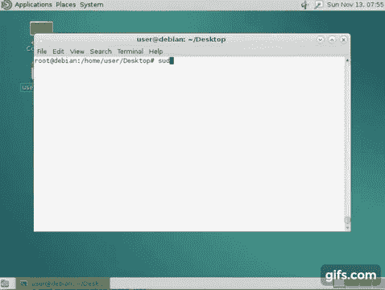
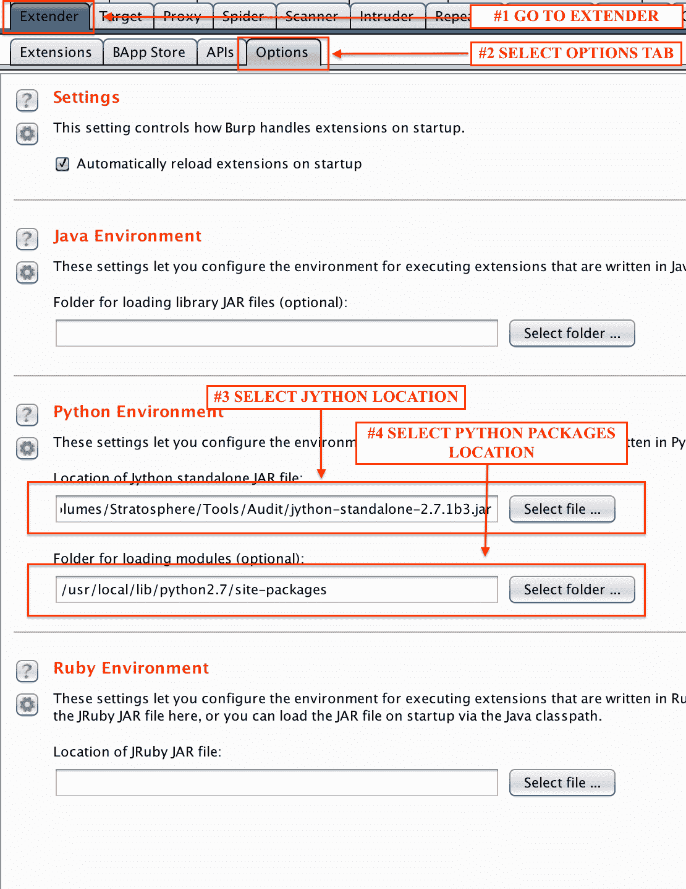
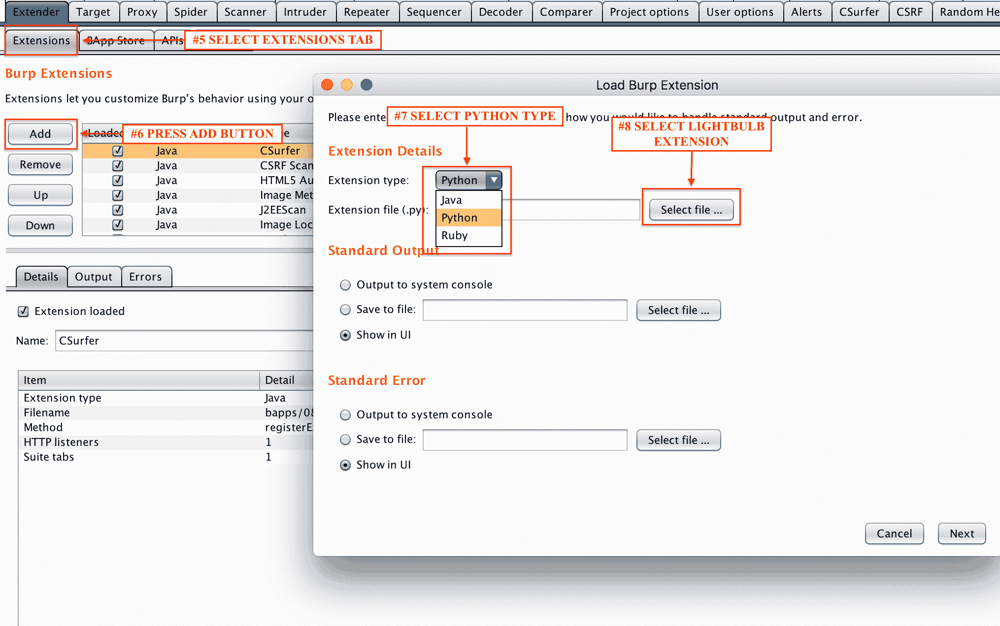

# 灯泡框架:审计 WAFS 的工具

> 原文：<https://kalilinuxtutorials.com/lightbulb-framework-wafs/>

LightBulb Framework 是一个用于审计 web 应用程序防火墙和过滤器的开源 python 框架。

## **灯泡框架简介**

该框架由两个主要算法组成:

*   **GOFA** :一种主动学习算法，在标准成员/等价查询模型中推断 automate 的符号表示。

主动学习算法允许对过滤和杀毒程序进行远程分析，即只给定查询目标程序和观察输出的能力。

*   SFADiff :基于符号有限自动机(SFA)学习的黑盒差分测试算法

发现具有相似功能的程序之间的差异是一个重要的安全问题，因为这种差异可被用于指纹识别或创建针对安全软件(如 web 应用防火墙(WAFs ))的规避攻击，这些安全软件被设计成检测对 Web 应用的恶意输入。

**也可理解为 [KBD-Audio:用于捕获的工具&分析与麦克风捕获配对的键盘输入](https://kalilinuxtutorials.com/kbd-audio-keyboard-microphone-capture/)**

## **命令用法**

### **主界面命令:**

| 命令 | 描述 |
| --- | --- |
| 核心 | 显示可用的核心模块 |
| utils | 显示可用的查询处理器 |
| 信息 | 打印模块信息 |
| 图书馆 | 进入图书馆 |
| 模块 | 显示可用的应用模块 |
| 使用 | 进入模块 |
| 开始<modulea></modulea> | 启动算法 |
| 帮助 | 打印帮助 |
| 状态 | 检查并安装所需的软件包 |
| 完成 | 打印 bash 完成命令 |

### **模块命令:**

| 命令 | 描述 |
| --- | --- |
| 背部 | 返回主菜单 |
| 信息 | 打印当前模块信息 |
| 图书馆 | 进入图书馆 |
| 选择 | 显示可用选项 |
| 定义<option><value></value></option> | 设置选项值 |
| 开始 | 启动算法 |
| 完成 | 打印 bash 完成命令 |

### **库命令:**

| 命令 | 描述 |
| --- | --- |
| 背部 | 返回主菜单 |
| 信息 | 打印请求的模块信息(文件夹必须位于 lightbulb/data/) |
| 猫 | 打印请求的模块(文件夹必须位于 lightbulb/data/) |
| 模块 | 显示请求文件夹中的可用库模块(文件夹必须位于 lightbulb/data/) |
| 搜索 | 使用逗号分隔的关键字搜索可用的库模块 |
| 完成 | 打印 bash 完成命令 |

## **安装**

### **准备您的系统**

首先，您必须验证您的系统支持 flex、python dev、pip 和构建工具:

对于 apt 平台(ubuntu，debian…):

```
 sudo apt-get install flex
	sudo apt-get install python-pip
	sudo apt-get install python-dev
	sudo apt-get install build-essential
```

(对于 apt 是可选的)如果您想要添加对 MySQL 测试的支持:

```
 sudo apt-get install libmysqlclient-dev
```

对于已经安装了额外软件包 repo (epel-release)的 yum 平台(centos、redhat、fedora…):

```
 sudo yum install -y python-pip
	sudo yum install -y python-devel
	sudo yum install -y wget
	sudo yum groupinstall -y 'Development Tools'
```

(对于 yum 是可选的)如果您想要添加对 MySQL 测试的支持:

```
 sudo yum install -y mysql-devel 
	sudo yum install -y MySQL-python
```

### **安装灯泡**

为了在没有完整软件包安装的情况下使用应用程序:

```
git clone https://github.com/lightbulb-framework/lightbulb-framework
cd lightbulb-framework
make
lightbulb status
```

以便执行完整的软件包安装。您也可以从 pip 存储库中安装它。这需要首先安装最新版本的 setuptools:

```
pip install setuptools --upgrade
pip install lightbulb-framework
lightbulb status
```

如果您想使用 virtualenv:

```
pip install virtualenv
virtualenv env
source env/bin/activate
pip install lightbulb-framework
lightbulb status
```

“灯泡状态”命令将引导您安装 MySQLdb 和 OpenFst 支持。如果在 linux 中使用 virtualenv，只有在安装 libmysqlclient-dev 包时才需要“sudo”命令。

应该注意的是，如果您要使用 Burp 扩展，则不需要“灯泡状态”命令。

原因是这个命令安装了“openfst”和“mysql”绑定，并且默认情况下扩展使用的是 Jython，它不支持 C 绑定。

仅当您想要从设置中更改 Burp 扩展配置并启用本机支持时，建议使用命令。

也可以使用 docker 实例:

```
docker pull lightbulb/lightbulb-framework
```



## **安装打嗝扩展装置**

如果您希望使用新的 GUI，您可以使用[打嗝套件](https://portswigger.net/burp/)的扩展。首先，您必须用 Burp 代理和 Jython 设置一个工作环境

*   从[这里](http://www.jython.org/downloads.html)下载最新的 Jython
*   找到本地 python 包安装文件夹*
*   配置 Burp 扩展器以使用这些值，如下所示*



*   选择新的灯泡模块(“BurpExtension.py”)，并将扩展类型设置为“Python”



您可以忽略这一步，安装包含所有必需 python 包的独立版本。你可以在这里下载它

[](https://github.com/lightbulb-framework/lightbulb-framework)

***你可以在 [Linkedin](https://www.linkedin.com/company/gbhackers/) 、 [Twitter](https://twitter.com/GbhackerOn) 、[脸书](https://www.facebook.com/gbhackersadmin)上关注我们的日常网络安全更新，你也可以在线参加[最佳网络安全课程](https://ethicalhackersacademy.com/)以保持自我更新。***