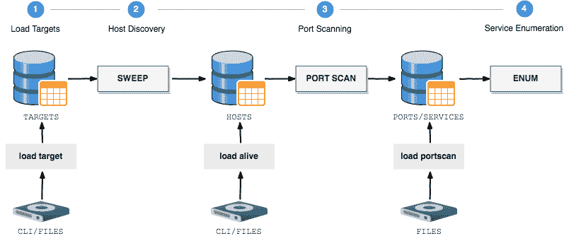

# GoScan:2019 年交互式网络扫描仪

> 原文：<https://kalilinuxtutorials.com/goscan-network-scanner-2019/>

GoScan 是一个交互式网络扫描仪客户端，具有自动完成功能，它提供了对 nmap 的抽象和自动化。

GoScan 现在可以用于执行主机发现、端口扫描和服务枚举，不仅是在隐蔽性不是优先考虑的事项和时间有限的情况下(想想 CTFs、OSCP、考试等)。)，但也可以(对其配置进行一些调整)在专业活动中使用。

GoScan 也特别适合不稳定的环境(想想不可靠的网络连接，缺少“`screen`”等)。)，因为它触发扫描并在 SQLite 数据库中维护它们的状态。

扫描在后台运行(与主线程分离)，因此即使与运行 GoScan 的机器的连接丢失，结果也可以异步上传(下面将详细介绍)。

也就是说，可以在流程的不同阶段将数据导入 GoScan，而不需要在出现问题时从头开始重新启动整个流程。

此外，服务枚举阶段集成了其他工具的集合(例如，`EyeWitness`、`Hydra`、`nikto`等)。)，每一个都是针对特定服务定制的。

**也读作:** [Fnord:混淆代码的模式提取器](https://kalilinuxtutorials.com/fnord-pattern-extractor/)

**安装**

**二进制安装(推荐)**

**Linux(64 位)**
$ wget https://github . com/Marco-lancini/goscan/releases/download/v 2.3/goscan _ 2.3 _ Linux _ amd64 . zip
$ unzip goscan _ 2.3 _ Linux _ amd64 . zip
**Linux(32 位)**
$ wget https://github . com/Marco-lancini/goscan/releases/download/v 2.3/goscan/goscan /usr/local/bin/goscan

**从源代码构建**

$ git 克隆 https://github.com/marco-lancini/goscan.git
$ CD goscan/goscan/
$制作设置
$制作构建

**要创建多平台二进制文件，通过 make 使用 cross 命令:**

**$制作十字**

**码头工人**

$ git 翻制 https://github . com/Marco-lancini/goscan . git
$ CD goscan/
$ docker-compose up–build

**用途**

GoScan 支持网络枚举的所有主要步骤:

| 步骤 | 命令 |
| --- | --- |
| 1.**装载目标** | 通过 CLI 添加单个目标(必须是有效的 CIDR): `load target SINGLE <IP/32>`从文本文件或文件夹上传多个目标:`load target MULTI <path-to-file>` |
| 2.**主机发现** | 执行 Ping 扫描:`sweep <TYPE> <TARGET>`或加载以前发现的结果:通过 CLI 添加单个活动主机(必须是/32): `load alive SINGLE <IP>`从文本文件或文件夹上传多个活动主机:`load alive MULTI <path-to-file>` |
| 3.**端口扫描** | 执行端口扫描:`portscan <TYPE> <TARGET>`或从 XML 文件或文件夹上传 nmap 结果:`load portscan <path-to-file>` |
| 4.**服务枚举** | 模拟运行(仅显示命令，不执行命令):`enumerate <TYPE> DRY <TARGET>`执行检测到的服务的枚举:`enumerate <TYPE> <POLITE/AGGRESSIVE> <TARGET>` |
| 5.**特殊扫描** | *目击者*截图网站、RDP 服务、打开 VNC 服务器(仅限 KALI):`special eyewitness``EyeWitness.py`需要在系统路径*从枚举数据中提取(Windows)域信息* `special domain <users/hosts/servers>` *DNS* 枚举 DNS (nmap、dnsrecon、dnsenum): `special dns DISCOVERY <domain>`暴力强制 DNS: `special dns BRUTEFORCE <domain>`反向暴力强制 DNS: `special dns BRUTEFORCE_REVERSE <domain> <base_IP>` |
| **Utils** | 显示结果:`show <targets/hosts/ports>`通过加载配置文件自动配置设置:`set config_file <PATH>`更改输出文件夹(默认为`~/goscan` ): `set output_folder <PATH>`修改默认 nmap 开关:`set nmap_switches <SWEEP/TCP_FULL/TCP_STANDARD/TCP_VULN/UDP_STANDARD> <SWITCHES>`修改默认单词列表:`set_wordlists <FINGER_USER/FTP_USER/...> <PATH>` |

**外部集成**

*服务枚举*阶段目前支持以下集成:

| 什么 | 综合 |
| --- | --- |
| 空袭预防措施 | nmap |
| 域名服务器(Domain Name Server) | nmapdnsrecondnsenumhost |
| 手指 | nmap finger-用户-枚举 |
| 文件传送协议 | nmapftp-user-enum hydra[AGGRESSIVE] |
| 超文本传送协议 | nmapniktodirbeyewitnessssqlmap[AGGRESSIVE]fimap[AGGRESSIVE] |
| RDP | nmapEyeWitness |
| 服务器信息块 | nmapenum4linuxnbtscansamrdump |
| 简单邮件传输协议 | nmapsmtp-用户-枚举 |
| 简单网络管理协议(Simple Network Management Protocol) | nmapsnmpcheckonesixtyonesnmpwalk |
| 嘘 | 九头蛇[好斗的] |
| 结构化查询语言 | nmap |
| VNC | 目击者 |

[**Download**](https://github.com/marco-lancini/goscan)