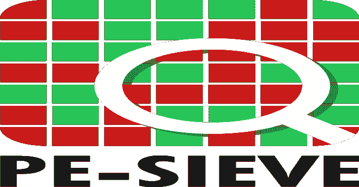

# Pe-Sieve:识别和转储各种潜在的恶意植入

> 原文：<https://kalilinuxtutorials.com/pe-sieve-malicious-implants/>

**PE-sieve** 是一款轻量级工具，有助于检测系统上运行的恶意软件，并收集潜在的恶意材料以供进一步分析。

识别并转储扫描过程中的各种植入:替换/注入的 PEs、外壳代码、挂钩和其他内存补丁。

检测内嵌挂钩、进程空洞、进程重叠、反射 DLL 注入等。

**也可阅读-[OSINT-SPY:对电子邮件/域/IP 地址/组织进行 OSINT 扫描](https://kalilinuxtutorials.com/osint-spy/)**

**克隆**

使用递归克隆获得 repo 和子模块:

**git 克隆–递归 https://github.com/hasherezade/pe-sieve.git**

**最新版本**

这些版本可供测试，它们可能在官方[发布](https://github.com/hasherezade/pe-sieve/releases)之前发布:

*   [32 位](https://goo.gl/PnM3U2)
*   [64 位](https://goo.gl/scP1Hi)

[**Download**](https://github.com/hasherezade/pe-sieve)