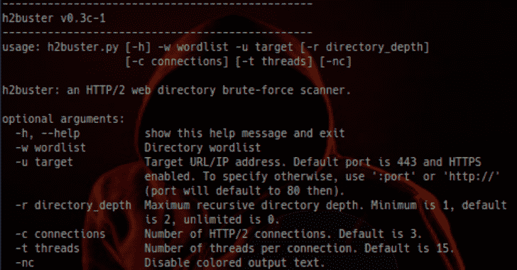

# H2Buster:一个基于 HTTP/2 的线程化递归 Web 目录暴力扫描程序

> 原文：<https://kalilinuxtutorials.com/h2buster/>

受 Gobuster 的启发，H2Buster 是一款基于 HTTP/2 的线程化递归网页目录暴力扫描器。以下是功能:

*   快速便携——安装 [hyper](https://github.com/Lukasa/hyper) 并运行。
*   多重连接扫描。
*   多线程连接。
*   可扩展:扫描可以像您配置的那样温顺或积极。
*   h2 和 h2c 支持。
*   可配置的目录递归深度。
*   多平台:可以在 Linux 和 Windows 上运行(OS X 有待测试)。

**也可阅读-[versions scan:用于报告可能漏洞的 PHP 版本扫描器](https://kalilinuxtutorials.com/versionscan/)**

**安装**

您只需要安装一个依赖项。如果您没有 hyper，请运行:

**pip 3 install-r requirements . txt**

**用途**

**用法:h2buster . py[-h]-w word list-u target[-r directory _ depth]
[-c connections][-t threads][-NC][-x extension _ list]

h2buster:一个 HTTP/2 web 目录暴力扫描程序。

参数:
-h，–help 显示此帮助信息并退出
-w wordlist 目录 wordlist
-u target 目标 URL/IP 地址(host[:port])。默认端口是 443
，HTTPS 启用。要以其他方式指定，请使用':port '或
'http://'(端口将默认为 80)。
-r directory_depth 最大递归目录深度。最小值为 1，默认
为 2，无限制为 0。
-c 连接 HTTP/2 连接的数量。默认值为 3。
-t 线程每个连接的线程数。默认值为 20。
-nc 禁用彩色输出文本。
-x extension_list 要检查的文件扩展名列表，用
分号分隔。例如，-x '。php。js；空白；/'将检查
。php，。js，空白和/用于每个单词表条目。
“空白”关键字表示没有文件扩展名。默认的
扩展名为“/”、“空白”、“”。html“，”。php'**

[**Download**](https://github.com/00xc/h2buster)