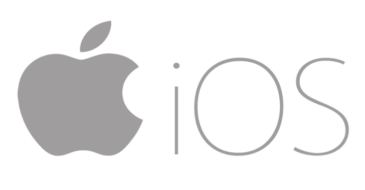

# SwiftMonkey:对 iOS 应用进行随机 UI 测试的框架

> 原文：<https://kalilinuxtutorials.com/swiftmonkey-testing-ios-apps/>

SwiftMonkey 项目是一个在 iOS 应用中生成随机用户输入的框架。这种猴子测试对于压力测试应用程序和发现罕见的崩溃非常有用。

它还包含一个名为 SwiftMonkeyPaws 的相关框架，该框架提供了所生成事件的可视化。这大大增加了你的随机测试的有用性，因为你可以看到什么触摸导致了你可能遇到的任何崩溃。

**为什么用 SwiftMonkey？**

*   当测试你的用户界面时，很容易想到如何测试事情*应该*如何工作，但是你是否努力找出哪种事情*可能不*工作？
*   你有没有把你的应用程序展示给一个不停敲击屏幕的人，而这个人做了一些你从未想过的事情，立刻就让你的应用程序崩溃了？
*   你想对你的应用程序的稳定性更有信心吗？
*   您是否遇到过无法重现的罕见崩溃？
*   您是否遇到过需要很长时间才能显现的内存泄漏，并且需要大量的 UI 操作？

随机测试将帮助你解决所有这些问题！

SwiftMonkey 受到了 [UI AutoMonkey](https://github.com/jonathanpenn/ui-auto-monkey) 的启发并与之有相似的目标，但被集成到 Xcode UI 测试框架中，提供了更好的调试机会。

**又读-[URL extractor:信息收集&网站侦察](https://kalilinuxtutorials.com/urlextractor/)**

**快速启动**

要亲眼看看这个框架是如何工作的，只需抓取代码并打开`**SwiftMonkeyExample/SwiftMonkeyExample.xcodeproj**`。然后按下`**Cmd-U**`运行 UI 测试。

**安装**

作为高级概述，将`**SwiftMonkey.framework**`添加到您的 UI 测试目标中。然后添加一个测试，创建一个`**Monkey**` 对象并使用它来生成事件。

可选地，您还可以将`**SwiftMonkeyPaws.framework**`添加到您的主应用程序中，并创建一个`**MonkeyPaws**`对象来实现可视化。您可能只希望对调试版本这样做，或者在使用特定命令行标志时这样做。

**要求**

SwiftMonkey 用的是 Swift 4.0。它除了 iOS 本身之外没有依赖(8.0 及以上应该可以)。SwiftMonkeyPaws 也没有任何依赖关系；你甚至可以单独使用，不用 SwiftMonkey。

**【cocoa pods】**

你可以使用 [CocoaPods](https://cocoapods.org/) 来安装框架。假设您已经将您的主应用程序和测试目标命名为“app”和“Tests”，您可以在您的`**Podfile**`中使用类似这样的内容:

**目标‘App’做
pod‘SwiftMonkey paws’，‘~>2 . 1 . 0’
结束
目标‘Tests’做
pod‘swift monkey’，‘~>2 . 1 . 0’
结束**

**手动安装**

将`**SwiftMonkey**`和`**SwiftMonkeyPaws**`文件夹复制到您的项目中。接下来，将`**xcodeproj**`文件拖到您的项目中。

然后，对于 SwiftMonkey，添加`**SwiftMonkey.framework**`作为测试目标的依赖项，并添加一个复制文件构建阶段来将其复制到`**Frameworks**`中。

对于 SwiftMonkeyPaws，将`**SwiftMonkeyPaws.framework**`添加到应用目标的嵌入式二进制部分就足够了。

(如果您不想使用框架，也可以直接链接 Swift 文件。)

**Swift 包管理器**

在撰写本文时，Swift 包管理器不支持 iOS 项目。SPM 包文件已经被实验性地创建了，但是显然还不能真正工作。

**用法**

**金丝猴**

为了进行猴子测试，`**import SwiftMonkey**`，然后创建一个新的测试用例，使用`Monkey`对象来配置和运行输入事件生成。这里有一个简单的例子:

func test monkey(){
let application = XCUIApplication()

//Xcode 7.3 中 bug 的变通方法。最初调用 app.frame 时，快照没有正确更新
//导致 rect 大小为零。
//做一个随机查询似乎可以正确地更新一切。
//TODO:Xcode bug 修复后移除此！_ = application.descendants(匹配:。任何)。元素(boundBy: 0)。frame

//用当前设备初始化猴子测试仪
// frame。给出一个显式种子将使它在每次运行时生成
//相同的事件序列，而不给出它
//将在每次运行时生成一个新的序列。let Monkey = Monkey(frame:application . frame)
//let Monkey = Monkey(seed:123，frame:application . frame)

//添加猴子要执行的动作。我们只是使用了一个
//默认的动作集，这通常就足够了。
//使用其中任何一个，但也许不能两个都用。
// XCTest 私人行动目前看来效果更好。
// UIAutomation 动作似乎只在模拟器上起作用。monkey . adddefaultxctestprivateactions()//monkey . adddefaultuiautomationactions()

//偶尔会使用常规的 XCTest 功能
//来检查是否有告警显示，在上面随机点击一个
//按钮，monkey . addxctesttapalertaction(interval:100，application:application)
//无限期运行猴子测试。monkey . monkey around()
}

`Monkey`对象不仅允许您添加内置的事件发生器，还允许您自己的任意块随机或按设定的时间间隔执行。在这些块中，你可以做任何你想做的事情，包括(但不仅仅是)生成更多的输入事件。

目前这方面的文档是有限的，所以如果你需要的话，请参考`Monkey.swift`及其扩展来获得如何使用更高级功能的例子。

 **在应用程序中启用可视化的最简单方法是首先`**import SwiftMonkeyPaws**`，然后在程序执行的早期执行以下操作:

var paws: MonkeyPaws？

func application(_ application:ui application，did finishlaunchingwithoptions launch options:[UIApplicationLaunchOptionsKey:Any]？)->Bool {
if command line . arguments . contains("–monkey paws "){
paws = monkey paws(view:window！)
}
还真
}

(这个例子使用了`application(_, didFinishLaunchingWithOptions)`，但是在你拥有 UIWindow 之后的任何时候都可以。如果传递了某个命令行标志，它也只支持可视化，因此它只能在测试运行时启用。)

使用命令行标志，如果您想要在您的测试用例文件上启用 MonkeyPaws，您可以在 yout testMonkey 函数上添加以下内容:

let application = XCUIApplication()
application . launch arguments =["–monkey paws "]

这个调用将调用 UIApplication 中的一些方法来捕获 UIEvents。如果您不想这样做，或者如果您已经有一个 UIEvents 源，您可以将下面的选项传递给`init`来禁用 swizzling:

paws = MonkeyPaws(视图:窗口！，tapUIApplication: false)

然后，您可以通过以下调用传入事件:

paws？。append(event: event) //事件是 UIEvent

**待办事项**

**金丝猴**

*   多写文档。
*   添加更多输入事件动作。
*   添加使用公共 XCTest APIs 而不是私有 API 的随机测试。
    *   找到可点击的视图并直接点击它们，而不是点击随机的位置，以弥补事件生成的缓慢。
*   修正滑动动作以避免拉出顶部和底部面板。(这可能会导致猴子从您的应用程序中逃脱，这可能会有问题！)
*   通常，找到一种快速的方法来查看猴子是否设法离开了应用程序。
*   了解如何使用 XCTest 私有 API 进行设备轮换。
*   找出为什么 UIAutomation 操作在设备上不起作用，而只在模拟器上起作用。
*   研究生成不依赖私有 API 的输入事件的其他方法。
*   一旦 Swift 软件包管理器获得 iOS 支持，更新项目以正确支持它。

 ***   为可视化添加更多的可定制性。

**swift monkey 举例**

*   添加更多的 UI 元素、视图和控件，使示例看起来更有趣。
*   也许添加一些猴子测试可以找到的实际崩溃？

[**Download**](https://github.com/zalando/SwiftMonkey)****