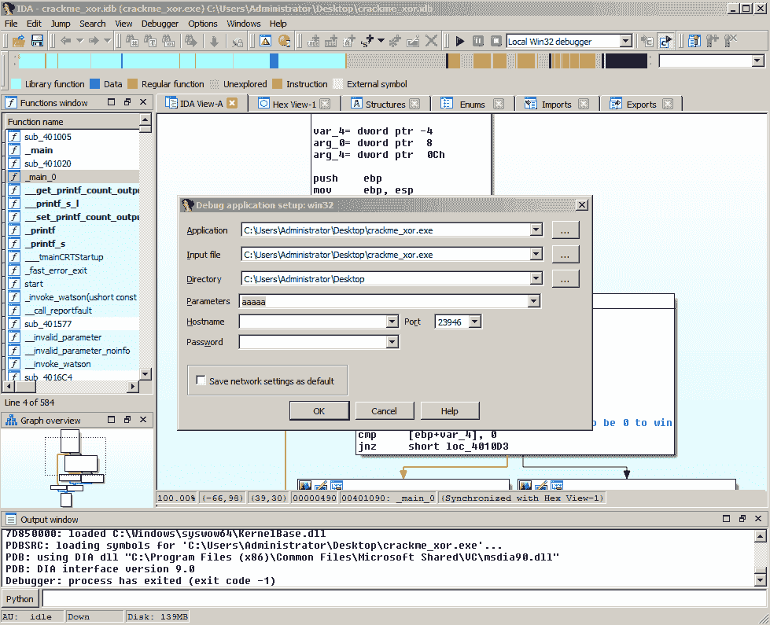
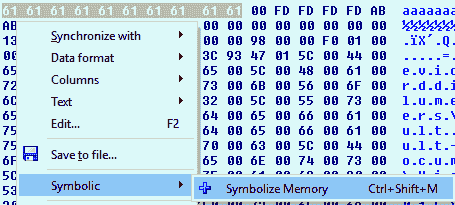

# Ponce : IDA Pro 插件，为用户提供执行污点分析和符号执行的能力

> 原文：<https://kalilinuxtutorials.com/ponce-ida-pro-plugin/>

Ponce 是一个 IDA Pro 插件，它为用户提供了以简单直观的方式对二进制文件进行污点分析和符号执行的能力。有了 Ponce，您只需点击一下鼠标，就能获得尖端符号执行的所有功能。完全用 C/C++写的。

符号执行在安全社区中并不是一个新概念。它已经存在很多年了，但是直到最近几年，像 [Triton](https://github.com/JonathanSalwan/Triton) 和 [Angr](http://angr.io/) 这样的开源项目才被创建出来满足这种需求。尽管这些项目是可用的，但是最终用户经常被留下来自己实现特定的用例。

我们通过创建 Ponce 来满足这些需求，Ponce 是一个 IDA 插件，它在逆向工程师最常用的反汇编器/调试器中实现了符号执行和污点分析。

**安装**

Ponce 可以在 IDA 6.8 和 IDA 6.9x 中使用 x86 和 x64 二进制文件。安装该插件非常简单，只需将适当的文件从 IDA 安装目录中的[最新版本](https://github.com/illera88/Ponce/tree/master/latest_builds)复制到`plugins\`文件夹即可。

**IDA 7.0。**

Ponce 最初支持 Windows 中 x86 和 x64 二进制文件的 IDA 7.0。名为`Ponce64.dll`的插件应该从[的最新版本](https://github.com/illera88/Ponce/tree/master/latest_builds)复制到 IDA 安装目录的`plugins\`文件夹中。从 7.0 版开始，IDA64 应该用于 x86 和 x64 二进制文件。

不要忘记通过添加以下行来注册位于同一文件夹中的`plugins.cfg`中的 Ponce:

Ponce Ponce Ctrl+Shift+Z 0 WIN

**OS 支持**

庞塞可以在 Windows、Linux 和 OSX 上工作！

**用例**

*   利用漏洞开发 : Ponce 可以帮助你以更高效的方式创建一个利用漏洞，因为利用漏洞开发人员可以很容易地看到你控制了哪些内存部分和哪些寄存器，以及可以用作 ROP 小工具的可能地址。
*   **恶意软件分析**:Ponce 的另一个用途与恶意软件代码有关。通过符号化一个简单的已知命令并否定命令被检查的所有条件，分析特定恶意软件家族支持的命令是容易确定的。
*   **协议反转**:Ponce 最有趣的用途之一是识别受控用户输入所需的幻数、报头甚至整个协议的可能性。例如，Ponce 可以帮助您列出给定命令行二进制文件的所有可接受参数，或者提取特定文件解析器所需的文件格式。
*   CTF:庞塞在 CTFs 中加速了逆向工程二进制程序的进程。由于 Ponce 完全集成到 IDA 中，您无需担心设置时间。已经可以用了！

该插件将自动运行，引导您完成首次运行时的初始配置。配置将被保存到一个配置文件中，这样您就不必再担心配置窗口了。

**又读-[碧玺:水晶的电报机器人框架](https://kalilinuxtutorials.com/tourmaline-telegram-bot/)**

**使用模式**

*   **污点引擎**:这个引擎用于在二进制文件执行的每一步确定用户输入可以控制内存和寄存器的哪些部分。
*   符号引擎(Symbolic engine):这个引擎在二进制执行路径的每一步维护寄存器和部分内存的符号状态。

**例子**

**用符号执行解决一个难题**

这里我们可以看到符号引擎的使用，以及我们如何解决约束:

*   将简单的`aaaaa`作为参数传递。
*   我们首先选择符号引擎。
*   我们将 argv[1] ( `aaaaa`)指向的内存转换为符号
*   识别使我们获胜的象征性条件并解决它。
*   测试解决方案。

**求反并注入一个条件**

在下一张 gif 中，我们可以看到自动污点的使用，以及如何在调试时否定一个条件并将其注入内存:

*   我们选择符号引擎并设置选项来符号化`argv`。
*   我们确定了赢得胜利需要满足的条件。
*   每当我们的输入的一个字节被对照密钥检查时，我们就否定并注入解决方案。
*   最后，我们得到已经注入内存的密钥`elite`，因此到达`Win`代码。

**使用污点引擎跟踪用户控制的输入**

在这个例子中，我们可以看到使用 cmake 的污染引擎。我们是:

*   将文件作为参数传递给 cmake，让他解析文件。
*   我们选择要使用训练引擎
*   我们污染了“` fread()”从文件中读取的缓冲区。
*   我们在调试器控制下恢复执行，以查看污点输入被移动到了哪里。
*   庞塞会给被污染的函数重新命名。这些是用户以某种方式影响的功能，而不是简单执行的功能。

**使用求反，注入&恢复**

在下一个示例中，我们将使用快照引擎:

*   将文件作为参数传递。
*   我们选择我们想要使用符号引擎。
*   我们污染了“` fread()”从文件中读取的缓冲区。
*   我们在解析从文件中读取的缓冲区的函数中创建一个快照。
*   当评估一个条件时，我们否定它，将解决方案注入内存，并用它恢复快照。
*   这个解将是“有效的”,所以我们将满足现有的条件。

**用途**

在本节中，我们将列出不同的 Ponce 选项以及键盘快捷键:

*   访问配置和污点/符号窗口:编辑> Ponce >显示配置(Ctl+Shift+P 和 Ctl+Alt+T)

*   启用/禁用 Ponce 跟踪(Ctl+Shift+E)

*   象征/玷污寄存器(Ctl+Shift+R)

*   象征/玷污记忆。可以在 IDA 视图或 Hex 视图中完成(Ctl+Shift+M)

*   求解公式(ctrl+Shift+S)

*   求反和注入(ctrl+Shift+N)

*   取反、注入和恢复快照(Ctl+Shift+I)

*   创建执行快照(Ctl+Shift+C)

*   还原执行快照(ctrl+Shift+S)

*   删除执行快照(Ctl+Shift+D)

*   执行本机(Ctl+Shift+F9)

**大楼**

我们为 Ponce 提供编译后的二进制文件，但是如果你想构建你自己的插件，你可以使用 Visual Studio 2013。我们试图让建造过程尽可能简单:

*   用子模块克隆项目:

**git 克隆–递归 https://github . com/illera 88/ponceproject . git**

*   **打开** `**Build\PonceBuild\Ponce.sln**` **:** 项目配置已经准备好使用项目附带的位于`external-libs\`中的包含和库。
*   VS 项目有一个`Post-Build Event`，它会将创建的二进制插件移动到 IDA 插件文件夹中。`**copy /Y $(TargetPath) "C:\Program Files (x86)\IDA 6.9\plugins**"`。

**注意:**使用您的 IDA 安装路径。

该项目有 4 个构建配置:

*   x86ReleaseStatic:将创建 32 位版本，将每个第三方库静态链接到一个大插件文件中。
*   将创建 32 位版本，静态链接除 z3.lib 之外的所有第三方库。
*   x64ReleaseStatic:将创建 64 位版本，将每个第三方库静态链接到一个大插件文件中。
*   将创建 64 位版本，静态链接除 z3.lib 之外的所有第三方库。

`z3.lib`的静态版本大约 1.1Gb，链接时间相当长。这就是为什么我们有一个动态使用 z3(作为 dll)的构建版本的主要原因。如果你正在动态地使用 z3，不要忘记将[libz3.dll](https://github.com/illera88/Ponce/blob/master/external-libs/libs/Z3_dyn_rest_static_MT_x86/libz3.dll)文件复制到 IDA 的目录中。

**信用:**Alberto Garcia Illera&Francisco Oca

[**Download**](https://github.com/illera88/Ponce#installation)