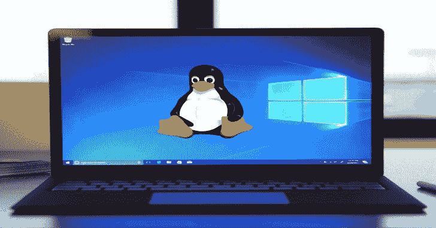

# Windows Linux 内核现在可以通过 WSL 2 获得

> 原文：<https://kalilinuxtutorials.com/windows-linux-kernel-wsl-2/>

当微软第一次报道 Windows 上的 bash 并将 Linux 作为 Windows 子系统引入 Windows 时，很少有人会想到接下来的阶段会将真正的 Linux 引入 Windows 工作框架。

的确，我们所期望的是正确的，微软刚刚发布了另一个 Windows 10 Insider 预览版，突出了 Linux 2 的 Windows 子系统。WSL 2 整合了一个真正的 Linux 分区，让您有机会在 Windows 上运行更多的 Linux 软件，并且比 WSL1 执行得更好。

> **“我们很高兴地宣布，从今天开始，您可以通过在 Insider Fast ring 中安装 Windows build 18917 来试用适用于 Linux 2 的 Windows 子系统！在这篇博文中，我们将介绍如何开始，新的 wsl.exe 命令，以及一些重要的提示。”**
> 
> **Craig Loewen Program Manager, Windows Developer Platform.**

WSL 2 最大的变化来自于 Windows 10 自带的正版 Linux 部分。随着这一变化，Linux 二进制文件与 Windows 和您的 PC 的连接已经改变。

**也可阅读-[Twitter Shadowban v2:Twitter Shadowban 测试](https://kalilinuxtutorials.com/twittershadowbanv2/)**

Windows 终端应用程序包含许多选项卡支持、按主题关闭以及为需要更改终端应用程序的开发人员定制。它同样会支持完全基于 GPU 的内容渲染，甚至表情符号。

**如何安装？**

*   以下命令将在你的电脑上安装**虚拟机器平台**。

**启用-windows optional feature-Online-feature name 虚拟机器平台**

*   要在最新的内部版本上安装 WSL2，请在管理员同意的情况下在 PowerShell 窗口中运行附带的命令:

**wsl -l**

*   使用这个命令来转换一个发行版，以使用 WSL2 架构或 WSL1 架构。

**wsl–设置版本**

*   更改新版本的默认安装版本(WSL1 或 2)。

**wsl–设置-默认-版本**

*   快速结束每一个正在运行的发行版和 WSL2 轻量级实用程序虚拟机。

**wsl–关闭**

*   只要列出发行名单。

**wsl–列表–安静**

*   显示了几乎每个分布的逐点信息。

**wsl–list–verbose**

虽然开发人员可以选择从 GitHub 的代码中订购和使用 Windows 终端，但微软目前正在从 6 月 22 日起通过 T2 的 Windows 商店发布一个简单的安装程序。