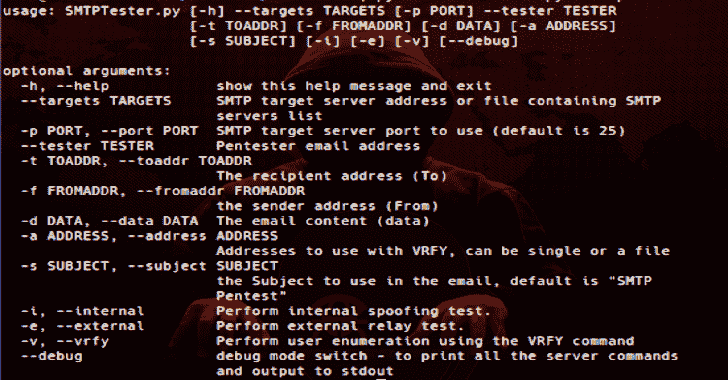

# SMTPTester:用于检查 SMTP 服务器中常见漏洞的小型 Python3 工具

> 原文：<https://kalilinuxtutorials.com/smtptester-check-common-vulnerabilities/>

**SMTPTester** 是一个 python3 工具，用于测试 SMTP 服务器的 3 个常见漏洞:

*   **欺骗—**代表内部用户发送邮件的能力
*   **中继—**使用此 SMTP 服务器向组织外部的其他地址发送电子邮件
*   **用户枚举-**使用 SMTP VRFY 命令检查组织中是否存在特定的用户名和/或电子邮件地址。

**怎么用**？

首先，安装所需的依赖项:

**pip install-r requirements . txt**

其次，使用所需的标志运行该工具:

**python SMTP tester . py–tester[tester email]–targets[SMTP IP 或包含多个 IP 的文件]**

**也读作-[MalConfScan:Volatility 插件，用于提取已知恶意软件](https://kalilinuxtutorials.com/malconfscan-extracts-configuration-data-malware/)的配置数据**

**要考虑的选项**

*   **-I \–内部**
    *   仅测试邮件欺骗
*   **-e \–外部**
    *   仅测试邮件中继
*   **-v \–vrfy**
    *   仅执行用户枚举当没有指定特定的测试类型时，该工具将执行内部和外部测试，并将输出附加到与 SMTPTester.py 文件位于同一文件夹的日志文件中。

**问题、bug 和其他代码问题**

是的，我知道，这个代码不是最好的。我很好，因为我不是一个开发人员，这是我学习过程的一部分。如果有可以做得更好的选择，请告诉我。

[**Download**](https://github.com/xFreed0m/SMTPTester)