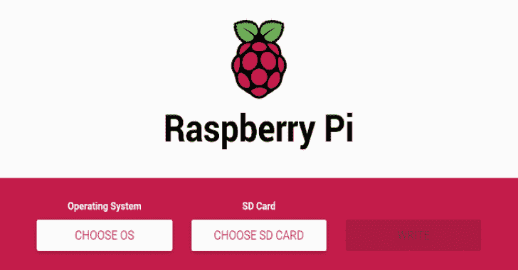

# Raspberry Pi 成像仪实用程序 2020

> 原文：<https://kalilinuxtutorials.com/raspberry-pi-imager/>

**Raspberry Pi Imager** 成像实用程序的主要代码根据 Apache 许可条款提供。请参阅 license.txt 和“dependencies”文件夹中的文件，了解适用于所使用的第三方依赖项(如 Qt、libarchive、drivelist、mountutils 和 libcurl)的各种开源许可证的更多信息。

**如何重建？**

**Debian/Ubuntu Linux**

**获取依赖关系**

*   **安装构建依赖项:**

sudo apt install–no-install–建议使用 build-essential dev scripts deb helper cmake git lib archive-dev lib curl 4-OpenSSL-dev \
Qt base 5-dev Qt base 5-dev-tools Qt declarative 5-dev \
qml-module-Qt quick 2 qml-module-Qt quick-controls 2 qml-module-Qt-labs-settings qml-module-Qt quick-templates 2 qml-module-Qt quick-window 2 qml-module-qtgraphicaleffect

*   **获取来源**

**git 克隆–深度 1 https://github.com/raspberrypi/rpi-imager**

*   **构建 Debian 包**

**CD rpi-imager
debuild-UC-us**

Debuild 将编译所有内容，创建一个. deb 包并将其放在父目录中。可以用 apt 安装它:

**cd..
sudo 易于安装。/rpi-imager*。黛比**

它应该在“工具”或“附件”下的开始菜单中创建一个图标。映像实用程序通常以普通用户的身份运行，并将通过 DBus 调用 udisks2 来执行特权操作，如打开磁盘设备进行写入。如果 udisks2 在您的 Linux 发行版上不起作用，您也可以使用 sudo 和类似的工具以“root”身份启动它。

**也可阅读-[扩展的 XSS 搜索:我的 XSSFinder 工具的更好版本](https://kalilinuxtutorials.com/extended-xss-search/)**

**窗户**

**获取依赖关系**

*   从[https://www.qt.io/download-open-source](https://www.qt.io/download-open-source)获取 Qt 在线安装程序在安装过程中，选择一个带有 Mingw32 32 位工具链和 CMake 的 Qt 5.x。
*   如果使用不支持 schannel (Windows 原生 SSL 库)的官方 Qt 发行版，编译 OpenSSL 库([https://wiki.qt.io/Compiling_OpenSSL_with_MinGW](https://wiki.qt.io/Compiling_OpenSSL_with_MinGW))并将 libssl/crypto dll 复制到 C:\qt\5.x\mingw73_32\bin
*   对于建筑安装获得 Nullsoft 可脚本安装系统:[https://nsis.sourceforge.io/Download](https://nsis.sourceforge.io/Download)
*   假设您已经有了正确的代码签名证书，并且安装了 Windows SDK 的 signtool.exe。如果不是，并且只是为了个人使用而编译，那么注释掉 CMakelists.txt 和。nsi 安装程序脚本。

**大楼**

构建可以使用命令行、使用“cmake”、“make”等手动完成。，但是如果您不熟悉如何设置一个合适的 Windows 构建环境(设置路径，等等)。)，用 Qt creator GUI 代替是最简单的。

*   下载源。从 github 解压到磁盘上的一个文件夹
*   在 Qt creator 中打开 CMakeLists.txt。
*   对于您分发给其他人的构建，确保您在工具链设置中选择了“发布”,而不是调试版本。
*   菜单“构建”->“全部构建”
*   结果将会出来../build_rpi-imager_someversion
*   转到构建文件夹，右键单击。nsi 脚本“编译 NSIS 脚本”，创建安装程序。

注意:Qt Creator 中的 CMake 集成有时有点奇怪。如果您对 CMakeLists.txt 文件进行了任何自定义更改，并且该文件随后陷入无限循环，在重新处理该文件时永远不会完成“配置”阶段，请删除“build_rpi-imager_someversion”目录并重试。

麦克·OS X

**获取依赖关系**

*   从[https://www.qt.io/download-open-source](https://www.qt.io/download-open-source)获取 Qt 在线安装程序在安装过程中，选择一个 Qt 5.x 版本和 CMake。
*   为了创建一个用于发行的. DMG，你可以使用一个实用程序，比如:[https://github.com/sindresorhus/create-dmg](https://github.com/sindresorhus/create-dmg)
*   假设你有一个苹果开发者订阅，并且已经有一个“开发者 ID”代码签名证书，可以在苹果商店之外分发。(Mac 商店中不允许特权应用程序)

**大楼**

*   下载源。从 github 解压到磁盘上的一个文件夹
*   启动 Qt Creator(可能需要启动“finder”使用“Go”菜单导航到主文件夹，并找到 Qt 文件夹以手动启动它，因为它可能没有在应用程序中创建图标)，并打开 CMakeLists.txt
*   菜单“构建”->“全部构建”
*   结果将会出来../build_rpi-imager_someversion
*   分发给其他人:代码签名。应用程序，创建一个 DMG，代码签署的 DMG，提交给苹果公证，并钉公证书到 DMG。

**例如:**

–> CD build-rpi-Imager-Desktop _ Qt _ 5 _ 14 _ 1 _ clang _ 64 bit-Release/
–>code design–deep–force–verify–verbose–sign " YOUR KEYID "–options runtime rpi-Imager . app
–>mv rpi-Imager . app " Raspberry Pi Imager . app "
–>create-dmg Raspberry \ Pi \ Imager . app
–>mv Raspberry \ Pi \ Imager \\dmg imager . dmg
–>xcrun altool–notarize-APP-t OSX-f imager . dmg–primary-bundle-ID = " org . raspberrypi . imaging utility "-u YOUR-EMAIL-ADDRESS-p YOUR-APP-SPECIFIC-APPLE-PASSWORD-ITC _ provider TEAM-ID-IF-APPLICABLE
–>xcrun stapler staple imager . dmg

**其他注释**

**调试**

在 Linux 和 Mac 上，如果从控制台启动，默认情况下应用程序会将调试消息打印到控制台。在 Windows 上，使用命令行选项–debug 启动应用程序，让它打开一个控制台窗口。

**自定义存储库**

如果应用程序是用“–repo[您自己的 URL]”启动的，它将使用自定义的图像存储库。因此，可以简单地创建另一个“开始菜单快捷方式”的应用程序与该参数使用应用程序与您自己的图像。

[**Download**](https://github.com/raspberrypi/rpi-imager)