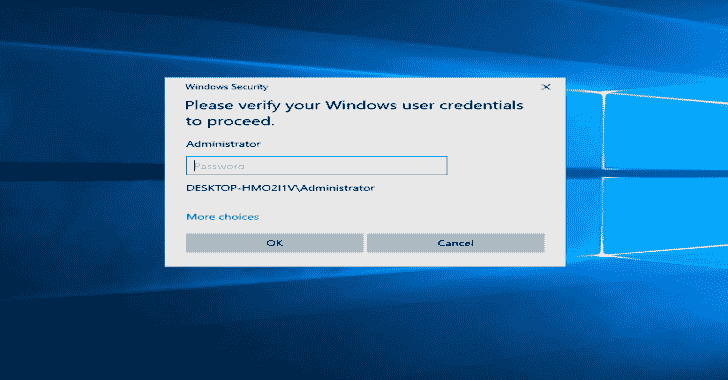

# Pickl3 : Windows 活动用户凭据仿冒工具

> 原文：<https://kalilinuxtutorials.com/pickl3/>

**Pickl3** 是一款 Windows 活动用户凭据钓鱼工具。您可以执行 Pickl3 并仿冒目标用户凭据。

**操作使用–1**

如今，由于许多最终用户的操作系统是 Windows 10，我们无法像旧时代那样轻松地使用类似 Mimikatz 的项目来窃取帐户信息。

使用 Pickl3，您可以尝试在不提升权限的情况下窃取活动用户的帐户信息。

**也读作——[SSRF 警长:服务器端请求伪造](https://kalilinuxtutorials.com/ssrf-sheriff/)**

**操作使用–2**

如今，大约有 200 种宣布的沙盒检测方法。沙箱，尤其是在管理程序层中的分析，不受这些检测方法的影响。但是沙盒在用户交互方面还不太好。

在你开发的恶意软件中使用 Pickl3 可以获得优势。例如，在今天的红队行动中，最终用户通常是目标。

作为目标的最终用户有一个密码，只要您作为目标的用户没有正确输入他们的密码，您就可以阻止您的恶意软件运行并绕过可能的沙盒控制。

然而，如果你能在第一次安装时阻止你的恶意软件使用管理员权限的话，那就太好了。

因为，在沙盒里，恶意软件一般是在管理员权限里分析的。

[**Download**](https://github.com/hlldz/pickl3)