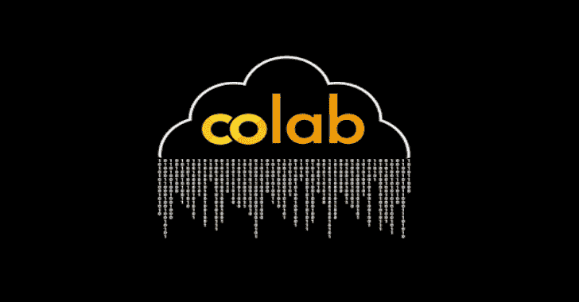

# colabcat——在 Google Colab 上运行 Hashcat，并进行会话备份和恢复

> 原文：<https://kalilinuxtutorials.com/colabcat/>

**Colabcat** 是一个用于在 Google colab 上运行 hashcat 的工具，具有会话备份和恢复功能。

**用途**

*   转到下面的链接，在 Google Colab 中打开`**colabcat.ipynb**`文件的副本:[https://Colab . research . Google . com/github/someshkar/colabcat/blob/master/colabcat . ipynb](https://colab.research.google.com/github/someshkar/colabcat/blob/master/colabcat.ipynb)
*   点击 **`Runtime`、`Change runtime type`，将`Hardware accelerator`** 设置为 GPU。
*   转到你的 Google Drive 并创建一个名为`**dothashcat**`的目录，其中有一个`**hashes**`子目录，你可以在那里存储散列。
*   回到 Google Colab，点击`**Runtime**`，然后点击`**Run all**`。
*   当它要求 Google Drive 令牌时，转到它提供的链接，并使用您的 Google 帐户进行身份验证以获得令牌。
*   您可以编辑笔记本中的最后几个单元格，以自定义它下载的单词列表和它破解的哈希类型。完整的列表可以在[这里](https://hashcat.net/wiki/doku.php?id=example_hashes)找到。
*   如果需要，只需在新的单元格中键入`!bash`就可以访问 Google Colab 实例上的交互式 shell。

它是如何工作的？

Colabcat 在 Google Drive 中的`**dothashcat**`文件夹和 Google Colab 会话中的`**/root/.hashcat**`文件夹之间创建一个符号链接。

通过将 **`.restore`、`.log`** 和`**.potfile**`文件存储在您的 Google Drive 中，在 Google Colab 会话间同步这些文件，即使您的 Google Colab 断开连接或您达到了单个会话的时间限制，也能实现无缝会话恢复。

**基准**

这个存储库中的`**benchmarks**`目录列出了使用`**hashcat -b**`运行的带有 hashcat 基准的`**.txt**`文件。下面列出了已知的 Google Colab GPUs 列表。最新列表可以在 [Colab FAQ](https://research.google.com/colaboratory/faq.html) 中找到。

*   英伟达特斯拉 K80
*   英伟达特斯拉 T4
*   英伟达特斯拉 P4
*   英伟达特斯拉 P100

[**Download**](https://github.com/someshkar/colabcat)