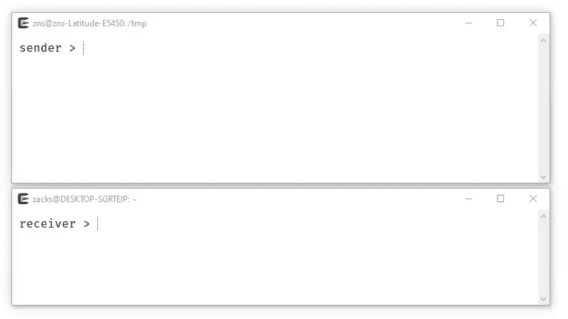

# Croc:轻松安全地将东西从一台计算机发送到另一台计算机

> 原文：<https://kalilinuxtutorials.com/croc/>

Croc 是一个工具，可以让任意两台计算机简单安全地传输文件和文件夹。AFAIK， *croc* 是唯一一款 CLI 文件传输工具，它能够**完成以下所有**功能:

*   允许**任何两台计算机**传输数据(使用继电器)
*   提供**端到端加密**(使用 PAKE)
*   实现轻松的**跨平台**传输(Windows、Linux、Mac)
*   允许**多个文件**传输
*   允许**恢复被中断的传输**
*   不需要本地服务器或端口转发
*   ****ipv6 优先**带 ipv4 回退**

 **有关`croc`的更多信息，请参见[我的博客文章](https://schollz.com/software/croc6)。

**安装**

为您的系统下载[的最新版本，或者从命令行安装一个版本:](https://github.com/schollz/croc/releases/latest)

**$卷毛 https://getcroc.schollz.com |痛击**

在 macOS 上，你可以用[自制软件](https://brew.sh/)安装最新版本:

**$ brew 安装鳄鱼**

在 macOS 上，您还可以使用 [MacPorts](https://macports.org/) 安装最新版本:

**$ sudo 端口自我更新
$ sudo 端口安装 croc**

在 Windows 上你可以用 [Scoop](https://scoop.sh/) 或 [Chocolatey](https://chocolatey.org) 安装最新版本:

**$勺装鳄鱼**

**$ choco 安装鳄鱼**

在 Unix 上，您可以使用 [Nix](https://nixos.org/nix) 安装最新版本:

**$ no-env-I cro**

在 Arch Linux 上，您可以使用`pacman`安装最新版本:

**$吃豆人鳄鱼**

在 Ubuntu 上你可以安装`snap`:

**$ snap 安装 croc**

在 Termux 上，您可以使用`pkg`进行安装:

**$ pkg 安装 croc**

或者，您可以[安装 Go](https://golang.org/dl/) 并从源代码构建(需要 Go 1.12+):

**$ go 111 module = on go get-v github.com/schollz/croc/v8**

**用途**

要发送文件，只需:

**$ croc send[文件或文件夹]
发送“文件或文件夹”(X MB)
代码为:代码短语**

然后在另一台计算机上接收文件(或文件夹)，您只需

**$ croc 密语**

密码短语用于建立密码认证的密钥协议( [PAKE](https://en.wikipedia.org/wiki/Password-authenticated_key_agreement) )，该协议为发送方和接收方生成用于端到端加密的秘密密钥。

有许多可配置的选项(见`--help`)。可以使用`--remember`设置一组选项(如自定义中继、端口和密码短语)。

**自定义代码短语**

您可以发送自己的密码短语(必须超过 4 个字符)。

**$ croc send–code[代码短语][文件或文件夹]**

*   **Use pipes – Stdin & Stdout**

您可以通过管道连接到`croc`:

**$猫[文件名] |鳄鱼发送**

在这种情况下，`croc`将自动使用标准输入数据，发送并分配一个文件名，如“croc-stdin-123456789”。要接收到`stdout`，您可以随时使用`--yes`自动批准转账，并通过管道将其发送到`stdout`。

**$ croc–是【密语】> out**

打印到控制台的所有其他文本都将发送到`stderr`，因此不会干扰发送到`stdout`的消息。

**发送文本**

有时你想发送网址或短文本。除了管道，您还可以使用`croc`轻松发送文本:

**$ croc send–text“hello world”**

这将自动告诉接收者在收到文本时使用`stdout`,这样文本就会显示出来。

**自主机继电器**

需要继电器来固定并行的输入和输出连接。默认情况下，`croc`使用公共中继，但您也可以运行自己的中继:

**$鳄鱼继电器**

默认情况下，它使用 TCP 端口 9009-9013。一定要把它们打开。您可以自定义端口(如`croc relay --ports 1111,1112`)，但您必须至少有 **2 个**端口用于中继。第一个端口用于通信，后续端口用于多路复用数据传输。

您可以使用您的中继发送文件，方法是输入`--relay`来更改您正在使用的中继，如果您想要自定义您自己的主机。

**$ croc–relay " my relay . example . com:9009 "发送[文件名]**

注意，发送时只需要包含第一个端口(通信端口)。用于数据传输的后续端口将从中继传输回用户。

*   **自主机中继(Docker)**

如果更简单的话，你也可以用 Docker 进行中继:

$ docker run-d-p 9009-9013:9009-9013-e
CROC _ PASS = ' your password ' scholz/CROC

确保包括中继的密码，否则任何请求都将被拒绝。

**$ croc–传递您的密码–中继“myreal.example.com:9009”发送[文件名]**

注意:当包含`**--pass YOURPASSWOR**D`时，可以改为传递一个带密码的文件，如 **`--pass FILEWITHPASSWORD`。**

[**Download**](https://github.com/schollz/croc)**