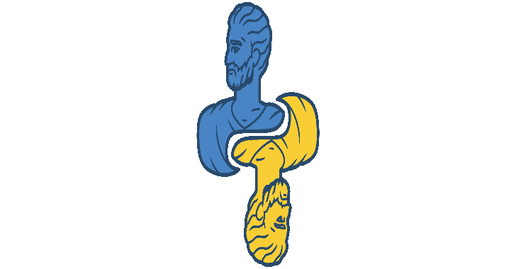

# Polypyus:通过提取已知函数来定位原始二进制文件中的函数

> 原文：<https://kalilinuxtutorials.com/polypyus/>

**Polypyus** 通过从相似的二进制文件中提取已知函数来学习定位原始二进制文件中的函数。因此，它是一个固件历史记录。 *Polypyus* 工作时不需要反汇编这些二进制文件，这对于反汇编起来很复杂的二进制文件和普通工具缺少功能的地方是一个优势。此外，只有二进制的方法使它非常快，在几秒钟内就可以运行。然而，这种方法要求二进制文件具有相同的架构和相似的编译器选项。

*Polypyus* 集成到现有工具的工作流程中，如 *Ghidra* 、 *IDA* 、 *BinDiff* 和*dia fra*。例如，它可以导入以前注释过的函数并从中学习，还可以导出找到的函数以导入到 *IDA* 中。因为 *Polypyus* 使用相当严格的阈值，所以它在我们的实验中只找到正确的匹配。虽然这导致比现有工具中更少的结果，但这是将这些匹配加载到 *IDA* 中以改善其自动分析结果，然后在顶部运行 *BinDiff* 的好切入点。

【Polypyus 解决什么？

在处理原始固件二进制文件，即各种 *Broadcom* 和 *Cypress* 蓝牙固件版本时，我们发现 *IDA* 自动分析经常错误地识别功能启动。在 *IDA Pro 6.8* 中，自动分析更加激进，导致更多的结果，但也有更多的误报。总体来说， *IDA Pro 7.2* 比较悲观，但是漏了很多功能。这导致在 *IDA Pro 6.8* 中我们的固件之间只有几次 *BinDiff* 匹配，而在 *IDA Pro 7.2* 中根本没有有用的匹配。

有趣的是， *BinDiff* 经常不能识别出除了分支以外的字节相同的函数。注意，*polypus*精确地搜索这些字节相同的函数。我们假设 *BinDiff* 在这些函数上失败是由于缺失函数和误报产生的不同调用图。有时，这些函数已经被 *IDA* 识别出来，但是通常 *IDA* 要么不把它们识别为代码，要么不把它们标记为函数。请注意，*隔膜*也有类似的问题，因为它在进一步处理之前导出了由 *IDA* 识别的函数。

此外，虽然我们发现*失忆*发现了许多功能，但它也发现了许多假阳性。然而，许多函数在开始时都有类似的堆栈框架设置。因此， *Polypyus* 可以选择从带注释的输入二进制文件开始学习公共函数，并将其应用于其他二进制文件，以识别不匹配其名称的函数。这个可选步骤仅适用于以前没有函数的区域，这样，公共函数 starts 方法和主函数 finding 就不会冲突。

它是如何工作的？

通过比较一组带注释的固件二进制文件中的常用函数，Polypyus 创建模糊二进制匹配器。

目前，支持以下注释:

*   一个 *WICED Studio* `patch.elf`文件，这是一个特殊的 ELF 文件，只包含符号定义。
*   一个由大多数 ARM 编译器生成的`.symdefs`文件。
*   具有示例中记录的格式的`.csv`文件。

这些注释包含已知函数的地址、大小和名称。历史收集中的输入二进制文件的共性越多，对*polypus*的性能和结果就越好。考虑到几个略有不同的函数，*poly Yus*创建了非常好的匹配器。

**如何安装？**

*Polypyus* 需要 Python 3 > = 3.6。我们建议在以下安装中使用 virtualenv。克隆此存储库，并在此文件夹中运行:

**pip 安装**

**怎么跑？**

安装后，以下命令可用:

*   **T2`polypyus-gui`**
*   **T2`polypyus-cli`**

**使用 Polypyus？**

*Polypyus* 可以通过图形和命令行界面获得。GUI `polypyus-gui`和 CLI `polypyus-cli`都在调用期间接受这些参数:

**–verbose 是详细级别。默认情况下，它显示警告-v 显示信息-vv 显示调试信息。**
**–项目设置项目文件的位置。这是文件路径或“:内存:”路径。**
**–帮助显示帮助信息。**

项目选项便于您将不同上下文的工作存储在不同的文件中，并再次打开它们。

[点击此处](https://github.com/seemoo-lab/polypyus/blob/master/doc/gui_demo.mp4)观看演示。

**使用图形用户界面**

一般的 GUI 工作流程是从窗口的左侧到右侧。首先，将二进制文件添加到历史记录中。然后，对历史记录中的条目进行符号注释。之后，可以添加目标二进制文件。匹配时，点击`Create matchers from history`。一旦创建了匹配器，可以选择单个目标，或者通过选择`batch match`匹配所有目标。最后，调查结果可以导出到一个`.csv`文件中。

在接下来的视频中，你可以看到一个演示视频，其中 *Polypyus* 只需要几秒钟就可以从两个输入二进制文件中学习，注释它们，创建匹配器，并将匹配应用到一个新的二进制文件中。

**使用命令行界面**

使用 CLI 的好处是它的自动化能力。截至目前，CLI 的输出格式可能会发生变化。但是，这里有一个调用它的例子:

**poly Yus-CLI–历史示例/history/20819-A1 . bin–注释示例/history/20819-A1 _ patch . elf**
**–历史示例/history/20735 B1 . bin**
**–注释示例/history/20735 B1 _ patch . elf****–项目测试. SQLite poly Yus-CLI**
**–目标示例/history/20739B1**

第一个命令创建`test.sqlite`作为新的项目文件，并导入`20819-A1.bin`和`20735B1.bin`以及它们各自的`patch.elf`文件。第二次调用重用同一个项目文件，并匹配二进制文件`20739B1.bin`。对于每个命令，`--history`和`--annotation`的数量需要匹配。这两个命令也可以通过在第一个命令中添加`--target`参数合并成一个。

它内部是如何工作的？

我们将很快发布一篇论文。在此之前，您可以看一下 [Jan 的硕士论文最终报告](https://github.com/seemoo-lab/polypyus/blob/master/doc/jan_msc-final-presentation.pdf)，它涵盖了在 ARM Thumb2 模式下使用传统二进制差分方法时遇到的问题，以及替代的纯二进制方法是如何工作的。

**推荐的 IDA 工作流程**

经过一些内部测试后，我们可以推荐在使用 *IDA Pro* 和*polypus*时采用以下工作流程:

*   创建新的数据库。ARM v7 little endian，ARM Cortex M 用于蓝牙固件。
*   将位置 0x0 标记为拇指(`Alt-g`、`T=0x1`)。
*   创建 ROM 和 RAM 段。ROM 在`0x0`带`rx`，RAM 在`0x200000`带`rwx`(至少对于蓝牙固件)。
*   在 ROM 中创建向量表偏移量，至少对于复位向量，在`0x4` ( `o`)是一个 4 字节的偏移量。在 *CYW20735* 固件上它指向`0x3bc+1`。返回一个字节，创建一个函数(`p`)。
*   等待自动分析完成。
*   导入*个多肽*个结果。
*   运行[拇指向上](https://github.com/CheckPointSW/Karta/blob/master/src/thumbs_up/thumbs_up_firmware.py)脚本。
*   运行 [BinDiff](https://www.zynamics.com/bindiff.html) 和[diaphra](http://diaphora.re/)。后者最好是带有反编译器的 IDA 版本。使用两者，因为它们使用不同的试探法。

…现在你的 IDA 数据库可能有点用了🙂在 ARM Thumb2 中，反汇编程序仍然有很多失败的地方，但是比 IDA 自己做的任何事情都要好。