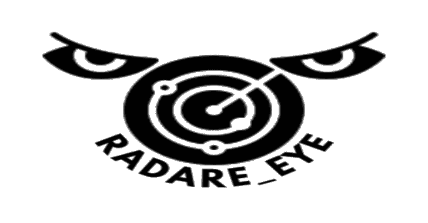
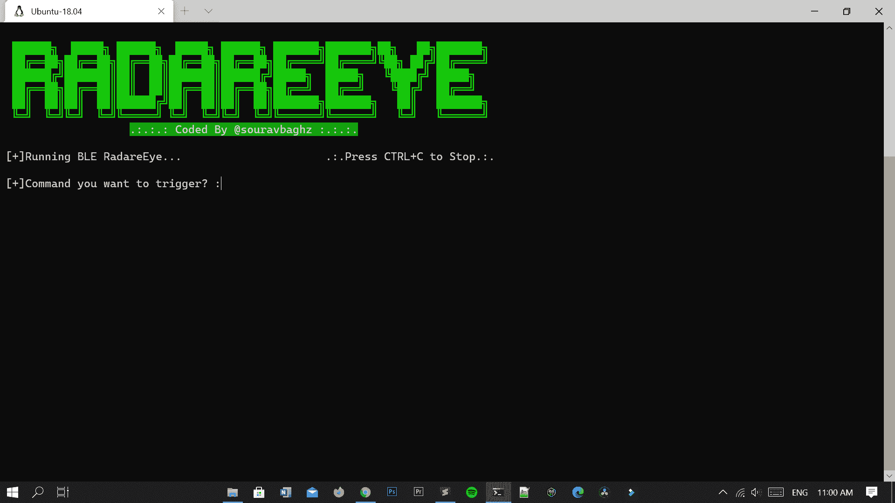

# 雷达眼:一种专门用于扫描附近设备的工具

> 原文：<https://kalilinuxtutorials.com/radareeye/>

RadareEye 是一款专门扫描附近设备[BLE，蓝牙&Wifi]的工具，当目标设备进入范围时，它会在我们的系统上执行我们给定的命令。

**注意** :-如果任何用户使用此工具进行恶意活动，RadareEye 所有者将不负任何责任。仅用于学习目的。

*   **雷达眼的安装:**

**git 克隆 https://github.com/souravbaghz/RadareEye**

**用途**

**。/radare < mac_addr > <选项>**

**可用选项有**

*   -蓝色蓝牙雷达眼
*   -ble BLE radareEye
*   -wifi 无线接入点雷达眼

*   **运行蓝牙雷达眼:**

sudo bash radare XX:XX:XX:XX:XX:XX-blue

*   **奔跑中的 BLE 雷达眼:**

sudo bash radare XX:XX:XX:XX:XX:XX-ble

Wifi 也有-wifi 选项，这里 XX:XX:XX:XX:XX:XX 表示您的目标设备的 MAC 地址&确保使用 sudo(如果您不是 root)。我没有在这个脚本中添加扫描功能，但是您可以通过在终端中执行蓝牙的“hcitool 扫描”和 BLE 设备的“hcitool lescan”来轻松获得 MAC 地址。

运行 RadareEye 后，它会问你“你想触发的命令？”，你可以跳过它，只需保持空白，它会显示你的目标的状态，无论它是否在范围内，而不触发任何命令。如果你想在你的目标进入射程时触发任何命令，那么在它询问时输入一个命令。示例:

*   当目标设备进入范围时，下面的命令将立即关闭我们的系统。

**[+]你想触发的命令？:现在关机**

*   **它将运行你的另一个脚本**

**[+]你想触发的命令？:./myscript.py**

[**Download**](https://github.com/souravbaghz/RadareEye)