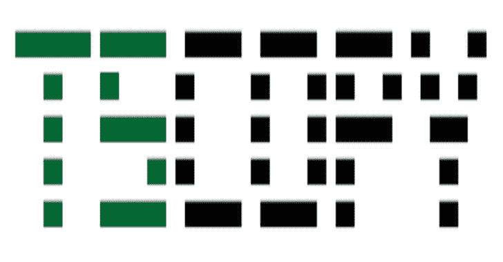

# Tscopy:解析 NTFS $MFT 文件以定位和复制特定文件的工具

> 原文：<https://kalilinuxtutorials.com/tscopy/>

**Tscopy** 是事件响应(IR)合约期间的一项要求，以便能够分析文件系统上的文件。有时，这些文件会被操作系统(OS)锁定，因为它们正在使用中，这对于事件日志和注册表配置单元来说尤其令人沮丧。

它允许以管理员权限运行的用户通过解析文件系统中的原始位置并复制它们来访问锁定的文件，而无需询问操作系统。

还有其他工具可以执行类似的功能，比如我们已经使用过的 RawCopy，它是这个工具的基础。然而，RawCopy 也有一些缺点，这些缺点促使我们开发 TScopy，包括性能、大小以及将它集成到其他工具中的能力。

本博客旨在介绍 TScopy，同时也寻求帮助。正如在所有软件开发中一样，一个工具用得越多，就能发现越多的边缘案例。我们要求人们试用该工具，并报告任何错误。

**什么是 TScopy？**

TScopy 是一个 Python 脚本，用于解析 NTFS $MFT 文件以定位和复制特定文件。通过解析主文件表(MFT)，该脚本绕过操作系统对文件的锁定。这个剧本最初是根据 RawCopy 的作品改编的。RawCopy 是用 AutoIT 编写的，很难根据我们的目的进行修改。之所以决定将 RawCopy 移植到 Python，是因为需要将这一功能原生集成到我们的工具集中。

TScopy 设计为作为独立程序运行或作为 python 模块包含。python 的实现利用了在[https://github.com/williballenthin/python-ntfs](https://github.com/williballenthin/python-ntfs)找到的 python-ntfs 工具。TScopy 构建在 python-ntfs 的基本功能之上，将每个文件的位置与原始磁盘隔离开来。

**是什么让 TScopy 与众不同？**

TScopy 是用 Python 编写的，并被组织成类，使其比 AutoIT 更易维护和阅读。AutoIT 可能会被反病毒或检测软件标记为恶意软件，因为一些恶意软件已经利用了它的潜力。

TScopy 和 RawCopy 之间的主要区别是每次执行复制多个文件的能力，以及缓存文件结构的能力。如下图所示，TScopy 可以选择下载单个文件、多个逗号分隔的文件、目录内容、通配符路径(单个文件或目录)和递归目录。

TScopy 在迭代目标文件的完整路径时缓存每个目录和文件的位置。然后，它使用此缓存优化对任何其他文件的搜索，确保未来的文件复制执行得更快。这是 RawCopy 的一个显著优势，RawCopy 遍历每个文件的整个路径

**t 复制选项**

**。\TScopy_x64.exe -h
用法
ts copy _ x64 . exe-r-o c:\test-f c:\ users \ ts copy \ ntuser.dat
描述:仅将 ntuser . dat 文件复制到 c:\ test 目录
ts copy _ x64 . exe-o c:\ test-f c:\ Windows \ system32 \ config
描述:复制 config 目录中的所有文件，但不复制其下的目录。
ts copy _ x64 . exe-r-o c:\ test-f c:\ Windows \ system32 \ config
描述:复制 config 目录下的所有文件和子目录。
ts copy _ x64 . exe-r-o c:\ test-f c:\ users * \ ntuser*，c:\Windows\system32\config 描述:使用通配符和列表复制用户帐户下以 ntuser 开头的任何文件，并递归复制注册表配置单元。通过解析 MFT 复制受保护的文件。必须以管理员权限运行可选参数:-h，–help 显示此帮助消息并退出-f FILE，–FILE FILE 要复制的文件或目录的完整路径。文件名可以以逗号'，'分隔的列表进行分组。接受通配符“*”。
-o OUTPUTDIR，–output dir output dir
也是复制文件的目录。复制将保留路径
-i，–ignore _ saved _ ref _ nums
脚本将参考号和路径信息存储到
以加速内部运行。该选项将忽略并且不
保存存储的 MFT 参考号和路径
-r，–递归递归复制目录。注意这只适用于
目录。**

有一个隐藏选项'–debug '，用于启用调试输出。

**例题**

**ts copy _ x64 . exe-f c:\ windows \ system32 \ config \ SYSTEM-o e:\ output di**r

将系统注册表复制到 e:\outputdir。新文件将位于 e:\ output dir \ windows \ system32 \ config \ SYSTEM

**ts copy _ x64 . exe-f c:\ windows \ system32 \ config \ SYSTEM-o e:\ output dir-I**

将系统注册表复制到 e:\outputdir，但忽略任何以前缓存的文件，并且不将当前缓存保存到磁盘

**ts copy _ x64 . exe-f c:\ windows \ system32 \ config \ SYSTEM，c:\ windows \ system32 \ config \ SOFTWARE-o e:\ output dir**

将系统和软件注册表复制到 e:\outputdir

**ts copy _ x64 . exe-f c:\ windows \ system32 \ config \-o e:\ output dir**

将目录配置的内容复制到 e:\outputdir

ts copy _ x64 . exe-r-f c:\ windows \ system32 \ config \-o e:\ output dir

递归地将目录 config 的内容复制到 e:\outputdir

**ts copy _ x64 . exe-f c:\ users * \ ntuser . dat-o e:\ output dir**

复制每个用户 NTUSER。DAT 文件到 e:\outputdir

**ts copy _ x64 . exe-f c:\ users * \ ntuser . dat *-o e:\ output dir**

For each users 复制所有以 NTUSER 开头的文件。数据到 e:\outputdi

**ts copy _ x64 . exe-f c:\ users * \ AppData \ Roaming \ Microsoft \ Windows \ Recent，c:\windows\system32\config，c:\ users * \ AppData \ Roaming \ Microsoft \ Windows \ PowerShell \ PSReadLine \ console host _ history . txt-o e:\ output dir**

对于每个用户，将所有跳转列表、注册表配置单元和 Powershell 历史命令复制到 e:\outputdi

**错误报告信息**

请在 GitHub 页面的问题部分报告错误。

**错误修复和改进**

版本 2.0

*   问题 1:更改 sys.exit 以引发异常
*   问题 2:文件的双重复制。全名和简称。
*   问题 3:增加了递归复制目录的能力
*   问题 4:添加对路径中通配符的支持。目前仅支持*
*   问题 5:删除了硬编码的 MFT 大小。MFT 大小由引导扇区决定
*   问题 6:将 TScopy 类转换为 singleton。这允许该类被实例化一次，并对所有副本重复使用当前的 MFT 元数据对象。
*   问题 7:现在正在处理属性类型 ATTRIBUTE_LIST。
*   问题 9:没有为文件处理属性类型 ATTRIBUTE_LIST。这导致了软件注册表配置单元等文件的静默失败。
*   变更:代码中添加了一般注释
*   更改:输入参数已更改。减少了三(3)个不同的选项–文件、–列表和–目录到文件。
*   变化:后端重组以支持新功能。

##### **待办事项:**

1.  添加对备用数据流(ADS)的支持
2.  验证对非 ascii 路径字符的支持

[**Download**](https://github.com/trustedsec/tscopy)