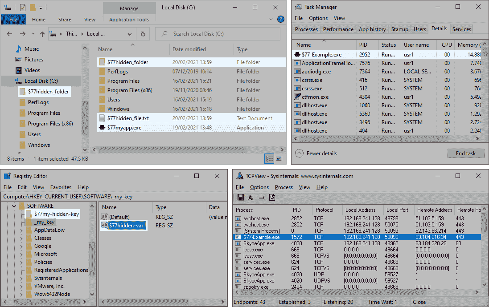
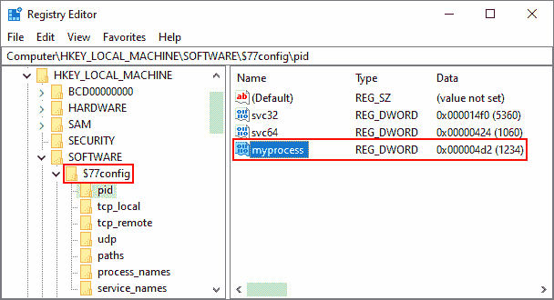
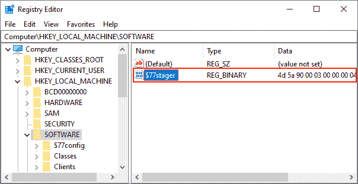
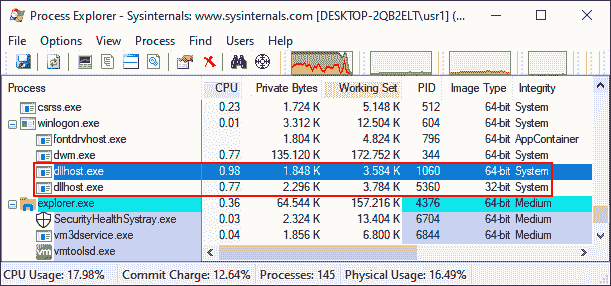

# R77 Rootkit:无文件环 3 Rootkit 与安装程序和持久性

> 原文：<https://kalilinuxtutorials.com/r77-rootkit/>

[](https://1.bp.blogspot.com/-BemkqnSqv5Y/YKvq-Zt6erI/AAAAAAAAJNA/84xl-2_UirgI3wiAIVOhEpzRXFui3e89gCLcBGAsYHQ/s728/R77%25281%2529.png)

R77 是一个 ring 3 Rootkit，它对所有进程隐藏以下实体:

*   文件、目录、连接、命名管道、计划任务
*   处理
*   CPU 使用率
*   注册表项和值
*   服务
*   TCP 和 UDP 连接

它兼容 x64 和 x86 版本的 Windows 7 和 Windows 10。

**通过前缀隐藏**

名称以`"$77"`开头的所有实体都被隐藏。



**配置系统**

动态配置系统允许通过 **PID** 和**名称**隐藏进程，通过**全路径**隐藏文件系统项，通过特定端口的 TCP & UDP 连接等。



配置存储在 **`HKEY_LOCAL_MACHINE\SOFTWARE\$77config`** 中，任何没有提升权限的进程都可以写入。该键的 DACL 设置为授予任何用户完全访问权限。

RegEdit 被注入 rootkit 时，`**$77config**`键被隐藏。

安装人员

r77 可以使用单个文件 **`"Install.exe"`** 进行部署。它安装在第一个用户登录之前启动的 r77 服务。这个后台进程注入所有当前正在运行的进程，以及以后产生的进程。需要两个进程来注入 32 位和 64 位进程。这两个进程都使用配置系统通过 ID 隐藏。

从系统中删除 r77，并优雅地从所有进程中分离 rootkit。

**子进程挂钩**

当一个进程创建一个子进程时，新的进程在运行它自己的指令之前被注入。当创建一个新的进程时，函数 **`NtResumeThread`** 总是被调用。因此，这是一个合适的挂钩目标。因为 32 位进程可以产生 64 位子进程，反之亦然，所以 r77 服务提供了一个命名管道来处理子进程注入请求。

此外，每 100 毫秒还会定期检查子进程挂钩可能遗漏的新进程。这是必要的，因为有些进程是受保护的，不能被注入，比如 services.exe。

**内存注入**

rootkit DLL**(`r77-x86.dll``r77-x64.dll`)**可以从内存注入进程，不需要存储在磁盘上。**反射 DLL 注入**用于实现这一点。DLL 提供了一个导出函数，当被调用时，加载 DLL 的所有部分，处理依赖关系的加载和重定位，最后调用 **`DllMain`。**

**无文件持久性**

rootkit 驻留在系统内存中，不会将任何文件写入磁盘。这是分多个阶段实现的。

**阶段 1:** 安装程序为 32 位和 64 位 r77 服务创建两个调度任务。一个预定的任务确实需要存储一个名为`**$77svc32.job**`和`**$77svc64.job**`的文件，这是无文件概念的唯一例外。然而，一旦 rootkit 运行，计划任务也会被前缀隐藏。

使用以下命令行启动计划任务`**powershell.exe**`:

```
[Reflection.Assembly]::Load([Microsoft.Win32.Registry]::LocalMachine.OpenSubkey('SOFTWARE').GetValue('$77stager')).EntryPoint.Invoke($Null,$Null)
```

该命令是内联的，不需要. ps1 脚本。给你。利用 PowerShell 的. NET Framework 功能从注册表加载 C#可执行文件并在内存中执行。因为命令行的最大长度是 260 (MAX_PATH)，所以空间只够执行一个简单的 **`Assembly.Load().EntryPoint.Invoke()`。**



**Stage 2:** 被执行的 C#二进制是 stager。它将使用进程中空化创建 r77 服务进程。r77 服务是分别以 32 位和 64 位编译的本机可执行文件。父进程是伪造的，并被设置为 winlogon.exe 以增加模糊性。此外，这两个进程被 ID 隐藏，在任务管理器中不可见。



没有可执行文件或 DLL 存储在磁盘上。stager 存储在注册表中，并从其资源中加载 r77 服务可执行文件。

PowerShell 和。NET 依赖关系存在于 Windows 7 和 Windows 10 的全新安装中。有关无文件初始化的完整描述，请查看[文档](https://bytecode77.com/downloads/r77%20Rootkit%20Technical%20Documentation.pdf)。

**挂钩**

Detours 用于挂钩`ntdll.dll`中的几个函数。这些低级系统调用包装器由任何 T2 WinAPI 或框架实现调用。

*   NtQuerySystemInformation
*   NtResumeThread
*   NtQueryDirectoryFile
*   NtQueryDirectoryFileEx
*   NtEnumerateKey
*   NtEnumerateValueKey
*   EnumServiceGroupW
*   EnumServicesStatusExW
*   NtDeviceIoControlFile

唯一的例外是 **`advapi32.dll`。**两个函数被挂钩来隐藏服务。这是因为实际的服务枚举发生在 services.exe，不能被注入。

**测试环境**

测试控制台可用于将 r77 注入单个进程或从单个进程中分离 r77。

[**Download**](https://github.com/bytecode77/r77-rootkit)