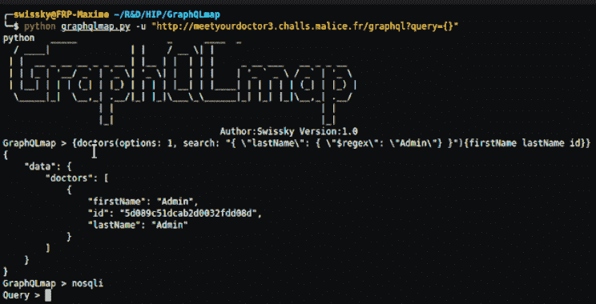

# GraphQLmap:一个脚本引擎，用于与 Graphql 端点进行交互，以进行测试

> 原文：<https://kalilinuxtutorials.com/graphqlmap/>

GraphQLmap 是一个脚本引擎，用于与 graphql 端点进行交互以进行测试。

**安装**

**$ git 克隆 https://github.com/swisskyrepo/GraphQLmap
$ python graphqlmap . py
*_*
/*| |/_ |*_ _*_ | |*| '/*`| '_ | '_ | | | | | | '_`*\/*` | '*\ | | | |(*| | |*)| | | | |*| | | |*| _*| _*， *|。 /|*| |*| _ _*| _ _ _ _ _ _ _ |*| |*| |*| _*， *|。_*/
| | | |
| |*| |*|
作者:Swissky 版本:1.0
用法:graphql map . py[-h][-u URL][-v[VERBOSITY]][–METHOD]][–HEADERS[HEADERS]]
可选参数:
-h，–help 显示此帮助消息并退出
-u 要查询的 URL:example.com/graphql?query={}
-v[VERBOSITY**

**特征和示例**

示例基于 HIP2019 的几个 CTF 挑战。

**连接到 graphql 端点**

**python 3 graph qlmap . py-u https://your hostname . com/graph QL-v–method post–headers " { " authorization ":" bearer eyjhbgcioijihuzi 1 niisinr 5 CCI 6 ikpvcj 9 . eyj 0 zxh 0 ijoibm 8 vjcmv 0 cyzjlid 1 Qin 0 . jqdoesc-R4 ltos 9 h0 和 7bIq-M8AGYjK92x4K3hcBA6o"} "**

**转储一个 GraphQL 模式**

使用`dump_new`转储 GraphQL 模式，该函数将自动使用找到的字段填充“自动完成”。

**GraphQLmap>dump _ new
= = = = = = = = = = = = = =[SCHEMA]= = = = = = = = = = = = = =
例如:name【Type】:arg(Type！)
查询
医生[]:邮箱(字符串！)，
医生【医生】:
患者【患者】:
患者[]: id (ID！)，
allrendezvous[Rendezvous]:
Rendezvous[]:ID(ID！)，
医生
id[ID]:
名[字符串]:
姓[字符串]:
专科[字符串]:
患者[无]:
集合点[无]:
邮箱[字符串]:
密码[字符串]:
[…]**

**与 GraphQL 端点进行交互**

编写一个 GraphQL 请求并执行它。

**GraphQLmap>{医生(选项:1，搜索:" { \ "姓氏\": { \"$regex\": \ "管理\ " } } " {名字姓氏 id}}
{
"数据":{
"医生":[
{
"名字": "管理"，
" id ":" 5d 089 C5 1d cab 2d 0032 FDD 08 "，
"姓氏":"管理"
} 【T9**

**GraphQL 字段模糊化**

使用`GRAPHQL_INCREMENT`和`GRAPHQL_CHARSET`模糊参数。

GraphQLmap > {doctors(options: 1，搜索:" { \ "姓氏\": { \"$regex\": \"AdmiGRAPHQL _ CHARSET \ " } " { first name last name id } }
[+]查询:(45) {doctors(options: 1，搜索:" { \ "姓氏\ ":{ \ " $ regex \ ":\ " Admi！\ " } } " {名字姓氏 id}}
[+]查询:(45){医生(选项:1，搜索:" { \ "姓氏\ ":{ \ " $ regex \ ":\ " Admi $ \ " } } " {名字姓氏 id}}
[+]查询:(45){医生(选项:1，搜索:" { \ "姓氏\ ":{ \ " $ regex \ ":\ " Admi % \ " }){名字姓氏 id}}
[+]查询:(45){医生(选项:查询 搜索:" { \ "姓氏\": { \"$regex\": \"Admi * \ " } } " {名字姓氏 id}}
[+]查询:(45){医生(选项:1，搜索:" { \ "姓氏\ ":{ \ " $ regex \ ":\ " Admi+\ " } } " {名字姓氏 id}}
[+]查询:(45){医生(选项:1，搜索:" { \ "姓氏\ ":{ \ " $ regex \ ":\ " Admi，\ " } } " {名字姓氏 \ " } } " {名字姓氏 id}}
[+]查询:(45){医生(选项:1，搜索:" { \ "姓氏\ ":{ \ " $ regex \ ":\ " Admi/\ " } } " {名字姓氏 id}}
[+]查询:(45){医生(选项:1，搜索:" { \ "姓氏\ ":{ \ " $ regex \ ":\ " Admi 0 \ " }){名字姓氏 id}}
[+]查询:(45){医生\ " } } " { first name last name id } }
[+]Query:(206){ doctors(options:1，search:" { \ " last name \ ":{ \ " $ regex \ ":\ " Admin \ " } } " { first name last name id } }

**诺舒利注射液**

在`**nosqli**`函数的查询中使用`**BLIND_PLACEHOLDER**`。

**GraphQLmap > nosqli
查询>{医生(选项:" {\"\"patients.ssn\":1} "，搜索:" { \ " patients . SSN \ ":{ \ " $ regex \ ":\"^blind_placeholder\"}，\ "姓氏\":\"Admin\ "，\ " first name \ ":\ " admin \ " } " { id，firstName}}
检查>5d 089 C5 1d cab 2d 0032 FDD 08d
charset>0123456789 abcdef**

**SQL 注入**

**graphql map>PostgreSQL Li
graphql map>mysqli
graphql map>mssqli**

[**Download**](https://github.com/swisskyrepo/GraphQLmap)