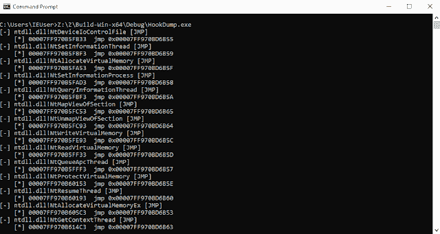

# HookDump:安全产品挂钩检测

> 原文：<https://kalilinuxtutorials.com/hookdump/>

**HookDump** 是一款安全产品挂钩检测工具。

**建筑来源**

*   为了构建它，你需要 Visual Studio 2019(社区版)和 CMake。批处理文件 Configure.bat 将使用 Visual Studio 解决方案创建两个构建目录。
*   该项目可能会建立与 MinGW 与正确的 CMake 命令行，这是未经测试的 YMMV。
*   zydis 反汇编程序有依赖关系，所以在配置项目之前，一定要更新 git 中的子模块。
*   有一个 32 位和 64 位的项目，你可能会发现 EDR 的钩子在 32/64 位不同的功能，所以建立和运行这两个可执行文件可能会提供更完整的结果

**注释**

*   一些 edr 替换了 TEB 结构中的 WOW 存根(特别是 Wow32Reserved ),以便挂钩 32 位二进制文件的系统调用。在这种情况下，您可能会看到零挂钩，因为 NTDLL 中没有跳转指令。最有可能在 x64 版本中看到钩子，因为 syscall 指令用于系统调用，而不是 WOW 存根
*   我们已经注意到 Windows Defender 不使用任何用户模式挂钩
*   该工具设计为作为标准用户运行，不需要提升权限

**检测到的挂钩类型**

**JMP**

跳转指令已被修补到函数中，以重定向执行流

**哇**

检测被挂钩的 WOW64 syscall 存根，这允许过滤所有系统调用

**吃**

导出地址表中的地址与光盘副本中的导出地址表中的地址不匹配

**GPA**

GetProcAddress hook，一个实验性的特性，这只是在 verbose 模式下输出，当 GetProcAddress 的结果与手动解析的函数地址不匹配时。YYMV 与此，并应采取一些小心，以验证结果。

**验证**

真正验证程序正确运行的唯一方法是检查调试器中是否存在钩子。如果你得到一个零钩子的结果，并期望看到一些不同的东西，那么首先在调试器中验证这一点，并请与我们联系。

[**Download**](https://github.com/zeroperil/HookDump#wow)