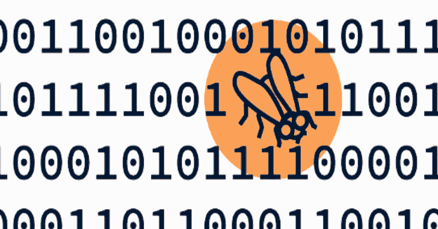

# bb Scope:hacker one、Bugcrowd 和 Intigriti 的范围收集工具

> 原文：<https://kalilinuxtutorials.com/bbscope/>

Bbscope，sw33tLie 为 HackerOne、Bugcrowd 和 Intigriti 提供的终极范围收集工具。需要清理你的 bug bounty 平台上所有的大范围域名吗？这是这项工作的合适工具。获得一份允许你测试的 android 应用程序列表怎么样？我们也会保护你。

逆向工程神？别担心，你也可以得到一个二进制文件列表来分析。

**安装**

确保你的系统上安装了最新版本的 Go 编译器。然后运行:

**go 111 module = on go get-u github.com/sw33tLie/bbscope**

**用途**

**bb scope(h1 | BC | it)-t<session-token><其他-flags >**

如何获取会话令牌:

*   HackerOne:登录，然后抓取 **`__Host-session`** cookie
*   Bugcrowd:登录，然后抓取`**_crowdcontrol_session**` cookie
*   Intigriti:登录，然后拦截一个发送给 api.intigriti.com 的请求，并查找`**Authentication: Bearer XXX**`头。XXX 是你的令牌

请记住，您可以使用–help 标志来获取所有标志的描述。

**例题**

下面你会发现一些命令的例子。请记住，它们都与 Bugcrowd 和 Intigriti 子命令(`**bc**`和`**it**`)一起工作，而不仅仅是与`**h1**`一起工作。

**打印您所有提供奖励的 HackerOne 计划的所有范围内目标**

**bb scope h1-t<YOUR _ TOKEN>-b-o t**

输出将如下所示:

**app.example.com
* . user . example . com
* . demo . com
www.something.com**

**打印您所有提供奖励的私人黑客计划的所有范围内目标**

**bb scope h1-t<YOUR _ TOKEN>-b-p-o t**

**打印您所有 HackerOne 程序中所有范围内的 Android APKs】**

**bb scope h1-t<YOUR _ TOKEN>-o t-c Android**

**使用额外数据打印所有 HackerOne 程序中的所有范围内目标**

**bb scope h1-t<YOUR _ TOKEN>-o tdu-d "，"**

这将打印来自所有 HackerOne 程序(包括公共程序和 vdp)的范围内目标的列表，但在同一行上，它还将打印目标描述(如果可用)和程序的 URL。它可能看起来像这样:

**something.com，某事的主要网站，https://hackerone.com/something
* . demo . com，Demo 拥有的所有资产都在范围内，https://hackerone.com/demo**

**获取您的黑客私人程序的程序 URLs】**

**bb scope h1-t<YOUR _ TOKEN>-o u-p | sort-u**

您将得到如下列表:

**https://hackerone.com/demo
https://hackerone.com/something**

**小心范围异常**

在理想的情况下，所有程序都以相同的方式使用作用域内表来清楚地显示作用域内的内容，并使解析变得容易。不幸的是，情况并非总是如此。

有时，资产被分配了错误的类别。例如，如果你使用`**-c url**`跟踪 URL，使用 **`-c all`** 仔细检查通常是个好主意。

其他时候，在 HackerOne 上，您会发现目标写在作用域描述中，而不是作用域标题中。有几个程序可以做到这一点:

*   [威瑞森媒体](https://hackerone.com/verizonmedia/?type=team)
*   [Mail.ru](https://hackerone.com/mailru)

如果你也想 grep 那些 URL，你**必须**在打印选项标志 **( `-o`)中包含 **`d`** 。**

有时会变得更奇怪: [Spotify](https://hackerone.com/spotify) 使用范围内表的标题来列出通配符，但随后在目标描述中列出实际范围内的子域。

人类的思维是怪异的，这个工具并不试图解析无意义的东西，你将不得不手动地做那件事(或者打扰能做这种改变的人，也许？).

[**Download**](https://github.com/sw33tLie/bbscope)