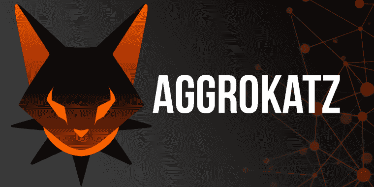

# Aggrokatz:“钴击”的入侵者插件扩展，使 Pypykatz 能够远程连接信标

> 原文：<https://kalilinuxtutorials.com/aggrokatz/>

`**aggrokatz**`是对 **[`CobaltStrike`](https://www.cobaltstrike.com/)** 的入侵者插件扩展，它使 **[`pypykatz`](https://github.com/skelsec/pypykatz)** 能够与信标远程交互。
当前版本的 **`aggrokatz`** 允许 **`pypykatz`** 解析 LSASS 转储文件和注册表配置单元文件，提取存储的凭证和其他机密，无需下载文件，也无需上传任何可疑代码到信标(反正钴击已经在那里了)。在未来，这个项目旨在为秘密行动提供额外的功能，如搜索和解密所有 DPAPI 秘密/Kerberos/等等。

我们为这个工具发布发布了一个简短的 [`**blog post**`](https://r.sec-consult.com/aggrokatz) ，其中还包括一些截图。

**重要注意事项–请阅读此**

LSASS/注册表转储不是这个项目的目标，只是解析。原因:

*   多种倾倒技术已经从钴撞击(CS)开始实施，并广泛提供给公众。最近，我们转而使用修改后的 [`CredBandit`](https://github.com/xforcered/CredBandit) 版本，将原始字节转储到磁盘，而不是 base64。很酷的工具，看看吧。
*   我们想保密我们的倾倒技术。

在 CS 客户端中，不要使用“重新加载”,也不要尝试手动卸载然后重新加载脚本(如果您修改了它)。您必须卸载它，关闭客户端并重新启动它，然后加载修改后的脚本。否则，你将有多个版本同时运行，大量的错误和奇怪的行为将会发生！在远程端解析 LSASS/注册表文件时，请不要与启动脚本的特定信标进行交互。通常这不会引起任何问题，但我不能给出任何保证。

**安装**

*   你将需要 **[`pycobalt`](https://github.com/dcsync/pycobalt)** 进行安装和设置。他们的 github 页面上有一个自述。
*   您将需要安装 **[`pypykatz`](https://github.com/skelsec/pypykatz/)** 版本必须是`**>=0.4.8**`
*   你需要钴击

**设置**

*   确保 pyco 的 **`aggressor.cna`** 文件已设置好，并且知道 python 解释器的位置
*   将 **`aggrokatz.cna`** 中的 pycobalt_path 改为指向`**pycobalt.cna**`
*   在 CS 中使用`**View > Script Console**`和`**Cobalt Strike > Script Manager**`窗口。使用`**Script Manager**`加载 **`aggkatz.cna`** 脚本。

**用途**

*   如果`**aggkatz.cna**`脚本加载成功，右键单击信标时会出现一个新的菜单项`**pypykatz**`。
*   在解析过程中，您将在`**Script Console**`窗口中看到调试消息。
*   解析完成后，结果将显示在`**Script Console**`窗口和信标自己的窗口中。

**LSASS 转储解析菜单参数**

*   `**LSASS file**`:远程计算机上`**lsass.dmp**`文件的位置。您也可以使用 UNC 路径通过 SMB 访问共享的`**lsass.dmp**`文件
*   `**chunksize**`:一次读取的最大数量
*   **`BOF file`** :允许分块读取的 BOF 文件(信标对象文件)。每当读取一个新的块时，这个文件将被上传并执行(在内存中)。
*   `**(module)**`:指定要解析哪些模块。默认:`**all**`
*   `**Output**`:指定输出格式
*   `**Populate Credential tab**`:成功解析后，所有获得的凭证都将出现在 Cobalt Srike 的凭证选项卡上。这项功能还在测试阶段
*   `**Delete remote file after parsing**`:成功解析后，LSASS 转储文件将从目标中移除

**注册表转储解析菜单参数**

*   `**SYSTEM file**`:**`SYSTEM.reg`**文件在远程计算机上的位置。您还可以使用 UNC 路径通过 SMB 访问共享文件
*   `**SAM file (optional)**`:远程计算机上`**SAM.reg**`文件的位置。您还可以使用 UNC 路径通过 SMB 访问共享文件
*   `**SECURITY file (optional)**`:远程计算机上`**SECURITY.reg**`文件的位置。您还可以使用 UNC 路径通过 SMB 访问共享文件
*   `**SOFTWARE file (optional)**`:远程计算机上`**SOFTWARE.reg**`文件的位置。您还可以使用 UNC 路径通过 SMB 访问共享文件
*   `**chunksize**`:一次读取的最大数量
*   `**BOF file**`:允许分块读取的 BOF 文件(信标对象文件)。每当读取一个新的块时，这个文件将被上传并执行(在内存中)。
*   **`Output`** :指定输出格式

**限制**

文件读取 BOF 目前支持高达 4Gb 的文件读取。这可以通过一些修改来扩展，但是到目前为止还没有观察到如此大的文件。

**工作原理**

**TL；博士**

通常`**pypykatz**`的解析器在磁盘上执行一系列文件读取操作，但是在 aggrokatz 的帮助下，这些读取操作使用特制的 BOF(信标对象文件)隧道传输到信标，这允许成块地读取远程文件内容。这允许`**pypykatz**`从远程文件中提取所有秘密，而不需要读取整个文件，只需要抓取秘密所在的必要块。

**深入**

为了全面了解整个过程，我们需要强调两个部分:

*   **`pypykatz`** 如何与 **`CobaltStrike`** 集成
*   **`pypykatz`** 如何在不读取整个文件的情况下执行凭证提取。

**pypykatz 集成到 CobaltStrike**

CobaltStrike (agent)是用 Java 写的，pypykatz 是用 python 写的。这是一个问题。幸运的是，一个未知的实体已经创建了 **[`pycobalt`](https://github.com/dcsync/pycobalt)** ，它在两个世界之间提供了一个整洁的接口，并提供了可以直接从 python 调用的有用的 API。尽管`**pycobalt**`是一项了不起的工程，但我们需要指出它的一些问题/缺点:

*   关于信任`**pycobalt**`项目:

*   我们试图联系作者，但没有得到回复。
*   我们不能保证`**pycobalt**`项目在未来会被维持。
*   我们不能控制**`pycobalt`**发展的任何方面。

2.  关于观察到的技术问题:

*   通常在`**pycobalt**`和`**CobaltSrike**`之间会有一些编码问题。这会导致一些 API 调用返回无法使用的字节，因为有些字节会被编码器损坏。通过检查代码，我们得出结论，大多数编码/解码问题是因为`**pycobalt**`使用 STDOUT/STDIN 与 Java 进程通信
*   具体来说，对这个项目至关重要的 [`**bof_pack**`](https://www.cobaltstrike.com/aggressor-script/functions.html#bof_pack) API 调用必须作为纯攻击者脚本来实现，并且只能使用基本数据结构(string 和 int)从 python 中调用，而不能使用字节。
*   只有`**pycobalt**`包提供的阻塞 API，没有线程支持。好吧，至少我们观察到线程随机中断，但我们有点期待这个。
*   阻塞 API +无线程+依赖回调=我们不得不采用一些奇怪的方法来纠正它。

**对一叠卡片进行凭证解析**

**`pypykatz`** 和它的同伴模块 **`minidump`** 必须被修改，以允许比以前实现的更有效的分块解析，但这是另一天的主题。
在`**pypykatz**`能够通过`**pycobalt**`与`**CobaltStrike**`接口后，下一步是允许分块文件读取。遗憾的是，这个特性在我们见过的任何 C2 解决方案中都是默认不可用的，所以我们必须实现它。我们解决这个问题的方法是通过使用`**CobaltStrike**`的[信标对象文件接口](https://www.cobaltstrike.com/help-beacon-object-files)，简称 BOF 来实现分块读取。BOF 是运行在信标上的 C 程序，不是作为一个单独的可执行文件，而是作为已经运行的信标的一部分。这个接口非常有用，因为它使得 BOF 更加隐蔽，因为所有的代码都在内存中执行，没有任何东西被写入磁盘。
我们的 BOF 解决方案是一个简单的函数，有 4 个参数:

*   `**fileName**`:LSASS 转储文件或注册表配置单元的完整文件路径(在远端)
*   `**buffsize**`:从文件中读取的量(以字节为单位)
*   **`seekSize`** :文件读取操作应该开始的位置(从文件的开头)
*   `**rplyid**`:包含在回复中的标识号，以避免可能的冲突

使用这些参数， **`pypykatz`** (在代理上运行)可以在信标(目标计算机)上发出文件读取操作，这些操作专门针对文件的某些部分。
在另一端(在 CobaltStrike 中) **`aggrokatz`** 注册一个回调来监听目标信标返回的每一条消息。如果消息的报头与文件读取操作的报头相匹配，它将被作为一个 **`minidump`** 文件的块进行处理，并将被分派给`**minidump**`解析器，解析器将把结果分派给 **`pypykatz`。**在需要更多读取的情况下，`**pypykatz**`将使用`**minidump**`读取器发出读取，该读取器将通过 BOF 接口在信标上发送新的读取命令。这个过程重复进行，直到文件被解析。

**结果**

在使用这种方法解析了大约 100 个 LSASS 转储之后，我们可以得出以下结论(使用的块大小为 20k):

*   根据 LSASS 转储文件的大小(我们的转储文件在 40Mb 到 300Mb 之间),平均来说，所有的秘密都可以用 3，5Mb 来提取。请注意，这个数字不取决于 LSASS 转储的大小，而是取决于机密的数量和您选择要解析的包的数量。
*   一次成功的解析平均需要 250 次读操作。
*   解析时间只取决于你的抖动/睡眠配置，所以测量它是没有意义的。

**弊端**

*   对于每个读取操作，需要将 BOF 上传到信标。(我们私下希望 CobaltSrike 的某个人会看到这篇文章，并决定默认实现基本的文件读取操作，这样我们就可以跳过使用这个解决方案)。
*   如果使用抖动/休眠非常大的信标，读取操作的数量可能会有问题。

[**Download**](https://github.com/sec-consult/aggrokatz)