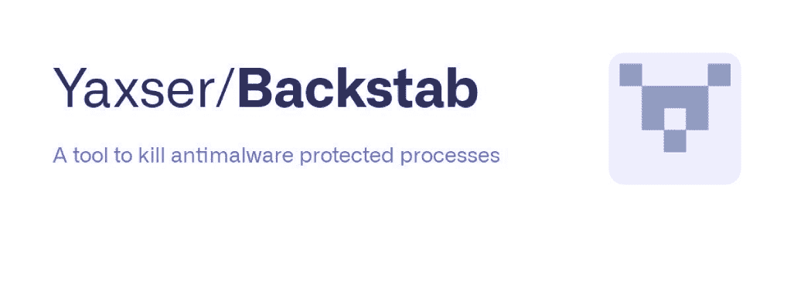

# 背刺:杀死反恶意软件保护进程的工具

> 原文：<https://kalilinuxtutorials.com/backstab/>

**背刺**是杀死反恶意软件保护进程的工具。

**杀死 EDR 保护的进程**

有这些本地管理证书，但 EDR 站在路上？脱钩或直接系统调用对 EDR 不起作用？为什么不直接杀了它？Backstab 是一个工具，能够通过利用 sysinternals 的 Process Explorer (ProcExp)驱动程序杀死反恶意软件保护的进程，该驱动程序由微软签署。

它能做什么？

**用法:backstab.exe<-n 名称|| -p PID >【选项】
-n，按名称选择进程，包括。exe 后缀
-p，通过 PID
-l 选择进程，列出受保护进程的句柄
-k，通过关闭其句柄
-x 杀死受保护进程，关闭特定句柄
-d，指定 ProcExp 将被提取到的路径
-s，指定服务名注册表项
-u，卸载 ProcExp 驱动程序
-a，添加 SeDebugPrivilege
-h， 打印此菜单
示例:
backstab.exe-n cyserver.exe-k【杀死 cyserver】
backstab.exe-n cyserver.exe-x E4C【关闭 cyserver 的句柄 E4C】
backstab.exe-n cyserver.exe-l【列出 cy server 的所有句柄】
backstab.exe-p 4326-k-d C:\ driver . sys【杀死 PID 为 4326 的受保护进程，将 ProcExp 驱动程序提取到 C:\ drive】**

这怎么可能？

ProcExp 有一个签名的内核驱动程序，它在启动时加载，这允许它杀死即使作为管理员也不能杀死的句柄。当您使用 UI 时，您不能终止受保护的进程，但是您可以终止它的句柄，因为 ProcExp UI 指示内核驱动程序终止那些句柄。Backstab 做同样的事情，但是没有 UI 元素。

**跳**

这里是发生的事情的快速纲要

*   嵌入式驱动程序被放到磁盘上
*   HKEY _ LOCAL _ MACHINE \ SYSTEM \ current control set \ Services 下的注册表项已创建
*   获得特权 SE_PRIVILEGE_ENABLED 是因为需要加载驱动程序
*   使用 NtLoadDriver 加载驱动程序，以避免创建服务
*   创建的注册表项被删除(服务在执行期间不可见)
*   通过使用 DeviceIoControl 与驱动程序通信
*   对于句柄枚举，调用 NtQuerySystemInformation

**你还应该知道什么**

*   该工具的行为模仿了 ProcExp 的行为。ProcExp 将驱动程序放到磁盘上，在 HKEY _ LOCAL _ MACHINE \ SYSTEM \ current control set \ Services 下创建注册表项，调用 NtLoadDriver，然后删除该注册表项
*   您可以指定放置驱动程序的位置和服务名称
*   完成后，应用程序将卸载驱动程序。通过首先重新创建注册表项，然后调用 NtUnloadDriver 来卸载驱动程序
*   加载的驱动程序由 MS 签名
*   该进程不试图直接终止受保护的进程句柄，而是指示 ProcExp 驱动程序终止它们。你不会被指控试图篡改任何程序

[**Download**](https://github.com/Yaxser/Backstab#opsec)