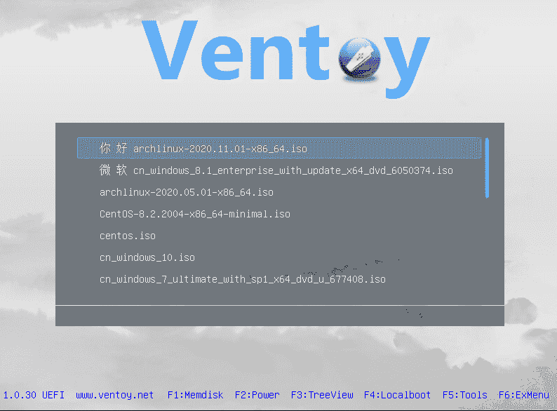
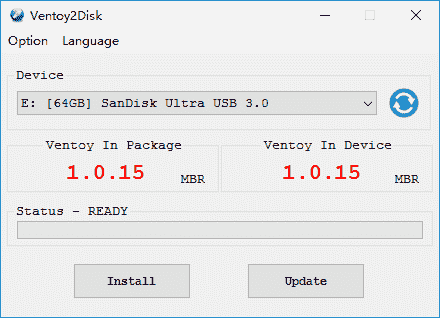
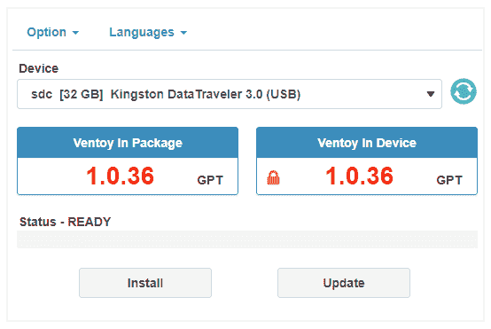

# Ventoy:一种新的可引导 USB 解决方案

> 原文：<https://kalilinuxtutorials.com/ventoy/>

Ventoy 是一款开源工具，可以为 ISO/WIM/IMG/VHD(x)/EFI 文件创建可启动的 USB 驱动器。
有了 ventoy，你不需要一遍又一遍地格式化磁盘，你只需要把镜像文件复制到 u 盘上，然后启动就可以了。你可以一次复制许多图像文件，ventoy 会给你一个引导菜单来选择它们。
x86 传统 BIOS，IA32 UEFI，x86_64 UEFI，ARM64 UEFI，MIPS64EL UEFI 支持方式相同。
MBR 和 GPT 分区风格都以同样的方式被支持。
支持大多数类型的操作系统(Windows/WinPE/Linux/Unix/Vmware/Xen…)
测试了 700 多个 ISO 文件([列表](https://www.ventoy.net/en/isolist.html))。支持 distrowatch.com[和](https://distrowatch.com/)90%以上的发行版。

**特性**

*   100%开源
*   简单易用
*   快速(仅受限于复制 iso 文件的速度)
*   可以安装在 USB/本地磁盘/SSD/NVMe/SD 卡中
*   直接从 ISO/WIM/IMG/VHD(x)/EFI 文件启动，不需要解压
*   对于 ISO/IMG 文件，不需要在磁盘中保持连续
*   支持 MBR 和 GPT 分区风格(1.0.15 以上)
*   支持 x86 传统 BIOS、IA32 UEFI、x86_64 UEFI、ARM64 UEFI、MIPS64EL UEFI
*   支持 IA32/x86_64 UEFI 安全引导(1.0.07+)
*   支持持久性(1.0.11+)
*   支持 Windows 自动安装(1.0.09 以上)
*   rhel 7/8/CentOS/7/8/SUSE/Ubuntu Server/Debian…支持自动安装(1.0.09 以上)
*   主分区支持 fat 32/exFAT/NTFS/UDF/XFS/ext 2(3)(4)
*   支持大于 4GB 的 ISO 文件
*   传统和 UEFI 的本机引导菜单样式
*   支持大多数类型的操作系统，测试了 700 多个 iso 文件
*   支持 Linux vDisk 引导
*   不仅引导，而且完成安装过程
*   菜单可在列表/树形视图模式之间动态切换
*   “Ventoy 兼容”概念
*   插件框架
*   将文件注入运行时环境
*   引导配置文件动态替换
*   高度可定制的主题和菜单
*   USB 驱动器写保护支持
*   USB 正常使用不受影响
*   版本升级期间数据无损
*   当新发行版发布时，不需要更新 Ventoy

**安装说明**

**将 Ventoy 安装到 USB 驱动器上**

**对于 Windows**

下载安装包，比如 ventoy-x.x.xx-windows.zip，解压。
运行`**Ventoy2Disk.exe**`，选择设备，点击安装或更新按钮。

**注释**

*   如果 Ventoy2Disk.exe 总是失败，你可以使用 Ventoy LiveCD，参考[注释](https://www.ventoy.net/en/doc_livecd.html)
*   Ventoy 可以安装在 USB 驱动器或本地磁盘上。为了防止误操作，Ventoy2Disk.exe 默认只列出 USB 驱动器。
    您可以切换`Show all devices`选项，然后将列出所有磁盘。但是这个时候你一定要非常小心，不要选错盘。
*   MBR/GPT 分区样式选项仅在安装期间使用，在更新期间将被忽略。
*   安装后，第一个分区将在 exFAT 中格式化，你可以手动用 FAT32/NTFS/UDF/XFS/Ext2/3/4 重新格式化它

**对于 Linux–GUI 模式**

**背景**

为了方便起见，Ventoy 从 1.0.36 开始在 Linux 系统中提供了基于 web 浏览器的 GUI。
UI 布局和用法与 Windows 中的 Ventoy2Disk.exe 没有区别。

**注意事项**:如果在 GUI 中遇到问题，可以使用 Ventoy2Disk.sh 安装或更新 Ventoy。参考用法

**截图**

**用于深井/UOS**

如果在使用这种方法时遇到问题，也可以将这种方法用于通用 linux。

*   **如何使用**

在终端中运行`**sudo sh VentoyWebDeepin.sh**`即可。

*   **如何关闭**

关闭弹出窗口或在终端中按 **`Ctrl + c`** 。

**通用 Linux 的使用**

*   **如何使用**

1.在终端
2 中运行`**sudo sh VentoyWeb.sh**`。打开浏览器并访问`**http://127.0.0.1:24680**`

提示:步骤 1 将在终端中打印 http 地址。在许多发行版中，你可以同时按下`**Ctrl**`并点击链接。

默认情况下，VentoyWeb.sh 监听 127.0.0.1:24680，只能在本地主机上访问。
你也可以像这样指定 IP 和端口`**sudo sh VentoyWeb.sh -H 192.168.0.100 -P 8080**`
然后你就可以从另一台电脑访问 WebUI。这在某些情况下非常方便。例如，您有一台装有 Linux 的计算机，但它没有 GUI 环境。您可以运行上面的脚本，并从另一台计算机(如 Windows)访问 WebUI，只要它们连接到互联网上。

*   **如何关闭**

*   关闭 web 浏览器
*   在终端中，按`**Ctrl + c**`退出

**对于 Linux–CLI 模式**

下载安装包，像 ventoy-x.x.xx-linux.tar.gz 和解压缩。
以 root 身份运行 shell 脚本`**sh Ventoy2Disk.sh { -i | -I | -u } /dev/XXX **` XXX 是 USB 设备，例如/dev/sdb。

**ventoy 2 disk . sh CMD[OPTION]/dev/sdX
CMD:
-我将 ventoy 安装到 sdX(如果磁盘已经安装了 ventoy 则失败)
-我强制将 Ventoy 安装到 sdX(无论是否安装)
-u 更新 sdX 中的 Ventoy
-L 列出 sdX 中的 Ventoy 信息
OPTION:(可选)
-r SIZE_MB 在磁盘底部保留一些空间(仅用于安装)
-s 启用安全引导支持**

**请注意，安装后 USB 驱动器将被格式化，所有数据都将丢失。**
你只需要安装一次 Ventoy，之后需要做的就是把 iso 文件复制到 USB 上。
你也可以把它当作普通的 USB 驱动器来存储文件，这不会影响 Ventoy 的功能。

**复制图像文件**

安装完成后，USB 驱动器将被分成 2 个分区。第一个分区是用 exFAT 文件系统格式化的(你也可以用 NTFS/FAT32/UDF/XFS/Ext2/3/4 手动重新格式化它…参见[注释](https://www.ventoy.net/en/doc_disk_layout.html))。你只需要把 iso 文件复制到这个分区。你可以把 iso/wim/img/vhd(x)文件放在任何地方。Ventoy 会递归搜索所有的目录和子目录，找到所有的镜像文件，并按字母顺序在引导菜单中列出。您还可以使用插件配置来告诉 Ventoy 只在一个固定的目录(及其子目录)中搜索图像文件。

**更新 Ventoy**

如果发布了新版本的 Ventoy，您可以将其更新到 USB 驱动器。
**需要注意的是，升级操作是安全的，第一个分区中的所有文件都将保持不变。**
升级操作与安装方式相同。如果 u 盘已经安装了 Ventoy，`**Ventoy2Disk.exe**`和 **`Ventoy2Disk`** `**.sh**`会提示您进行更新。

**编译指令**

1.  **编译环境
    我的构建环境是 CentOS 7.8 x86_64。所以在这里，我首先解释如何从头开始创建构建环境。
    因为 Ventoy 基于很多开源项目，所以环境很重要。建议你先在虚拟机上测试一下。
    1.1 安装 CentOS 7.8
    我使用 CentOS-7-x86 _ 64-Everything-2003 . iso 并选择最小安装
    1.2 安装包
    yum Install \
    libXpm net-tools bzip2 wget vim gcc gcc-c++ samba dos 2 UNIX glibc-devel glibc . i686 glibc-devel . i686 \
    mpfr . i686 mpfr-devel . i686**
2.  **下载源代码
    2.1 从 github 下载 Ventoy 源代码并解压。
    接下来，我假设您已经将代码解压到/home 目录中(查看/home/Ventoy-master/README.md 文件了解目录布局)。
    2.2 下载第三方源代码和工具
    https://www.fefe.de/dietlibc/dietlibc-0.34.tar.xz = = =>/home/Ventoy-master/DOC/diet libc-0.34 . tar . xz
    https://musl.libc.org/releases/musl-1.2.1.tar.gz = = =>/home/Ventoy-master/DOC/musl-1 . 2 . 1 . tar . gz
    https://ftp.gnu.org/gnu/grub/grub-2.04.tar.xz = = =>/home/Ventoy-master/grub 2/grub-2.04 . tar . xz
    https://code load . github . com/configure&&make install
    tar xf/opt/gcc-linaro-7 . 4 . 1-2019.02-x86 _ 64 _ aarch 64-Linux-GNU . tar . xz-C/opt
    tar xf/opt/aarch 64–uclibc–stable-2020.08-1 . tar . bz2-C/opt
    tar xf/opt/output . tar . bz2-C/opt【T23bashrc 和 relogin 作为 root**
3.  我做了一个 all_in_one.sh，你可以运行这个脚本来编译和打包 ventoy。如果想单独编译某一部分，可以继续参考本文后面的章节。CD/home/Ventoy-master/INSTALL sh all _ in _ one . sh 需要注意的是:
    1.  all_in_one.sh 中只有 grub2/EDK2/IPXE 会重新编译，其他部分包含二进制文件，修改很少，所以不会每次都重新编译。
        如果你愿意，你可以单独重建这些部件。
    2.  Ventoy 的某些部分有 32 位&64 位版本(如 4.9 4.10 4.11 以下)
        all_in_one.sh 只构建它们的 64 位版本，如果你想重建 32 位版本。您应该创建一个 32 位 CentOS 环境并构建它们。
        幸运的是这些部分很少修改，你只需要构建一次或者你可以直接使用我已经构建的二进制文件。
        另外，完全编译打包后，只能构建自己修改过的部分(例如 grub2)并运行 ventoy_pack.sh 生成包。
4.  **构建 Ventoy
    的每一部分 4.1 = = Build grub 2 = =
    CD/home/Ventoy-master/grub 2
    sh Build grub . sh
    4.2 = = Build IPXE . krn = =
    CD/home/Ventoy-master/IPXE
    sh Build IPXE . sh
    4.3 = = Build Ventoy2Disk.exe = =
    Ventoy2Disk.exe 是 Windows 平台中的安装程序。而且必须是用微软 Visual Studio (2013+版)在 Windows 下构建的。
    用 Visual Studio 打开/home/Ventoy-master/Ventoy 2 disk/Ventoy 2 disk . SLN 并构建。
    4.4 = = Build vtoyjump64.exe/vtoyjump32.exe = =
    vtoyjump64.exe/vtoyjump32.exe 用于在 windows PE 中挂载 iso 文件。您应该安装 Microsoft Visual Studio (2013+)来构建它。
    用 Visual Studio 打开/home/Ventoy-master/vtoy jump/vtoy jump . SLN 并构建(64 & 32)。
    4.5 == Build dmsetup ==
    请参考 DM setup/Build . txt
    4.6 = = Build Ventoy _ x64 . EFI = =
    CD/home/Ventoy-master/ed k2
    sh buildedk . sh
    4.7 = = Build VtoyTool = =
    CD/home/Ventoy-master/VtoyTool
    sh Build . sh
    4.8 = = Build vtoyfat = = = 复制 EXFAT/shared/mount . EXFAT-fuse = = =>/home/Ventoy-master/INSTALL/tool/mount . EXFAT-fuse _ 64
    使用相同的构建步骤在 32 位 CentOS 系统中构建 exfat-util 32bit 并获得 mkexfatfs_32 和 mount . EXFAT-fuse _ 32
    4.10 = = Build vtoy _ fuse _ iso _ 64/vtoy _ fuse _ iso _ 32 = =
    CD/home/vent sh build.sh
    使用相同的构建步骤在 32 位 CentOS 系统中构建并获得 unsquashfs _ 32
    4.12 = = Build v blade _ 64/v blade _ 32 = =
    CD/home/Ventoy-master/v blade/v blade-master
    sh Build . sh
    4.13 = = Build ZSTD cat = =
    请参考 ZSTD/Build . txt
    4.14 = = Build vto -f ventoy _ make file 64
    strip–strip-all xzminidec
    4.17 = = Build iso 9660 _ x64 . efi = =
    这个 EFI 驱动程序来自 https://github.com/pbatard/efifs
    遵循这个项目中的所有构建说明。 我修改了 3 个文件(原和修改的源码分别在/home/Ventoy-master/edk 2/efiffs)
    4.18 IMG/cpio/Ventoy/BUSYBOX/64h
    https://www . uclibc . org/downloads/binaries/0 . 9 . 30 . 1/mini-native-x86 _ 64 . tar . bz2
    https://busybox.net/downloads/busybox-1.32.0.tar.bz2
    使用 BUSYBOX/x86_64_ash.config 和 uclibc 构建 busybox-1/configure–disable-nls CC = ' diet gcc-nostdinc '
    make
    strip–strip-all LUN zip
    # AAR ch 64
    。/configure–disable-nls CC = ' AAR ch 64-build root-Linux-uclibc-gcc-static '
    make
    AAR ch 64-build root-Linux-uclibc-strip–strip-all LUN zip**
5.  Ventoy 安装包中有一些二进制文件。这些文件是从其他开源项目的网站上下载的，比如 busybox。
    下面是二进制文件及其 SHA-256 和下载网址的列表:
    5.1 IMG/cpio/ventoy/tool/LZ 4 cat
    https://create.stephan-brumme.com/smallz4 small Z4 cat-x32-v 1.4
    SHA-256:13d 293 ddeedb 469 f 51 da 41167 f 79 b 2 cbdb 904 e 681716 f 6 e 6e 6191 b 233 dbb 162438
    5.2 IMG/CpG
    INSTALL/ventoy/im Disk/64/im Disk . sys->sys/amd64/im Disk . sys SHA-256:670220220268787 e 361 F5 a 82 da e53362 c8 E6 c 6 DCD 240 bb 01 b 44 DD 77 AE 0788 da
    INSTALL/ventoy/im Disk/64/im Disk . exe->CLI/amd64/im Disk . exe SHA-256:977
    安装/EFI/BOOT/BOOTX64。EFI->EFI/BOOT/bootx 64。电喷 SHA-256:475552 c 7476 ad 45 e 42344 ee 8 b 30d 44 c 264d 200 AC 2468428 aa 86 fc 8795 fb6e 34
    INSTALL/EFI/BOOT/grubx 64 . EFI->EFI/BOOT/grubx 64 . EFI SHA-256:25d 858157349 DC 52 fa 70 F3 CDF 5c 62 Fe 1e 0 ba e37 ddfc 3a 6b 6

[**Download**](https://github.com/ventoy/Ventoy)