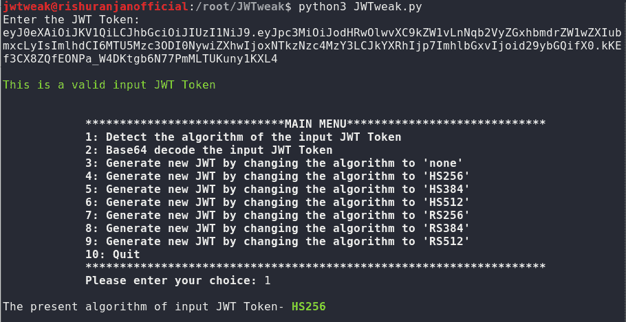

# JWTweak:检测输入 JWT 令牌的算法，并根据用户选择的算法提供生成新 JWT 令牌的选项

> 原文：<https://kalilinuxtutorials.com/jwtweak/>

JWTweak 是一个工具，用于检测输入 JWT 令牌的算法，并根据用户选择的算法提供生成新 JWT 令牌的选项。随着全球 JSON Web Token (JWT)使用的增加，攻击面也显著增加。话虽如此，该实用程序的设计目标是在很少或没有时间的情况下生成新的 JWT 令牌，这将有助于安全爱好者发现 JWT 实现中的安全缺陷。该工具旨在自动修改输入 JWT 令牌的 JWT 算法，然后根据新算法生成新的 JWT。

**要求**

*   Python 3(在 python-3.7.7/Kali 和 python-3.8.2/Windows 10 中测试并运行良好)
*   pip3 安装 pycryptodomex

**特性**

*   检测输入 JWT 令牌的算法
*   Base64 解码输入的 JWT 令牌
*   通过将输入 JWT 的算法更改为“无”来生成新的 JWT
*   通过将输入 JWT 的算法更改为“HS256”来生成新的 JWT
*   通过将输入 JWT 的算法更改为“HS384”来生成新的 JWT
*   通过将输入 JWT 的算法更改为“HS512”来生成新的 JWT
*   通过将输入 JWT 的算法更改为“RS256”来生成新的 JWT
*   通过将输入 JWT 的算法更改为“RS384”来生成新的 JWT
*   通过将输入 JWT 的算法更改为“RS512”来生成新的 JWT

**下载链接**

**JWTweak.py**

**概念验证**

[**Download**](https://github.com/rishuranjanofficial/JWTweak)