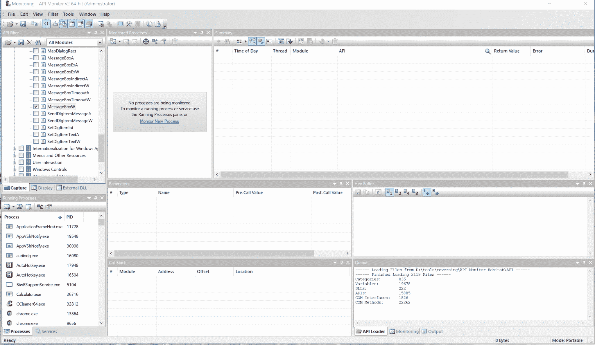

# UnhookMe:一个通用的 Windows API 解析器和 Unhooker 解决了从你的红队恶意软件内部调用不受监控的系统调用的问题

> 原文：<https://kalilinuxtutorials.com/unhookme/>

[](https://1.bp.blogspot.com/-ISN0E4Apmn0/XYMGP2A7rjI/AAAAAAAACiU/ZO6_gx25qaAutODJQ-9qyF784U4M3hKWwCLcBGAsYHQ/s1600/img01%2B%25281%2529.png)

是一个通用的 Windows API 解析器和解钩器，解决从红队恶意软件内部调用不受监控的系统调用的问题

在侵入式 AVs 和 EDRs 时代，它们会为运行过程引入热补丁以满足增强的光学要求，现代对手必须拥有强大的工具来穿过这些防护装置。提议的动态导入解析器的实现将能够在运行中解钩使用过的函数，这是朝着加强对手弹性努力的又一步。

我在这里提出的解决方案是从使用链接器解析的 WinAPI 导入，在编译后的可执行文件的 PE 头(特别是导入地址表)中保持可见，转向支持完全动态的方法，坚持只以动态方式解析导入。这种动态解算器可以配备在后台发生的脱钩逻辑，而无需来自操作员侧的任何种类的指导。

**展示区**



下面是 **`UnhookMe`** 的工作原理举例:

1.  它向我们展示了第一个不属于挂钩对象的`**MessageBoxW**`
2.  然后我们挂钩`**MessageBoxW**` prologue，让它总是返回 0 而不显示它的消息
3.  最后，我们使用`**UnhookingImportResolver**`解析器动态解析`**MessageBoxW**`，它将检测应用的序言补丁并恢复原始字节，有效地解除 **`MessageBoxW`** 功能。

在弹出消息框的同时，以下是打印到控制台标准输出的日志行:

**[~]解析符号 kernel32.dll！CreateFileA
[~]解析符号 kernel32.dll！ReadProcessMemory【kernel32.dll】[~]解析符号！MapViewOfFile
[~]解析符号 kernel32.dll！VirtualProtectEx
[#]在 symbol: MessageBoxW 中发现蹦床挂钩。已从文件中还原原始字节。
[~]解析符号 user32.dll！MessageBoxW**

### **怎么用？**

您的解决方案总共需要包含 5 个 C++源代码/头文件。然而，您的主程序文件只需要包含两个必需的头文件，如下所述。

*   `**resolver.h**`–包含大部分`**UnhookingImportResolver**`实现和方便的宏定义的头
*   `**resolver.cpp**`–定义了全局选项的源代码
*   `**usings.h**`–一个又大又脏的头文件，包含几十个常用 WinAPIs 的`using`类型定义
*   `**PE.cpp**`–自定义 PE 解析器源代码文件
*   `**PE.h**`–自定义 PE 解析器头文件

**必填表头**

您的程序只需要包含两个标题:

**# include " using s . h "
# include " resolver . h "**

**全局选项**

有几个全局选项可以更改，从而影响解析器工作或报告其活动的方式。这些都是在 **`resolver.cpp`** 文件的最开始定义的:

解析程序全局选项:

*   **`globalQuietOption`**–如果不想有任何输出，设置为真
*   **`globalVerboseOption`**–如果您想要详细的详细输出，请设置为 true
*   **`globalAntiSplicingOption`**–解钩已解析的函数。
*   **`globalLogFilePath`**–重定向输出日志行的位置。如果为空，选择 stdout。

**bool global quiet option = false；
bool globalVerboseOption = true；
bool globalsantisplingoption = true；
wchar _ t globalLogFilePath[MAX _ PATH]= L " "；**

**自定义 API 类型规范**

为了使用解析器，函数指针类型必须首先用严格形式的`using`语句声明:

```
using fn_FunctionName = ReturnType WINAPI (
    ParamType1 paramName1,
    ...,
    ParamTypeN paramNameN,
); 
```

这个库附带了 **`usings.h`** 头文件，包含数十种流行的 Windows APIs 的预定义使用类型。

*FunctionName* 将对应于我们想要让 ImportResolver 解析的 WINAPI，并且该函数指针必须被标记为具有 WinAPI 调用约定(x86 上的`**__stdcall**`和 x64 上的`**__fastcall**`)。 *ReturnType* 必须在`**WINAPI**`类型修饰符之前。

**功能解析及用法**

像上面指定的那样定义函数指针类型，我们将能够以下面的方式使用它:

**RESOLVE(libraryName，function name)；
ReturnType output = _ function name(param 1，…，paramN)；**

宏`**RESOLVE**`负责实例化`**ImportResolver**`模板化对象并调整指定库的名称。

Resolver 引入了几个更好的宏定义，便于在各种情况下调用构造函数:

# **define RESOLVE(mod，func) RESOLVE_PARAMETERIZED(mod，func，:globalVerboseOption，:globalAntiSplicingOption)
# define RESOLVE _ NO _ UNHOOK(mod，func) RESOLVE_PARAMETERIZED(mod，func，:globalVerboseOption，false)
# define RESOLVE _ VERBOSE _ UNHOOK(mod，func，true)RESOLVE _ PARAMETERIZED(mod，func，true，true)**

解析器的构造函数:

```
**template<typename Ret, typename ...Args>
ImportResolver<Ret WINAPI(Args...)>(
        std::string dllName,
        std::string funcName,
        bool _verbose = false,
        bool _unhook = false,
        bool *_wasItHooked = nullptr
    )**
```

它是如何工作的？

底层解析器利用自定义 PE 头解析器，该解析器处理每个被引用的 DLL 模块以映射它们的导出，并验证该模块的 PE 头完整性以及被引用函数的存根字节的完整性。

想法如下:

*   首先，如果不能通过`**GetModuleHandle**`到达，我们发出`**LoadLibrary**`来加载用户库(指定为`**RESOLVE**`宏的第一个参数)所引用的。
*   然后，我们处理加载/引用库的 PE 头，映射它的导出，检索导出地址数组，并自己计算这些地址以进行交叉验证。
*   如果在 DLL 的导出地址表中定义的一个例程的地址与我们期望的不一致，那么这个导出就被认为是 EAT hooked。同样，如果该函数的可执行导入地址表(IAT)条目被更改，不再指向 DLL 代码段中的正确位置，则该函数被认为是 IAT 挂钩的。
*   假设到目前为止没有发现钩子，我们获取函数序言的前 N 个字节，并将它们与存储在磁盘中的 DLL 文件中的内容进行比较。如果从内存和文件中获取的字节不一致，我们认为函数被内联修补(热修补)。
*   如果函数被认为是挂钩的——我们返回原始导出的地址(我们自己计算的)和/或解开条目。如果有补丁字节，我们将恢复它们。
*   最后，为了优化解析器的性能影响——我们缓存所有加载的模块图像库和解析的函数地址，并在后续命中时从缓存中返回它们。

这种动态解耦解析器面临的问题包括遍历转发的 API(一个 DLL 可能包含 Export thunk，说明这个函数没有在这个模块中实现，但它在另一个模块中实现)——尽管这个实现支持这个问题，但有时它会破坏它的遍历逻辑。

[**Download**](https://github.com/mgeeky/UnhookMe)