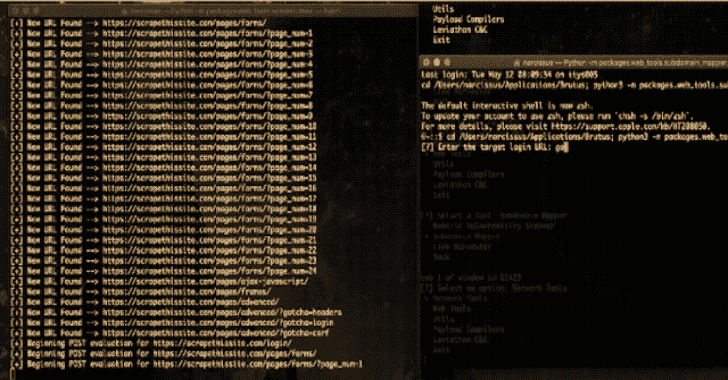

# Brutus:一个基于模块化和高度可扩展的多任务和多处理架构的教育开发框架

> 原文：<https://kalilinuxtutorials.com/brutus/>

**Brutus** 是一个教育开发框架，采用模块化、高度可扩展的多任务和多处理架构。

**简介**

寻找版本 1？查看此存储库中的分支。

Brutus 是一个用 Python 写的教育开发框架。它自动执行连接前和连接后基于网络的攻击，以及基于网络的侦察。作为一个轻量级框架，Brutus 旨在最大限度地减少对第三方的依赖。针对 Kali Linux 进行了优化，Brutus 也兼容 macOS 和大多数 Linux 发行版，具有完全交互式的命令行界面和多功能插件系统。

Brutus 具有高度可扩展的模块化架构。包含的漏洞(插件层)由几个在“任务层”上运行的解耦模块组成，任务层由线程池和线程安全的异步队列组成(以最适合给定模块的为准)。主线程运行在一个多处理池之上，该池管理应用程序上下文并调度新进程，因此任务可以在后台、在单独的 shells 中运行，等等。

UI 层也是解耦的和可扩展的。默认情况下，Brutus 附带了基于菜单的命令行界面 UI，但是没有理由不能为 GUI、参数解析器甚至 HTTP API 或远程过程调用添加适配器。

最后，Brutus 有一个实用程序层，具有文件系统操作、shell(终端仿真器)管理、持久性方法和系统元数据的通用功能。

如果您只是对一些 Python 黑客感兴趣，可以直接调用脚本——每个模块都可以独立调用。

**德莫斯**

网页扫描和有效负载编译演示:观看 mp4

**安装**

您可能需要以下依赖项:

*   sslstrip
*   pipenv

Brutus 针对 Kali Linux 进行了优化。网上有很多关于如何在 VM 中运行 Kali Linux 的信息。

要安装:

**管道安装**

**用途**

运行:

**pipenv run brutus**

测试:

**管道运行测试**

棉绒:

**pipenv 运行线头**

为开发设置 Git 挂钩:

**pipenv 运行设置**

请随意打开包含功能建议、错误修复等的 PRs。请注意，该项目的大部分内容仍在进行中。基础就在那里，等着你去建设。

**Brutus:特性和包含的模块**

Brutus 包括几个模块，可以概括为属于三个大类:*基于网络的*、*基于网络的*和*有效载荷*。后一类是编译器和附带有效载荷的库——有效载荷可以通过 Brutus 的交互式命令行菜单进行编译；编译后的有效载荷可以随后加载到 Brutus 的许多适用的基于网络的模块中。

Brutus 的基础层利用 POSIX 线程进行并发多任务处理。一些模块——即本质上任何与 I/O 紧密相关的模块——转而利用 Python 的异步 I/O 库，并在 Python 默认事件循环之上的抽象上运行。

**包含的实用程序/脚本**

*   IP 表管理
*   将 HTTPS 降级为 HTTP
*   启用监控模式
*   启用端口转发
*   键盘记录器

**文档**

**48 位 MAC 地址转换器(查看来源)**

**注意:**该工具适用于 48 位 MAC，具有%02x 默认字节格式。

MAC(媒体访问控制)是由设备制造商分配给网络接口的永久、物理且唯一的地址。举例来说，这意味着即使你的无线网卡也有它自己唯一的 MAC 地址。

MAC 地址类似于互联网上的 IP，在网络内使用，以便于资源和数据(即分组)的正确传送。交互通常由源 MAC 和目的 MAC 组成。MAC 地址可以识别您的身份、被过滤或以其他方式限制访问。

值得注意的是，这些唯一的地址不是短暂的；它们是持久的，如果用户将设备安装到另一台机器上，它们将保持与该设备的关联。但是这两者并不一定是密不可分的…

该模块将接受任何给定的无线设备和用户希望将所述设备重新分配到的任何有效的 MAC 地址作为用户输入。这个程序很简单，我不需要进一步解释:它利用子进程模块来自动执行必要的 shell 命令序列，以关闭无线接口、重新分配 MAC 并重新初始化它。

如果您正在主动更改您的 MAC 地址，谨慎的做法可能是使用某种验证结构或高阶方法来确保:1)无线设备存在；2)无线设备支持 MAC 地址；3)用户输入的 MAC 地址具有有效的格式；以及 4)无线设备的 MAC 地址已成功更新。这个工具自动化了这些功能。

通过选择“生成”选项代替特定的 MAC 地址，程序将根据 IEEE 规范生成一个有效的 MAC 地址。我很高兴实现了扩展功能，不仅可以生成完全随机的(有效的)MAC 地址，还可以生成以特定供应商前缀(OUI)开头的 MAC 地址，或者使用多播和/或 UAA 选项生成的 MAC 地址。这些选项在生成器方法中触发字节码逻辑，这是根据 IEEE 规范增加的。点击此处了解更多关于 MAC 地址的信息。

**【基于 ARP 的网络扫描器(查看来源)**

网络扫描器是另一个非常有用的工具，当与前面提到的 MAC 转换器结合使用时，它是一个强大的工具。该扫描器利用 ARP 请求功能，接受用户输入的有效 ipv4 或 ipv6 IP 地址，并附带可选的子网范围。

该程序然后获取给定的 IP 和/或范围，然后根据 IEEE 规范对它们进行验证(同样，该验证是针对 ipv4 和 ipv6 标准运行的)。最后，用给定的 IP 和生成的以太网帧实例化广播对象；这个对象向我们返回给定网络和伴随范围内所有连接设备的列表，将它们的 IP 映射到各自的 MAC 地址。

该程序输出一个具有这些关联的表，如果情况需要，该表可以用作 MAC 改变器的输入。

**自动 ARP 欺骗(查看来源)**

ARP 欺骗模块使我们能够通过同时操作给定目标客户端及其网络网关的 ARP 表来重定向给定网络中的数据包流。该模块在此过程中自动启用端口转发，并动态构造和发送 ARP 数据包。

当模块被用户终止时，目标的 ARP 表被重置，这样就不会让控制器处于危险的境地(另外，这是一件好事)。

因为该过程将控制器放置在客户端和 AP 之间的分组流的中间，所以控制器可以访问所有数据流(处理所述数据的潜在加密是另一个脚本的任务)。从这里开始，包流编排的无数选项变得显而易见:通过自动化和正则表达式的代码代理、强制重定向、远程访问等等。

**HTTP 数据包嗅探器(查看来源)**

数据包嗅探器是在运行 ARP 欺骗后使用的一个很好的模块；它创建了所有被拦截的 HTTP 数据包的数据流，包括 URL 或可能的用户凭证。

该脚本是可扩展的，可以通过用许多可用过滤器之一实例化监听器对象来适应各种协议。请注意，布鲁特斯自动降级 HTTPS，所以除非 HSTS 参与，数据流应该是可行的侦察。

[**Download**](https://github.com/MatthewZito/brutus)