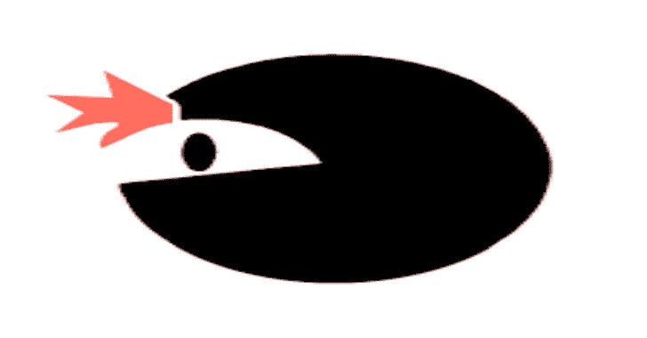

# Plution:使用无头 Chrome 的原型污染扫描仪

> 原文：<https://kalilinuxtutorials.com/plution/>

**Plution** 是一种通过 URL 有效负载大规模扫描易受客户端原型污染的页面的便捷方式。在默认配置中，它将使用一个硬编码的有效负载，可以检测这里记录的 11 种情况:https://github . com/black fan/client-side-prototype-pollution/tree/master/PP

**这不是什么**

这不是一站式商店。原型污染是一种复杂的野兽。这个工具不会做任何你手动不能做的事情。这不是一个经过打磨的无 bug 超级工具。它是功能性的，但是编码很差，最多被认为是 alpha 版本。

**工作原理**

Plution 将一个有效负载附加到提供的 URL，用 headless chrome 将 naviguates 添加到每个 URL，并在页面上运行 javascript 来验证原型是否被成功污染。

**如何使用**

*   基本扫描，仅输出到屏幕:
    `**cat URLs.txt | plution**`
*   使用提供的有效负载扫描，而不是硬编码的:
    `**cat URLs.txt|plution -p '__proto__.zzzc=example'**`
    **关于自定义有效负载的注意:您希望注入的变量必须被调用或呈现到“zzzc”。这是因为' window.zzzc '将在每个页面上运行，以验证污染。**
*   输出:
    `**Passing '-o' followed by a location will output only URLs of pages that were successfully polluted.**`
*   并发性:
*   `**Pass the '-c' option to specify how many concurrent jobs are run (default is 5)**`

[**Download**](https://github.com/raverrr/plution)