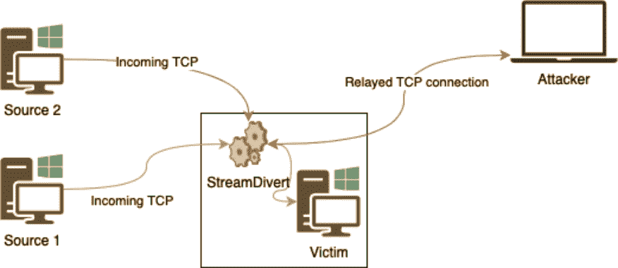

# StreamDivert:将(特定的)TCP、UDP 和 ICMP 流量重定向到另一个目标

> 原文：<https://kalilinuxtutorials.com/streamdivert/>

**StreamDivert** 是一个在系统上中间人或中继进出网络连接的工具。例如，它能够将端口 445 的所有传入 SMB 连接中继到另一台服务器，或者仅将来自一组特定源 IP 的特定传入 SMB 连接中继到另一台服务器。总而言之，StreamDivert 能够:

*   将特定端口的所有传入连接中继到另一个目的地。
*   将来自特定源 IP 的传入连接中继到另一个目的地的端口。
*   将传入连接中继到 SOCKS(4/5)服务器。
*   将特定端口的所有传出连接中继到另一个目的地。
*   将特定 IP 和端口的传出连接中继到另一个目标。
*   处理 IPv4 和 IPv6 上的 TCP、UDP 和 ICMP 流量。
*   通过特定的网络接口强制重定向数据包。

**下载二进制文件**

StreamDivert 的预编译二进制文件可以在这里下载。

**用法**

你如何使用 StreamDivert？以管理权限运行该工具:

**streamdivert.exe 配置文件[-f] [-v]**

配置文件包含您想要转移的流的条目。示例配置文件:

**//将来自 10.0.1.50 到 10.0.1.49 的所有入站 tcp 连接转移到端口 445 (SMB)端口 445
TCP<445 10 . 0 . 1 . 50->10 . 0 . 1 . 49 445
//将来自 10.0.1.51 到本地 SOCKS 服务器的所有入站 TCP 连接转移到端口 445(SMB)
TCP<445 从 fe80::f477:846a:775d:d37 到 fe80::20c:29ff:fe6f:88ff 端口 445
tcp<445 fe80::f477:846 a:775d:d37->fe80::20c:29ff:fe6f:88ff 445
//将所有到端口 445 (SMB)的入站 TCP 连接转移到 10.0.1.48 端口 444 到 10.0.1.49 端口 53
UDP<53 0 . 0 . 0 . 0->10.0.1.49 53
//将来自 10.0.1.50 到 10 . 0 . 1 . 49 的所有入站 ICMP 数据包转移到 10 . 0 . 1 . 50
ICMP<10 . 0 . 1 . 50->10 . 0 . 1 . 49
//将所有出站 TCP 连接转移到 10 如果接口不存在或未启用，数据包将从默认接口发送。
TCP>10.0.1.50 80->10 . 0 . 1 . 50 80 接口 9
//通过接口 9 强制所有去往 10 . 0 . 1 . 50 端口 80 的数据包，如果接口不存在或未打开，则丢弃数据包。
TCP>10 . 0 . 1 . 50 80->10 . 0 . 1 . 50 80 强制接口 9
//将所有到端口 53 (DNS)的出站 UDP 连接转移到 10.0.1.49 端口 53
UDP>0 . 0 . 0 . 0 53->10 . 0 . 1 . 49 53**

[-f]标志(如果存在)将修改 Windows 防火墙，为应用程序添加一个例外，以便将传入流量正确重定向到另一个端口。[-v]标志控制日志记录的详细程度。如果提供，StreamDivert 将记录有关重定向的数据包和流的详细信息。

**一些用例**

*   将出站 C&C 流量转移到本地套接字进行动态恶意软件分析。
*   将受损主机的入站 SMB 连接转移到 Responder/ ntlmrelayx(在渗透测试中很有用)。
*   通过保留端口路由流量。当网络防火墙介于两者之间时非常有用。比如说…
    *   通过端口 445 路由 meterpreter 外壳。
    *   在端口 3389 上运行 SOCKS 服务器。
*   …

**救命！我的数据包/连接没有正确转移！**

配置转移连接时要记住的一点是，您没有冲突的转移流。给定以下示例配置文件:

**icmp<0 . 0 . 0 . 0->10 . 0 . 1 . 50**
icmp>10 . 0 . 1 . 49->10 . 0 . 1 . 48

这两个被转移的流将相互冲突，因为第一个被转移的流的分组也将被第二个分组“转向器”拾取。通常，您只会在使用 UDP 和 ICMP 以及使用通配符时遇到这些问题。

另请注意，UDP 和 ICMP 流量不支持将 IPv4 地址转移到 IPv6 地址，反之亦然。

[**Download**](https://github.com/jellever/StreamDivert)