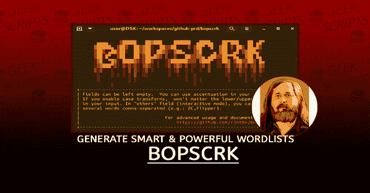

# Bopscrk:生成智能而强大的单词表的工具

> 原文：<https://kalilinuxtutorials.com/bopscrk/>

**bopscrk**(**B**before**O**ut set**P**a**S**sword**CR**AC**K**ing)是一个为有针对性的攻击生成智能而强大的单词表的工具。

*   **目标攻击词表创建者**:引入与目标相关的个人信息，组合每个词，并将结果转化为可能的密码。 *lyricpass* 模块允许**搜索与艺术家**相关的歌词，并将它们包含到词表中。
*   **可定制案例**和 **leet 变换**:通过简单的**配置文件**创建**定制字符集**和**变换模式**。
*   **单词列表排除**:从另一个单词列表中排除单词(以避免您已经测试过的密码)。
*   **支持交互方式**和**一行命令界面**。

**要求**

*   **Python 3** (二级分支保持 Python 2.7 遗留支持)
*   *可选*–使用`**lyricpass**`模块:
    `**pip install requirements.txt**`

**用途**

**-h，–help 显示此帮助消息并退出**
**-i，–interactive 交互模式下，脚本会询问您关于目标
-w 单词组合逗号分隔(非交互模式)
–要生成单词的敏敏长度(默认值:4)
–要生成单词的最大长度(默认值:32)
-c，–大小写启用大小写转换
-l，–leet 启用 leet 转换
-n 每次要组合的最大单词量 –artists artists 搜索歌词(逗号分隔)
-x，–exclude 排除其他单词列表中包含的所有单词
(多个单词列表应以逗号分隔)
-o，–output 输出文件保存单词列表(默认值:tmp.txt)
-C，–config 指定要使用的配置文件(默认值:。 /bopscrk.cfg)**

**工作原理**

*   你必须**提供**一些**单词**作为基础。
*   **lyricpass 功能**允许介绍**艺人**。该工具将下载他所有的**歌曲的歌词**，每一行都将被添加为一个新词。默认情况下，艺术家的名字和由每个短语的单词首字母组成的单词也将被添加。
*   该工具将生成**它们之间所有可能的组合**。
*   为了生成更多的组合，它会添加一些**常用分隔符**(如“-”、“_”、“.”)、**数字**和**特殊字符**常用于密码。
*   你可以使用 **leet** 和 **case transforms** 来增加你的机会。
*   您可以提供已经针对目标测试过的**单词列表**，以便**从结果单词列表(`**-x**`)中排除**所有这些单词。

**提示**

*   字段可以保留为空。
*   你可以在你的单词中使用重音符号。
*   在“其他”栏中，您可以写几个单词，用逗号分隔。*举例* : 2C，脚蹼。
*   如果你想产生**所有可能的 leet 变换**，启用配置文件中的**递归 _leet 选项**。
*   您可以**选择将哪些变换应用于通过 cfg 文件找到的歌词短语**。
*   使用**非交互模式**时，你应该以长和短的方式提供年份(1970，70)以获得与交互模式相同的结果。
*   你必须小心使用 **-n** 参数。如果你设置了一个大的值，可能会导致**太大的单词表**。我推荐介于 2 和 5 之间的值。
*   要通过命令行提供**几个艺术家的名字**，你应该提供**逗号分隔的**。*举例* : `**-a johndoe,johnsmith**`
*   要通过命令行给**艺术家名字加空格**，你应该给它提供**引号括起来的**。*举例* : `**-a "john doe,john smith"**`

**Lyricpass**

此功能基于最初由 init string 开发的工具的修改版本。这些更改是为了将输入和输出工具与 bopscrk 集成在一起。

它将检索所有歌曲的歌词，这些歌曲属于你提供的艺术家。**默认情况下，它将存储每个艺术家，每个找到的带有空格替换的短语，每个找到的短语简化为其首字母**(如果您激活了 leet 和 case transforms，它将在以后进行转换)。

**高级用法**

**定制行为使用。cfg 文件**

*   在`**bopscrk.cfg**`文件中，您可以指定自己的字符集并启用/禁用选项:
    *   **线程**:多线程操作中使用的线程数
    *   **额外 _ 组合**(如`**(john, doe) => 123john, john123, 123doe, doe123, john123doe doe123john**`)默认*开启。您可以在配置文件中禁用它，以便获得更集中的单词列表。*
    *   ***separators_chars** :用于额外组合的字符。*可以是单个字符，也可以是一串字符，例如:`**!?-/&(**`**
    *   ***分隔符 _ 字符串**:在额外组合中使用的字符串。*可以是单个字符串或空格分隔的字符串列表，例如:`**123**` `**34!@**`**
    *   ***leet _ charset**:leet 变换中要替换的字符和对应的替换，*例如:`**e:3 b:8 t:7 a:4**`**
    *   ***recursive_leet** :启用对 leet_transforms()函数的递归调用，以获取所有可能的 leet 转换(*默认禁用*)。*警告*:启用巨大最大值参数(如:大于 18)可能需要几分钟时间。*可真可假。**
    *   ***删除括号**:删除任何变换前歌词中的所有括号*
    *   ***take_initials** :根据找到的歌词短语中每个单词的首字母生成单词(如果在禁用 remove _ 括号的情况下启用，会生成无用的单词)*
    *   ***artist_split_by_word** :拆分艺术家姓名，并将每个单词作为新单词添加*
    *   ***lyric_split_by_word** :与找到的歌词相同*
    *   ***artist_space_replacement** :用字符集定义的字符/字符串替换艺术家名字中的空格*
    *   ***歌词 _ 空格 _ 替换**:与找到的歌词相同*
    *   ***space_replacement_chars** :在艺术家姓名或歌词中插入字符，代替空格。*可以是单个字符，也可以是一串字符，例如:`**!?-/&(**`**
    *   ***space _ replacement _ strings**:在艺术家姓名或歌词中插入字符串来代替空格。*可以是单个字符串或空格分隔的字符串列表，例如:`**123**` `**34!@**`**
*   *有些转换包含大量的字符集。要使用它来代替 basic，只需取消相应行的注释即可。*
*   ***参数配置示例**

    *   使用点作为分隔符组合所有单词，同样使用逗号
        `**separators_chars=.,**`
    *   将所有“a/A”事件转换为“4”，将所有“e/E”事件转换为“3”
        `**leet_charset=a:4 e:3**`* 

 *加权单词系统

[……]即将推出[……]

**更改列表**

*   `**2.3.1 version notes**`
    *   修复了在 windows 系统上运行时的命名空间错误(与 aux.py 模块相关，重命名为 auxiliars.py)
    *   **unittest** (以及简单的转换、排除和组合函数的酉测试)**实现**。
*   `**2.3 version notes (15/10/2020)**`
    *   **可定制的**配置为**艺术家和歌词使用 cfg 文件转换**
    *   在 **setup.py 更新的要求**
    *   **多线程逻辑得到改进**
    *   **Leet 和 case 顺序颠倒**以提高操作效率
    *   **修复了歌词空间替换中**的 BUG
    *   **修复了**删除重复项时的 BUG(*类型错误:无法删除的类型:【列表】*)
    *   **内存管理和效率得到改善**
    *   **分解成模块**以改善项目结构
    *   **修复了单词列表中的缺陷**——排除功能
*   `**2.2 version notes (11/10/2020**`
    *   **配置文件**已实施
    *   **新特性**:允许通过**配置文件**创建**自定义字符集**和**变换图案**
    *   **新特性** : **递归李特变换**已实现(*默认禁用*，可在 cfg 文件中启用)
*   `**2.2~beta version notes (10/10/2020)**`
    *   **lyricpass** 集成已经**更新，可以运行 initstring** 发布的最新版本
    *   `**--lyrics-all**`选项被删除(其他选项中集成的功能)
*   `**2.1 version notes (11/07/2020)**`
    *   修复**最小和最大长度错误**
*   `**2.0/1.5 version notes (17/06/2020)**`
    *   **现在支持 PYTHON 3**:主分支转移到 PYTHON 3。二级分支保持 Python 2.7 遗留支持
*   `**0-1.2(beta) version notes**`
    *   **排除单词表**:使用多线程排除提高速度
    *   **新功能**:与艺术家相关的歌词搜索增加词表机会

[**Download**](https://github.com/r3nt0n/bopscrk)*