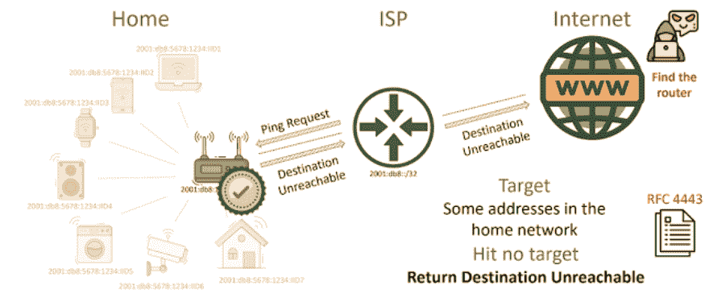

# Xmap:一种快速网络扫描器，设计用于执行互联网范围的 IPv6 &Amp; IPv4 网络研究扫描

> 原文：<https://kalilinuxtutorials.com/xmap/>

XMap 是一种快速网络扫描器，设计用于执行互联网范围的 IPv6 & IPv4 网络研究扫描。

XMap 是 ZMap 的重新实现和彻底改进，完全兼容 ZMap，配备了“5 分钟”探测速度和新颖的扫描技术。XMap 能够在 45 分钟内扫描 32 位地址空间。使用 10 gigE 连接和 PF_RING，XMap 可以在不到 5 分钟的时间内扫描 32 位地址空间。此外，利用新颖的 IPv6 扫描方法，XMap 可以快速发现 IPv6 网络外围。而且 XMap 可以任意长度任意位置随机扫描网络空间，比如 2001:db8::/32-64 和 192.168.0.1/16-20。此外，XMap 可以同时探测多个端口。

XMap 在 GNU/Linux、Mac OS 和 BSD 上运行。XMap 目前已经为 ICMP 回应扫描、TCP SYN 扫描和 UDP 探测实现了探测模块。

使用横幅抓取和 TLS 握手工具 ZGrab2，可以执行更多复杂的扫描。

**安装**

XMap 的最新稳定版本是 1.0.0 版，支持 Linux、macOS 和 BSD。我们建议从 HEAD 安装 XMap，而不是使用发行版包管理器(尚不支持)。

关于从源代码构建 XMap 的说明可以在 INSTALL 中找到。

**安装和构建 XMap**

**通过软件包管理器安装**

XMap 在 GNU/Linux、macOS 和 BSD 上运行。

与大多数操作系统软件包管理器一起安装尚未集成。

| 操作系统（Operating System） |  |
| --- | --- |
| Fedora 19+或 EPEL 6+ | `-` |
| Debian 8+或 Ubuntu 14.04+ | `-` |
| 巴布亚企鹅 | `-` |
| macOS(使用自制软件) | `-` |
| Arch Linux | `-` |

**建筑来源**

**安装 XMap 依赖关系**

XMap 具有以下依赖关系:

*   CMake–跨平台、开源的构建系统
*   GMP 用于任意精度算法的免费库
*   gen getop–C 程序的命令行选项解析
*   libpcap——著名的用户级数据包捕获库
*   flex 和 by ACC–输出过滤器词法分析器和解析器生成器
*   json-C——用 C 语言实现 JSON
*   libunistring–C 语言的 Unicode 字符串库
*   libnet

此外，以下可选软件包支持可选的 XMap 功能:

*   hire dis–C 中的 RedisDB 支持

使用以下命令安装所需的依赖项。

*   在基于 Debian 的系统上(包括 Ubuntu):

**sudo apt-get install build-essential cmake libg MP 3-dev genge topt libpcap-dev flex by ACC libjson-c-dev pkg-config libunistring-dev**

在基于 RHEL 和 Fedora 的系统上(包括 CentOS):

**sudo yum 安装 cmake GMP-devel gengetpt libpcap-devel flex by ACC JSON-c-devel libunistring-devel**

在 macOS 系统上(使用自制软件):

**brew install pkg-config cmake GMP genge topt JSON-c by ACC libdnet libunistring**

**构建和安装 XMap**

一旦安装了这些先决条件，就可以通过运行以下命令来编译 XMap:

**cmake。
make -j4**

**开发说明**

*   启用开发会打开调试符号，并关闭优化。发布构建应该用`-` **`DENABLE_DEVELOPMENT=OFF`来构建。**
*   启用`**log_trace**`会对性能产生重大影响，除非在早期开发阶段，否则不应使用。发布版本应该用 **`-DENABLE_LOG_TRACE=OFF`来构建。**
*   默认情况下，不启用 Redis 支持。如果你想在 Redis 中使用 XMap，你首先需要安装 hiredis。然后用`**-DWITH_REDIS=ON**`运行 cmake。Debian/Ubuntu 已经把 hiredis 打包成`**libhiredis-dev**`；Fedora 和 RHEL/CentOS 将其包装为`**hiredis-devel**`。
*   为像 Fedora 和 RHEL 这样的系统构建包需要一个用户可定义的目录(buildroot)来存放文件。尊重这个前缀的方法是用`**-DRESPECT_INSTALL_PREFIX_CONFIG=ON**`运行 cmake。
*   使用 ronn 工具，从存储库中的`**.ronn**`源文件生成联机帮助页(及其 HTML 表示)。这不会作为构建过程的一部分自动发生；要重新生成手册页，您需要运行`**make manpages**`。这个目标假设`**ronn**`在你的路径上。
*   使用某些版本的 CMake 构建可能会因`**unable to find parser.h**`而失败。如果发生这种情况，请尝试更新 CMake。如果仍然失败，不要将 XMap 克隆到包含字符串`**.com**`的路径中，然后重试。
*   XMap 可以用`**CMAKE_INSTALL_PREFIX**`选项安装到另一个目录。例如，在`**$HOME/opt**`运行中安装它

**cmake-DC make _ INSTALL _ PREFIX = $ HOME/opt。
制造-j4
制造安装**

**用途**

使用 XMap 的指南可以在我们的 GitHub Wiki 中找到。

使用 XMap 的简单命令和选项可以在 USAGE 中找到。

**xmap(1)–快速互联网扫描器**

**剧情简介**

xmap[-4 |-6][-x<len>][-p<port>][-o<outfile>][选项…][IP |域|范围]</outfile></port></len>

**描述**

XMap 是一个扫描任何 IPv6 IP v4 地址空间(或大样本)的网络工具，由 ZMap 重新实现并彻底改进。XMap 能够在大约 45 分钟内在千兆网络连接上扫描 32 位网络空间，达到大约 98%的理论线路速度。

**选项**

**基本选项**

*   **`-6`、`--ipv6`** :扫描 IPv6 网络(默认)。
*   **`-4`、`--ipv4`** :扫描 IPv4 网络。
*   **`-x`，`--max-len=len`** :扫描的最大 IP 位长度(默认= **`32` )** 。
*   **`ip` | `domain` | `range`** :要扫描的 IP 地址或 DNS 主机名。接受 CIDR 块表示法中的 IP 范围。域名最大长度为 256，如 2001::/64，192.168.0.1/16，www.qq.com/32.默认为`**::/0**`和`**0.0.0.0/0**`。
*   **`-p`、`--target-port=port|range`** :要扫描的 TCP 或 UDP 端口号(用于 SYN 扫描和基本 UDP 扫描)。接受带有`**,**`和`**-**`的端口范围，例如`**80,443,8080-8081**`。用`**--target-port**`，一个目标是一个 **< ip/x，端口>** 。
*   **`-o`、`--output-file=name`** :使用使用文件的输出模块时，将结果写入该文件。使用`**-**`作为标准输出。
*   **`-b`、`--blacklist-file=path`** :要排除的子网的文件，接受 DNS 主机名，用 CIDR 表示法，每行一个。建议您使用它来排除 RFC 1918 地址、多播、IANA 保留空间和其他 IANA 特殊用途地址。用于此目的的示例黑名单文件**黑名单 4.conf** 。
*   **`-w`，`--whitelist-file=path`** :要包含的子网文件，接受 DNS 主机名，用 CIDR 表示法，每行一个。指定白名单文件相当于直接在命令行界面上指定范围，但允许指定大量子网。**注意**:如果你要指定大量的个人 IP 地址(超过 100 万)，你应该使用`**--list-of-ips-file**`。用于此目的的示例白名单文件 **whitelist6.conf** 。
*   **`-I`、`--list-of-ips-file=path`** :要扫描的单个 IP 地址的文件，一行一个。此功能允许您扫描大量不相关的地址。如果您有少量的 IP，在命令行上指定或者使用`**--whitelist-file**`会更快。**注**:仅在扫描超过 100 万个地址时使用。当与`**--whitelist-file**`一起使用时，将只扫描两个集合交集的主机。此处指定但包含在`**--blacklist-file**`中的主机将被排除。

**扫描选项**

*   **`-R`、`--rate=pps`** :设置发送速率，单位为包/秒。注意:当与`**--probes**`或`**--retries**`结合使用时，这是每秒的总数据包数，而不是每秒的目标数。将速率设置为`**0**`将会以全速扫描(无睡眠)。默认为`**1**` pps。
*   **`-B`、`--bandwidth=bps`** :设置发送速率，单位为比特/秒(支持后缀 G/g、M/m、K/k，如-B 10M 代表 10 mbps)。这覆盖了`**--rate**`旗。默认为`**0**` bps。
*   `**--batch=num**`:在检查 ratelimit 之间的脉冲串中发送的数据包数量。大于 1 的批量大小允许基于睡眠的速率限制器以更高的速率使用。这可以减少 CPU 的使用，以换取突发的发送速率(default = `1`)。
*   `**--probes=num**`:发送到每个目标的探针数量(默认= `**1**`)。
*   `**--retries=num**`:send to 调用失败时尝试重发数据包的次数(默认= `**1**`)。
*   **`-n`，`--max-targets=num`** :捕获要探测的目标数量(默认= **`-1` )** 。
*   **`-k`、`--max-packets=num`** :捕获要发送的数据包数量(默认= `**-1**`)。
*   **`-t`、`--max-runtime=secs`** :捕获发送数据包的时间长度(默认= `**-1**`)。
*   **`-N`，`--max-results=num`** :收到这许多结果后退出(默认= `-1`)。
*   **`-E`、`--est-elements=num`** :唯一的预计结果数(默认= `**5e8**`)。**注意** : XMap 使用 bloomfilter 来检查重复的结果，这会消耗一些内存。选择合适的`**--est-elements**`来适应你的记忆容量。
*   **`-c`、`--cooldown-secs=secs`** :发送完成后继续接收多长时间(默认= `**5**`)。
*   **`-e`、`--seed=num`** :用于选择地址排列的种子。如果您想要在多次 XMap 运行中以相同的顺序扫描地址，请使用此选项(默认= `**0**`)。
*   `**--shards=num**`:在 xmap 的不同实例之间将扫描分成 N 个碎片/分区(默认= `**1**`)。分片时，`**--seed**`是必需的。
*   `**--shard=num**`:设置扫描哪个分片(默认= `**0**`)。碎片在范围[0，N]中以 0 为索引，其中 N 是碎片的总数。当需要分片`**--seed**`时。

**网络选项**

*   **`-s`、`--source-port=port|range`** :发送数据包的源端口。接受带有`**-**`的端口范围，例如`**12345-54321**`。默认为`**32768-**` **`61000`。**
*   **`-S`、`--source-ip=ip|range`** :发送数据包的源地址。单一 IP 或范围。接受带有`,`和`-`的 ip 范围，例如 2001::1、2001::2-2001::10。
*   **`-G`、`--gateway-mac=mac`** :向其发送数据包的网关 MAC 地址(以防自动检测失败)。
*   `**--source-mac=mac**`:发送数据包的源 MAC 地址(如果自动检测失败)。
*   **`-i`、`--interface=name`** :要使用的网络接口。
*   **`-X`、`--iplayer`** :发送 IP 层数据包，而不是以太网数据包(对于非以太网接口)。

**探头选项**

XMap 允许用户指定和编写自己的探测模块。探测模块负责生成要发送的探测数据包，并处理来自主机的响应。

*   `**--list-probe-modules**`:列出可用的探针模块(如 tcp_syn)。
*   **`-M`、`--probe-module=name`** :选择探头模块(默认= `**icmp_echo**`)。
*   `**--probe-args=args**`:传递给探测模块的参数。
*   `**--probe-ttl=hops**`:设置探测 IP 包的 TTL 值(默认= `**255**`)。
*   `**--list-output-fields**`:列出所选探头模块可以发送给输出模块的字段。

**输出选项**

XMap 允许用户指定和编写自己的输出模块，以便与 XMap 一起使用。输出模块负责处理探测模块返回的字段集，并将它们输出给用户。用户可以指定输出字段，并在输出字段上编写过滤器。

*   `**--list-output-modules**`:列出可用的输出模块(如 csv)。
*   **`-O`、`--output-module=name`** :选择输出模块(默认= `**csv**`)。
*   `**--output-args=args**`:传递给输出模块的参数。
*   **`-f`、`--output-fields=fields`** :逗号分隔的要输出的字段列表。接受带有`**,**`和`*****`的字段。
*   `**--output-filter**`:在探头模块定义的字段上指定一个输出过滤器。详情参见输出滤波器部分。

**IID 选项**

XMap 允许用户指定和编写自己的 iid 模块，以便与 XMap 一起使用。IID 模块负责填充探测前缀后面的剩余位，并创建完整的目标地址。

处理探针模块返回的字段集，并输出给用户。用户可以指定输出字段，并在输出字段上编写过滤器。

*   `**--list-iid-modules**`:列出可用的 iid 模块(如低)。
*   **`-U`、`--iid-module=name`** :选择 iid 模块(默认= `**low**`)。
*   `**--iid-args=args**`:传递给 iid 模块的参数。
*   `**--iid-num=num**`:一个目标前缀的 iid 号。

**日志和元数据选项**

*   **`-q`、`--quiet`** :不每秒打印一次状态更新。
*   `-v`、`--verbosity=n`:日志详细程度(0-5，默认= `**3**`)。
*   **`-l`、`--log-file=filename`** :日志信息的输出文件。**默认为`stderr`。**
*   **`-L`、`--log-directory=path`** :将日志条目写入该目录下带时间戳的文件。
*   **`-m`、`--metadata-file=filename`** :扫描元数据(JSON)的输出文件。
*   **`-u`、`--status-updates-file`** :将扫描进度更新写入 CSV 文件。
*   `**--disable-syslog**`:禁止将消息记录到系统日志。
*   `**--notes=notes**`:将用户指定的注释注入扫描元数据。
*   `**--user-metadata=json**`:将用户指定的 JSON 元数据注入扫描元数据。

**附加选项**

*   **`-T`、`--sender-threads=num`** :用于发送数据包的线程。XMap 将尝试根据处理器内核的数量来检测发送线程的最佳数量。
*   **`-C`、`--config=filename`** :读取一个配置文件，可以指定任何其他选项。
*   **`-d`、`--dryrun`** :将每个包打印到 stdout，而不是发送出去(对调试有用)。
*   `**--max-sendto-failures=num**`:扫描中止前最大 NIC 发送失败次数。
*   `**--min-hitrate=rate**`:扫描中止前扫描可以达到的最小命中率。
*   `**--cores**`:逗号分隔的要固定的核心列表。
*   `**--ignore-blacklist-error**`:忽略`**--whitelist-file**`和 **`--blacklist-file`中无效、格式错误或无法解析的条目。**
*   `**--ignore-filelist-error**`:忽略 **`--list-of-ips-file`中无效、格式错误或无法解析的条目。**
*   **`-h`、`--help`** :打印帮助并退出。
*   **`-V`、`--version`** :打印版本并退出。

**输出滤波器**

由探测模块生成的结果可以在被传递到输出模块之前被过滤。过滤器在探头模块的输出字段上定义。过滤器是用简单的过滤语言编写的，类似于 SQL，并使用`**--output-filter**`选项传递给 XMap。输出过滤器通常用于过滤掉重复的结果，或者只将成功的响应传递给输出模块。

过滤表达式的形式为 **`<fieldname> <operation> <value>`。**`**<value>**`的类型必须是字符串或无符号整数文字，并且与`**<fieldname>**`的类型相匹配。整数比较的有效操作有 **`=`、`!=`、`<`、`>`、`<=`、`>=`、**。字符串比较的操作有 **`=`，`!=`** 。`**--list-output-fields**`标志将打印所选探头模块可用的字段和类型，然后退出。

复合过滤表达式可以通过使用圆括号组合过滤表达式来构造，圆括号用于指定操作顺序、`**&&**`(逻辑 AND)和`**||**`(逻辑 OR)操作符。

例如，仅用于成功的非重复响应的过滤器将被写成:`**--output-filter="success = 1 && repeat = 0"**`。

**UDP 探测模块选项**

这些参数都是使用`**--probe-args=args**`选项传递的。一次只能传递一个参数。

*   `**file:/path/to/file**`:通过 UDP 发送到每个主机的有效负载文件的路径。
*   `**text:<text>**`:发送到各目的主机的 ASCII 文本。
*   `**hex:<hex>**`:发送到每个目的主机的十六进制编码的二进制文件。
*   `**dir:/directory/to/file**`:探测多个端口时，通过 UDP 发送到每个主机的有效负载文件的目录。文件扩展名优先级: **`pkt` > `txt` > `hex`** 。每个文件都由端口号命名，例如，53.pkt 表示 DNS 有效负载。
*   `**template:/path/to/template**`:模板文件的路径。对于每个目的主机，模板文件被填充、设置为 UDP 有效负载并被发送。
*   `t**emplate-fields**`:打印允许的模板字段信息并退出。
*   `**icmp-type-code-str**`:打印 icmp 相关过滤器的值并退出。

**扫描中期变化**

通过向 XMap 发送 SIGUSR1(增加)和 SIGUSR2(减少)信号，可以改变 XMap 扫描中间扫描的速率。这将导致扫描速率增加或减少 5%。

**例题**

**xmap
通过 Echo ping 扫描::/0-32 空间并输出到 stdout
xmap -4
通过 Echo ping 扫描 0.0.0.0/0-32 空间并输出到 stdout
xmap -N 5 -B 10M
找到 5 台活动的 IPv6 主机，以 10 Mb/s 的速度扫描
xmap 2001::/8 2002::/16
扫描两个子网以获取 2001::/8-32 2001::1783:ab42:9247:cb38
xmap-M icmp_echo-O csv-U low-h
显示 icmp _ echo、CSV 和 low 模块的帮助文本
xmap -M tcp_syn -p 80，443，8080-8081
扫描端口 80，443，8080，8081 的::/0-32 空间**

[**Download**](https://github.com/idealeer/xmap)