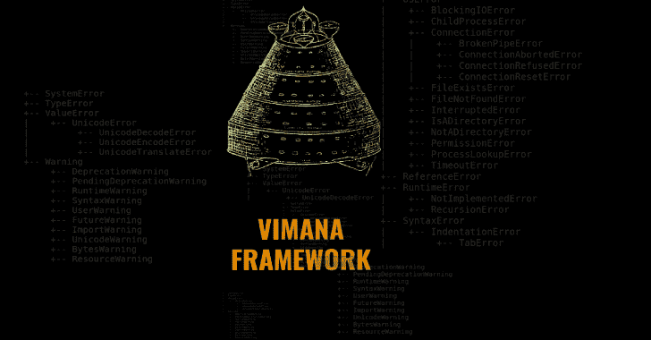
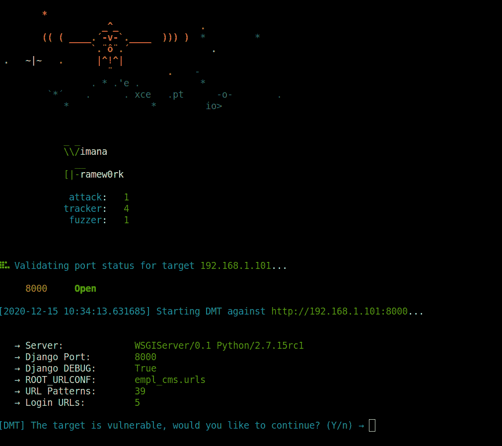
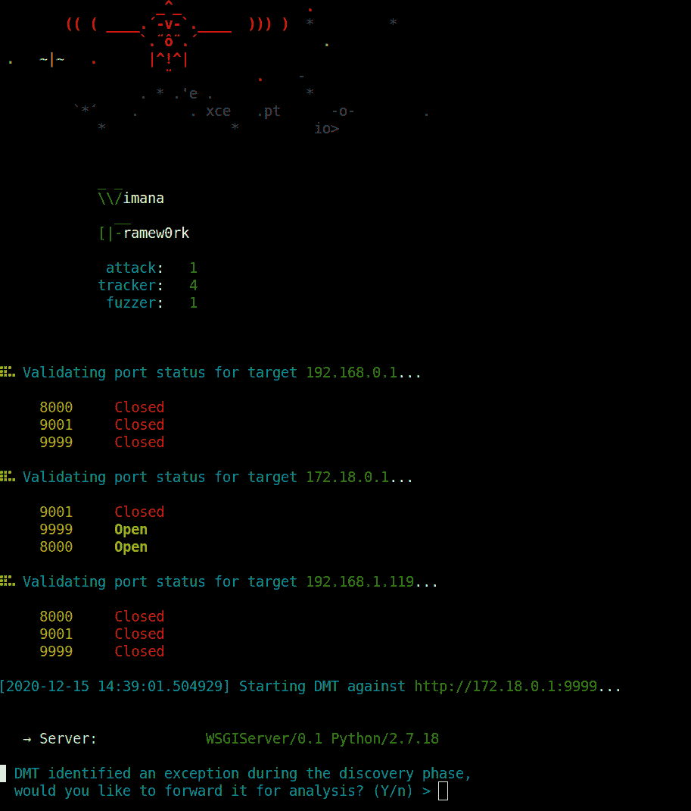
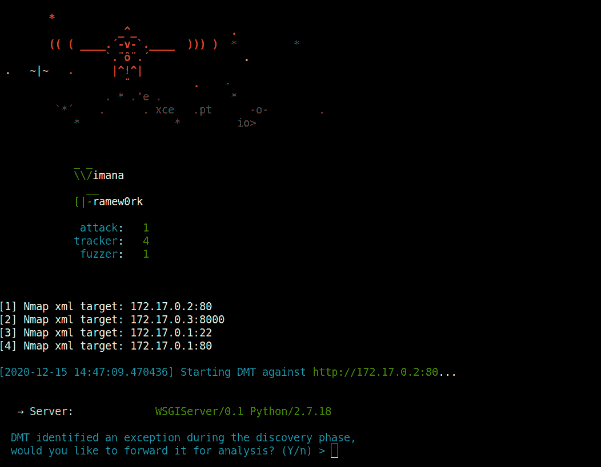
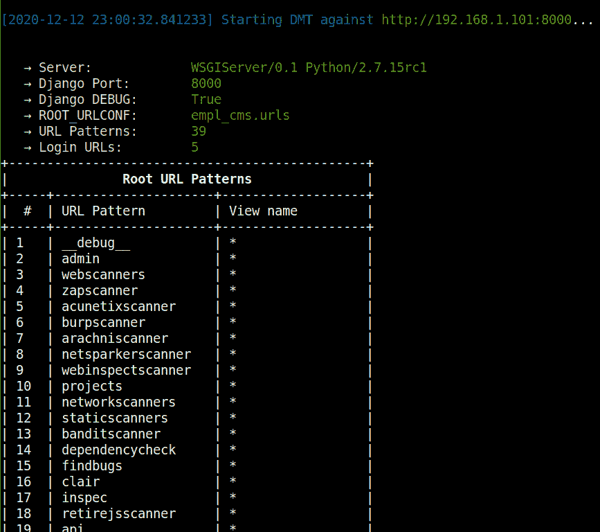
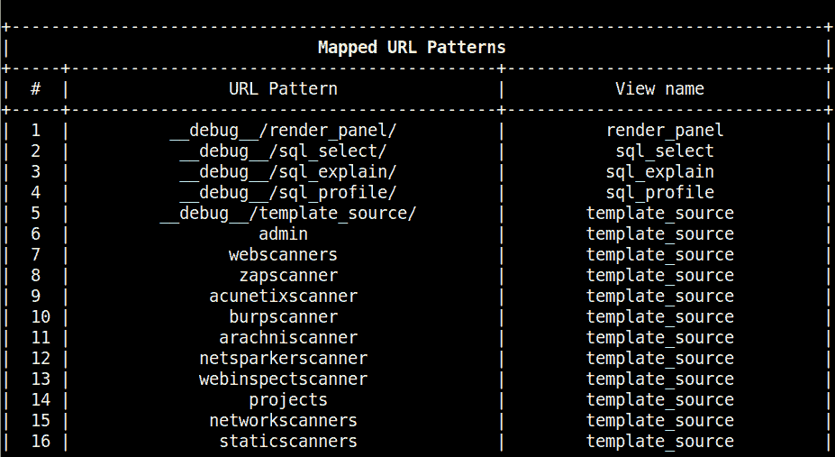
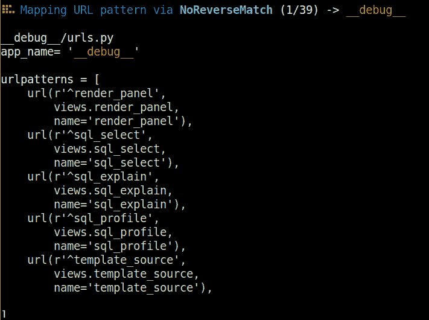
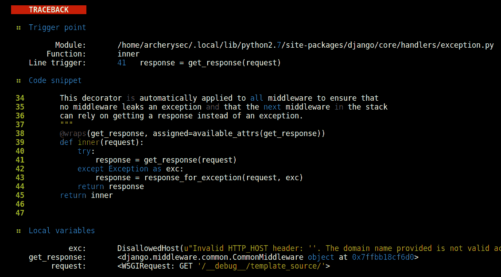
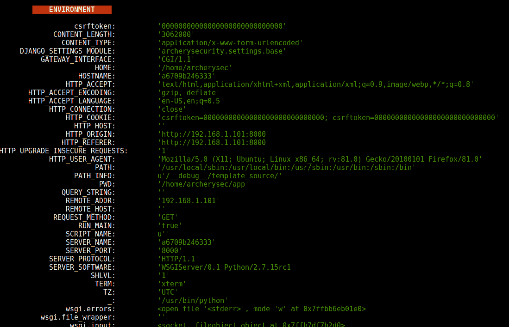

# Vimana:一个实验性的安全框架，旨在为审计 Python Web 应用程序提供资源

> 原文：<https://kalilinuxtutorials.com/vimana/>

Vimana 是一个模块化的安全框架，用于审计 Python web 应用程序。

**框架结构**

Vimana 的基础由专注于框架的爬虫(除了 web 的通用爬虫之外)、跟踪器、发现、模糊器、解析器以及其他类型的模块组成。该框架的主要思想是通过黑盒方法来识别允许触发未处理异常的配置缺陷和不适当和/或不充分的实现。根据框架设置(或特定库，甚至在不使用框架时，例如原始 wsgi)，这可能导致敏感和关键信息的泄漏，从而危及整个应用程序、服务器、api、数据库、服务和任何第三方软件在当前暴露的环境变量中的令牌、秘密或 API 密钥。

Vimana 执行的另一个重要步骤是获取和重建受影响模块的源代码片段(由异常泄露),这允许发现硬编码凭证、数据库的连接字符串、易受攻击的库，此外还允许分析黑盒和白盒方法之间的混合视角的应用逻辑，因为初始分析从盲测试开始，但最终允许访问代码片段。

**维曼拿入门**

最简单的方法是通过 Docker 映像构建脚本:

sudo git 克隆 https://github.com/s4dhul4bs/vimana-framework.git
CD 维马纳-框架& & sudo。/vmnf_build

如果构建运行顺利，您将看到“关于”屏幕(上面的自述图像)

如果您愿意，可以按照与脚本相同的步骤手动构建映像:

**time date CTL set-NTP yes
sudo git 克隆 https://github.com/s4dhul4bs/vimana-framework.git
CD vimana-framework
sudo docker build–no-cache = true–network = host-t vimana _ framework:alpha。**

一旦成功创建了映像，您就可以按如下方式启动 Vimana:

`**sudo docker run -it --name vimana vimana_framework:alpha about**`

并且将显示相同的图像。

当然，该框架也可以以传统方式执行。直接通过代码(目前最稳定的方式):

**sudo git 克隆 https://github.com/s4dhul4bs/vimana-framework.git
CD vimana-framework
pip 3 install-r requirements . txt
python 3 vimana . py**

运行神功(维曼拿模块)的例子:

**sudo docker run-it vimana _ framework:alpha run–module DMT–target-list 192 . 168 . 1 . 101，192.168.1.212，mypythonapp . com–port-list 5000，5001，8000–verbose–debug–random–threads 5**

解释上面的命令行语法:

在串联模式下运行神功(维曼拿框架模块)的命令(在这种情况下，模块 DMT，姜戈错误配置跟踪器)

该框架支持几种类型的作用域定义参数(尽管这也取决于每个模块所期望的参数)。在这种情况下，IP 和 URL 列表与参数 target-list(逗号分隔)一起使用。

`**--port-list**`在这里，与目标的定义一样，端口也接受各种格式，在这种情况下，将使用带有待测试端口列表的端口列表。一个重要的注意事项是，当您不希望在调用所选模块之前测试已定义的端口时，必须传递`**--ignore-state**`参数，这样就不会检查端口的状态。

`**--verbose**`在实时问题演示中启用详细模式

`**--debug**`启用 Vimana 调试模式，实时显示关于执行的技术信息

**`--random`** 启用随机化，此标志，在支持的模块中启用随机化(例如用户代理、cookies、令牌等)

`**--threads**`配置分析中涉及的模块(支持线程的模块)要执行的线程数量。

要知道神功支持的参数，使用语法:`**vimana.py args --module <module_name>**`

*注意:Vimana 是一个命令行工具，它通过终端完成结果和交互的所有表示，因此配置缓冲区大小以允许正确的表示是很重要的。在 Terminator 中，这可以通过编辑`**~/.config/terminator/config**`文件并在`**[profile]**`部分下面添加以下条目来完成:`**scrollback_infinite = True**`

**关于此版本**

大多数功能已经针对不同的场景进行了长时间的彻底测试，并且进行了仔细的观察，但是，该工具已经获得了相当大的规模和复杂性，因此，肯定会有一些目前未知的错误。已知的将被记录在问题中。如果您有任何建议、合作或其他相关事宜，请随时联系我们。

关于这个 alpha 版本的另一点是，主要特性(siddhis)集中在 Django 框架上，应用程序在大多数情况下运行在认证和/或生产场景中，DEBUG true。

对于下一个版本

除了整个框架结构和 siddhis 已有的总体改进之外，还有其他要点:

*   跟踪和指纹模板引擎(如石根，金贾，樱井真子等)的功能。)
*   自动化 SSTI 测试的资源(服务器端模板注入)
*   Django 的新 fuzzers 规则
*   一些 lib 漏洞
*   规则支持(semgrep-rules 和其他)
*   代理支持(SOCKS、CONNECT 等
*   在应用程序上下文中生成自定义有效负载的资源
*   新的 siddhis 专注于其他开发框架，如 Flask、Web2py、Bottle 等)
*   应用爬虫
*   数据库集成
*   记录
*   Siddhis 根据泄漏上下文测试服务(绑架)

**维曼拿不是**

Vimana 不是一个漏洞扫描器，至少不是传统的，因为它不直接寻找 SQLi、XSS、XXE、RFI 等漏洞。相反，该框架的主要焦点，也是它的主要特性，是执行模糊化来触发异常，并从那里提供可以从初始输入执行其他任务的其他模块。然而，当我谈到导致这个工具的研究时，我展示了在某些情况下，通过分析一个被触发的异常来识别传统的漏洞(比如 OWASP 前 10 名中的漏洞)是可能的。因此，已经有了神功来识别这些漏洞的计划，然而，重要的是要记住，维曼拿并不打算成为一个利用可能的 sqli 注入的工具，因为它有 sqlmap 和其他几个。

在某些部分定义了作用域(特定的模块将根据作用域执行)，在这些部分进行了基本的测试，以检查作为命令行参数通知的端口的状态。然而，同样重要的是要注意，这个工具不是用来作为端口和服务扫描器的，因为有 nmap 和其他工具。

等等，这个框架是什么我还不知道，还早，但是我已经可以指出一些它不是也不打算是的东西。

**用例**

**范围设置**

该框架支持一些选项来配置所选神功运行的范围。以下是主要选项。

在此之前，请注意:Vimana 不是端口扫描器，所以最好的选择，尤其是当目标数量非常大时，总是通过将结果导出到 XML 来使用 nmap 进行扫描，这将通过–nmap-XML<nmap_results.xml>选项作为 Vimana 的参数传递:</nmap_results.xml>

`**python3 vimana.py run --module dmt --nmap-xml scan_result.xml**`

nmap 的 XML 范围配置示例如下所示，在项目**`Multi-Target`**`(--nmap-xml option)`

**`One-Shot-Target``(--target option)`**中

想象一下，你正在进行一次入侵测试，在一片混乱中，你最终找到了一个没有被指出漏洞的目标，但即便如此，作为一名优秀的狙击手，它还是给你留下了一丝味道？]一只老鼠。

假设这是一个内部分析，IP 地址是 192.168.0.102，并且除了已知的服务端口之外，还发现了该 IP 地址上的端口 8000。在内部测试环境的情况下，pentester 将已经有一些关于开发人员使用的技术的信息，这将允许您推断哪些 siddhis 可以针对目标使用。

因此，我们已经预先知道了 IP，并且我们想要评估的端口是活动的，我们可以如下运行 Vimana:

`**python3 vimana.py run --module dmt --target 192.168.0.102 --port 8000 --verbose --debug**`

如果神功无能为力，就会显示一条信息。如果有的话，初始面板将显示一些关于目标的信息，如下所示:

**T0`(--target-list option)`**

在另一个场景中，您需要检查一些 IP 和端口:

`**python3 vimana.py run --module dmt --target-list 192.168.0.1,172.18.0.1,192.168.1.119 --port-list 8000,9999,9001**`

`Multi-Target` `(--nmap-xml option)`

现在想象一个场景，您有整个范围要分析，但您事先不知道每个范围中的主机 ups 或开放端口。在这种情况下，最好的方法是用 nmap 执行扫描，并只将 XML 格式的结果传递给 Vimana。这一点很重要，因为正如在知识库中已经提到的，了解每个工具的作用是很重要的，Vimana 并不打算成为一个端口或漏洞扫描器，所以每当范围未定义并且有整数范围可供扫描时，这总是最好的选择:

`**python3 vimana.py run -**-**module dmt --nmap-xml nmap_results.xml**`

**`Other scoping options`** 除了以上选项，vimana 还支持其他的作用域选项:

**分析 Django 应用程序**

在展示一个侧重于 Django 应用程序的用例之前，有必要非常清楚这个工具是从哪个角度开发的，以及它的可能性是什么。

从开发人员的角度来看，一个异常、一个警告、任何错误都是一个需要克服的障碍，以便您的应用程序能够稳定地运行。然而，从攻击者的角度来看，破裂事件，无论有无错误消息(如基于 SQLi 错误和盲、XXE、SSTI 等情况)，总是需要更好地调查。这是因为随着时间的推移，人们了解到许多悬而未决的结果来自于对这些场景的调查，这往往会使目标完全暴露。

入侵测试的第一步是主动基础设施、应用程序、技术、服务和端口的指纹。因此，发现阶段至关重要，尤其是在黑盒方法中。

此步骤中执行的测试之一是枚举应用程序的目录、端点和 URL。这种测试的一个特点是，工具需要向服务器发送大量请求，以分析每次尝试的响应，从而识别或至少推断特定的目录/ URL 是否存在。

在当前上下文中，在调试为真的 Django 应用程序中，诸如 DMT (Django 错误配置跟踪器)之类的插件通过单个请求来识别应用程序的根 URL 模式:

从那里，它通过 NoReverseMatch 和“扩展”这些初始模式来执行映射，以便在用户控制下识别新的 URL 和数据输入端点。

在这一步中，如果使用调试选项执行 vimana 模块，则在分析过程中会显示一些额外的信息，如下例所示，djmimic 尝试为每个已识别的应用程序重新生成 urls.py 文件:

在这个映射之后，DMT 然后调用应用程序 fuzzer，DJunch 确定最初识别的 URL 的范围。由此，fuzzer 将使用随机类型的数据创建一个新的范围，执行随机测试，交替使用数据类型、目录、文件和头来识别异常:

由 DJunch 识别的异常示例:

此外，在某些情况下，追溯中涉及的每个模块的代码片段被重新组合，以便通过识别每个模块的触发器以及对象和局部变量来进行进一步分析。一旦将这些部分加载到工具中，除了识别易受攻击的模块和库以及映射应用程序逻辑之外，还可以执行手动和 SAST 代码审查(在未来的版本中):

实时异常演示的最后一部分是 Django 应用程序环境，这些字段和源代码中的集合可以包含许多重要信息，如代码中的硬编码密码、环境变量中的纯文本密码、令牌、api 密钥、用户名、IP、电子邮件、URL 挂钩等。这些信息稍后将由绑架司令部(仍在开发中)进行分析和关联，该司令部将负责交叉分析的信息，并提供一个具有可能攻击媒介的场景:

[**Download**](https://github.com/s4dhulabs/vimana-framework)