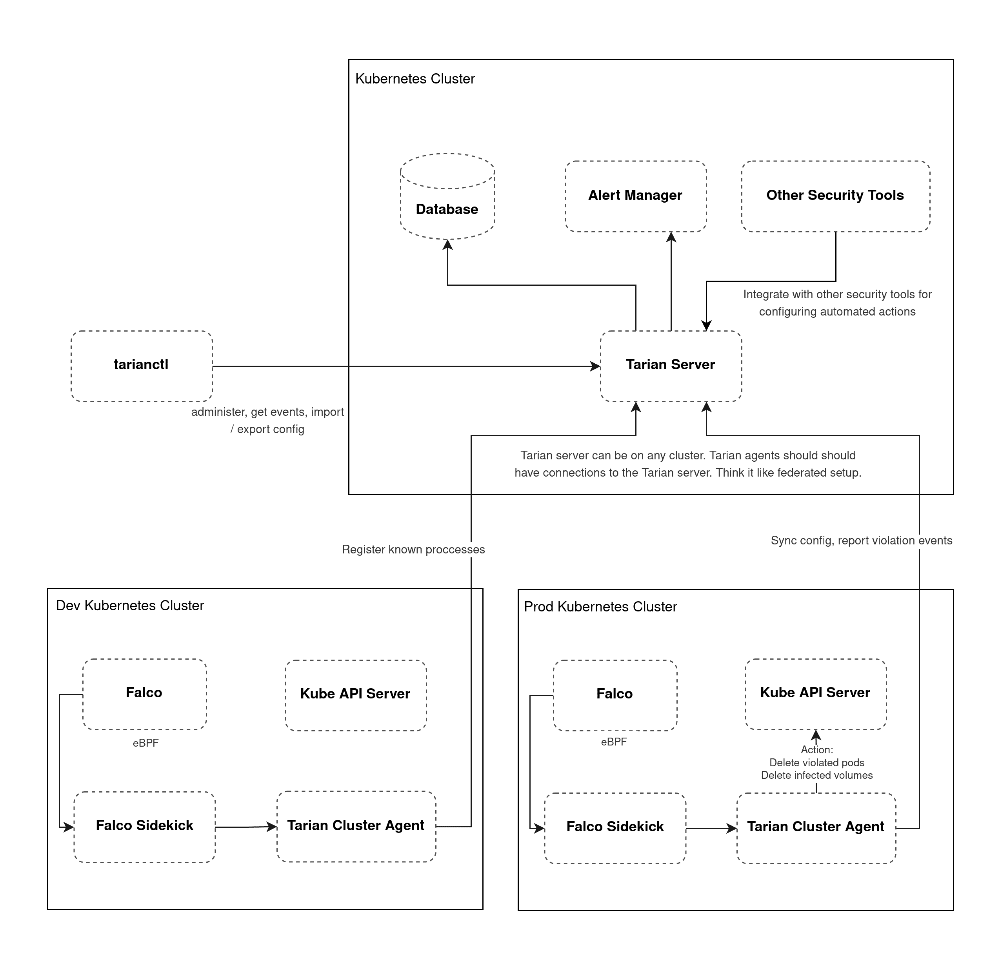

# tarian:Kubernetes 的杀毒软件

> 原文：<https://kalilinuxtutorials.com/tarian/>

**Tarian** 是一款通过预先注册您的可信进程和可信文件签名来保护您在 Kubernetes 上运行的应用程序免受恶意攻击的工具。Tarian 将检测未知的进程和注册文件的变化，然后它会发送警报，并采取自动行动。从勒索软件中拯救你的 K8s 环境！

我们希望将它作为一个开源项目来维护，以对抗对我们最喜欢的 Kubernetes 生态系统的攻击。通过持续的贡献，我们可以作为一个团体一起对抗威胁。

**Tarian 是如何工作的？**

Tarian 集群代理在 Kubernetes 集群中运行，检测未知进程和文件的未知更改，将它们报告给 Tarian 服务器，并有选择地采取行动:删除违反的 pod。它利用 Falco 的自定义规则来检测新执行的进程。对于文件更改检测，Tarian 集群代理在您的主应用程序的 pod 中注入一个 sidecar 容器，该容器将检查配置路径中的文件校验和，并将它们与 Tarian 服务器中注册的校验和进行比较。从开发到生产环境，Tarian 将成为您的应用程序 pod 的一部分，因此您可以向您的 Tarian DB 注册应该发生的事情&在您的容器中运行+要监视的文件签名+可以通知的内容+根据检测到的更改采取的行动(自我销毁 pod)。向左移动你的探测机制！

如果容器内部发生了不在 Tarian 注册数据库中的未知变化，Tarian 会如何应对？

如果发生未知的变化，Tarian 可以简单地通知您的安全团队观察分析。然后，您的安全工程师可以在 Tarian DB 中记录这种变化，无论它是否被视为威胁。此外，基于他们的分析，他们可以配置当变化再次发生时采取什么行动。

社区的贡献如何有助于对抗威胁？

安全专家分析并标记为威胁的任何新检测，如果他们选择，可以与开源社区数据库共享，包括所有日志、要查找的字符串、观察、透明度、要配置的操作……基本上是专家想要警告的任何内容，并与社区共享。你可以作为一个 Tarian 用户使用这些信息，并在你的环境中使用的 Tarian 应用程序中配置操作。这基本上是一种共享威胁信息的机制&如何应对它们。这有助于每个人通过分享他们的知识和经验，在各自的 K8s 环境中一起采取行动。

根据已知的威胁，Tarian 会采取什么样的行动？

Tarian 会简单地自我毁灭它正在运行的 pod。如果恶意软件/病毒扩散到环境的其他部分，你知道会发生什么。所以，Tarian 的基本设计是通过摧毁豆荚来帮助尽可能降低风险。K8s 部署将负责提供新的 pod。只有在你告诉他的情况下，他才会摧毁豆荚。如果你不希望任何动作发生，你不必配置或触发任何动作；你可以简单地告诉塔兰只是通知你。Tarian 基本上做你想做的事情来降低风险。

既然已经有很多工具可用，比如 Falco、Kube-Hunter、Kube-Bench、Calico Enterprise Security，以及更多可以检测&防止网络、基础设施&应用层威胁的安全工具(开源&商业版),为什么还要推出新的安全工具？为什么是 Tarian？

Tarian 诞生的主要原因是作为一个社区一起对抗 Kubernetes 的威胁。另一个原因是，如果仍然有一些复杂的攻击能够穿透您安全的每一层，能够到达您的运行时应用程序(远程代码执行)和您的存储卷，并且能够传播以损坏或锁定您的基础架构和数据，该怎么办？！对于这样的攻击，尤其是变成勒索软件的攻击，你想怎么办？Tarian 旨在通过采取行动来降低此类风险。我们知道，Tarian 不是最终的解决方案，但我们相信它有助于降低风险，尤其是在社区不断共享知识的情况下。从技术角度来看，Tarian 可以通过破坏被感染的资源来帮助降低风险。

**建筑示意图**

**先决条件**

支持运行 Falco 的 kubernetes 集群

**准备名称空间**

**kubectl 创建命名空间 tarian-system
kubectl 创建命名空间 falco**

安装法尔科自定义规则从塔兰

将此保存到`**falco-values.yaml**`

**falcosidekick:
enabled:true
config:
web hook:
地址:http://tarian-cluster-agent . tarian-system . SVC:8088**

然后使用 Helm 安装 Falco:

**helm repo 添加 Falco security https://falcosecurity.github.io/charts
helm repo 更新
helm upgrade-I Falco Falco security/Falco-n Falco-f Falco-values . YAML \
–set-file custom rules。" tarian _ rules . YAML " = https://raw . githubusercontent . com/kube-tarian/tarian/main/dev/Falco/tarian _ rules . YAML**

在 GKE，法尔科使用 ebpf，所以你需要添加

**–设置 ebpf.enabled=true**

**建立一个 Postgresql 数据库**

您可以将数据库作为云服务中的一项服务，也可以在集群中单独运行。例如，要在集群中安装数据库，请运行:

**helm repo add bitnami https://charts.bitnami.com/bitnami
helm install tarian-PostgreSQL bitnami/PostgreSQL-n tarian-system \
–set PostgreSQL username = postgres \
–set PostgreSQL password = tarian \
–set PostgreSQL database = tarian**

**安装 Tarian**

*   使用头盔安装 tarian

**helm repo add tarian https://kube-tarian.github.io/tarian
helm repo update
helm upgrade-I tarian-server tarian/tarian-server–devel-n tarian-system
helm upgrade-I tarian-cluster-agent tarian/tarian-cluster-agent–devel-n tarian-system**

*   等待所有的豆荚准备好

**ku bectl wait-for = condition = ready pod–all-n tanarian-system**

*   运行数据库迁移以创建所需的表

ku bectl exec-ti deploy/tarian-server-n tarian-system-。/t arian-服务器数据库迁移

完成上述步骤后，您应该会在 rianctl get 事件中看到 falco alert(参见下面的用法部分)。

**配置**

见舵图表值

*   塔兰特服务器
*   群体智能体

**云/厂商特定配置**

**私人 GKE 集群**

默认情况下，专用 GKE 集群创建防火墙规则，将主节点与节点的通信限制在端口`**443**`和`**10250**`上。为了注入 tanian-pod-agent 容器，tanian 使用了一个变异的准入 webhook。webhook 服务器运行在端口`**9443**`上。因此，我们需要创建一个新的防火墙规则，以允许从主 IP 地址范围进入 tcp 端口 **9443** 上的节点。

**用途**

**使用 rianctl 控制 rian-server**

*   从 Github 发布页面下载
*   解压文件，并将 tarianctl 复制到您的路径目录中
*   通过入口或端口转发向您的机器暴露 tarian-server。对于本例，我们将使用端口转发:

**kubectl 端口转发 SVC/tarian-server-n tarian-system 41051:80**

用环境变量配置服务器地址

**export TARIAN _ SERVER _ ADDRESS = localhost:41051**

查看违规事件

**trian CTL 获取事件**

添加流程约束

tarantictl add constraint–name nginx–namespace default \
**–match-labels run = nginx \
–allowed-processes = pause，tarant-pod-agent，nginx**

**trian CTL 获取约束**

添加文件约束

**tar actl add constraint–name nginx-files–namespace default \
–match-labels run = nginx \
–allowed-file-sha 256 sums =/usr/share/nginx/html/index . html = 38 ffd 4972 AE 513 a0c 79 A8 be 4573403 edcd 709 f 0 f 572105362 b 08 ff 50 cf 6 de 521**

**trian CTL 获取约束**

**在 pod 中运行 tarian agent**

然后，在创建约束条件后，我们通过添加注释将 tarian-pod-agent 注入 pod:

**元数据:
注解:【pod-agent.k8s.tarian.dev/threat-scan:《真实的 T2》**

带有这个注释的 Pod 将注入一个额外的容器(tarian-pod-agent)。tarian-pod-agent 容器将基于注册的约束不断验证运行时环境。任何违规行为都将被报告，可通过`**tarianctl get events**`访问。

**演示:尝试违反约束的吊舱**

**kube CTL apply-f https://raw . githubusercontent . com/kube-tarian/tarian/main/dev/config/monitored-pod/config map . YAML
kube CTL apply-f https://raw . githubusercontent . com/kube-tarian/tarian/dev/config/monitored-pod/pod . YAML
等待它准备就绪
kube CTL wait–for = condition = ready pod nginx
模拟未知的流程运行** 

**警报管理器集成**

默认情况下，Tarian 带有普罗米修斯警报管理器。如果要使用另一个警报管理器实例:

**helm install tarian-server tarian/tarian-server–devel \
–set server . alert . alert manager address = http://alert manager . monitoring . SVC:9093 \
–set alert manager . install = false \
-n tarian-system**

[**Download**](https://github.com/kube-tarian/tarian)