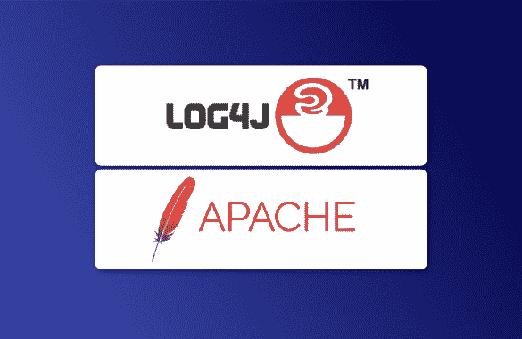

# Log4J-Detector:检测任何易受 CVE-2021-44228 和 CVE-2021-45046 攻击的应用程序中文件系统上的 Log4J 版本

> 原文：<https://kalilinuxtutorials.com/log4j-detector/>

**Log4J-Detector** 是一个检测易受攻击的 Log4J 版本的扫描器，以帮助团队评估他们对 **CVE-2021-44228(关键)**、CVE-2021-45046、CVE-2021-45105 和 CVE-2021-44832 的暴露程度。可以通过仔细检查整个文件系统(包括所有安装的应用程序)来搜索 Log4J 实例。它能够找到隐藏了几层的 Log4J 实例。可以在 Linux、Windows 和 Mac 上运行，也可以在 Java 运行的任何地方运行！

**简介**

目前，log4j-core 版本 2.3.2、2.12.4 和 2.17.1 被报告为 **_SAFE_** ，2.3.1、2.12.2、2.12.3、2.15.0、2.16.0 和 2.17.0 被报告为 **_OKAY_** ，所有其他版本被报告为 **_VULNERABLE_** (尽管它确实将 2.0-beta9 之前的版本报告为 **_POTENTIALLY_SAFE_)它将较旧的 log4j-1.x 版本报告为 **_OLD_** 。**

可以正确地检测可执行 spring-boot jar/war 中的 log4j、混合到超级 jar 中的依赖项、阴影 jar，甚至是文件系统中未压缩的展开的 jar 文件(又名*。类)。

我们目前维护着用于测试的 log4j 样本的集合。

**示例用法**

Java-jar log4j-detector-2021 . 12 . 29 . jar。/样品

**—github.com/mergebase/log4j-detector v 2021 . 12 . 29(mergebase.com)分析路径(可能需要一段时间)。
—注意:指定'–verbose '标志将检查的每个文件打印到 STDERR。
false-hits/Log4J-core-2 . 12 . 2 . jar 包含 Log4J-2 . x = = 2 . 12 . 2*ok*false-hits/Log4J-core-2 . 12 . 3 . jar 包含 Log4J-2 . x = = 2 . 12 . 3*ok*
false-hits/Log4J-core-2 . 12 . 4 . jar 包含 Log4J-2 . x = = 2 . 12 . 4【T8
true-hits/Log4J-core-2.0-beta 9 . jar 包含 Log4J-2 . x>= 2.0-beta 9(<2 . 10 . 0) *易受攻击*true-hits/Log4J-core-2 . 10 . 0 . jar 包含 Log4J-2.x > = 2.10.0 *易受攻击*/true-hits/Log4J-core-2 . 10 . 0 . zip 包含 Log4J-2.x > = 2.10.0 *易受攻击*
true-hits/Log4J-core-2 . 11 . 0 . jar 包含
true-hits/Log4J-core-2 . 14 . 1 . jar 包含 Log4J-2.x > = 2.10.0 *易受攻击*
true-hits/Log4J-core-2.2 . jar 包含 Log4J-2 . x>= 2.0-beta 9(<2 . 10 . 0)*易受攻击* true-hits/log4j-core-2 *易受攻击的*
OLD-hits/Log4J-1 . 1 . 3 . jar 包含 Log4J-1 . x<= 1 . 2 . 17*OLD*
OLD-hits/Log4J-1 . 2 . 17 . jar 包含 Log4J-1 . x<= 1 . 2 . 17*OLD*
OLD-hits/Log4J-core-2 )**

**了解结果**

**_VULNERABLE_** - >您需要升级或删除此文件。

**_OKAY_** - >我们为 Log4J 版本 2.3.1、2.12.2、2.12.3、2.15.0、2.16.0 和 2.17.0 报告了这一点。我们建议升级到 2.17.1。

**_SAFE_** - >我们目前仅针对 Log4J 版本 2.3.2、2.12.4 和 2.17.1(及更高版本)报告此问题。

**_OLD_** - >你从 CVE-2021-44228 是安全的，但是应该计划升级，因为 Log4J 1.2.x 已经停产 7 年了，有几个已知的漏洞。

**_ POTENTIALLY _ SAFE _**->“jndilookup . class”文件不存在，可能是因为您的 Log4J 版本太旧(2.0-beta9 之前)，或者是因为有人已经删除了该文件。如果是这种情况，请确保是您的团队或公司中的某个人删除了“JndiLookup.class ”,因为已知攻击者会自己删除该文件，以防止其他竞争攻击者获得对受损系统的访问权限。

**用法**

**Java-jar log4j-detector-2021 . 12 . 29 . jar
用法:Java-jar log4j-detector-2021 . 12 . 29 . jar[–verbose][–json][–stdin][–exclude = X][扫描路径…]
–JSON–在 JSON 中输出 STDOUT 结果。(仍然向 STDERR 发出错误/警告)
–stdin–读取 STDIN 以查找路径(每行一个路径)
–exclude = X–其中 X 是包含要排除的完整路径的 JSON 列表。必须是有效的 JSON。
示例:–exclude = '["/dev "，"/media "，" Z:\TEMP"]'
退出代码:0 =未发现易受攻击的 Log4J 版本。
1 =至少找到一个遗留 Log4J 1.x 版本。
2 =至少发现一个易受攻击的 Log4J 版本。
关于——merge base log4j 检测器(版本 2021.12.29)
文档——https://github.com/mergebase/log4j-detector
(C)版权 2021 Mergebase 软件公司通过 GPLv3 授权给您。**

**从源代码构建**

**git 克隆 https://github.com/mergebase/log4j-detector.git
CD log4j-detector/
mvn 安装
Java-jar target/log4j-detector-latest . jar**

[**Download**](https://github.com/mergebase/log4j-detector)