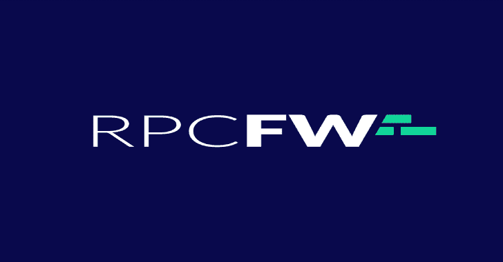

# RPC 防火墙:通过 RPC 防火墙停止横向移动

> 原文：<https://kalilinuxtutorials.com/rpc-firewall/>

**RPC 防火墙**是底层机制，用于众多的**横向移动**技术、 ***侦察*** 、**中继**攻击，或者仅仅是**利用易受攻击的 RPC 服务**。

DCSync 攻击？通过 RPC。偏远的 DCOM？通过 RPC。WMIC？通过 RPC。敏锐猎犬？通过 RPC。珀蒂波坦？通过 RPC。PsExec？通过 RPC。ZeroLogon？通过 RPC……好了，你明白了🙂

**是用来做什么的？**

**研究**

安装 RPC 防火墙并将其配置为**审计**所有远程 RPC 调用。一旦执行任何远程攻击工具，您将看到哪些 RPC UUIDs 和 Opnums 被远程调用。

**远程 RPC 攻击检测**

当 **RPC 防火墙**配置为审核时，它会将事件写入 Windows 事件日志。

将此日志转发到您的 SIEM，并使用它为您的服务器创建远程 RPC 流量的基准。

一旦审计到异常 RPC 调用，就使用它来触发针对您的 SOC 团队的警报。

**远程 RPC 攻击保护**

**RPC 防火墙**可以被配置为只阻止&审计潜在的恶意 RPC 调用。为了减少噪音和提高性能，所有其他 RPC 调用都不会被审核。

一旦检测到潜在的恶意 RPC 调用，就会被阻止和审核。这可以用来提醒您的 SOC 团队，同时保护您的服务器。

**RPC 防火墙有哪些组件？**

它由 3 个组件组成:

*   **RpcFwManager.exe**——负责管理 RPC 防火墙。
*   **RpcFirewall.dll**–执行 RPC 调用的审计&过滤的注入 DLL。
*   **RpcMessages.dll**–一个共享函数的公共库，以及将数据写入 Windows 事件查看器的逻辑。

**怎么用？**

**安装/卸载**

安装只需将 RPC 防火墙 dll 放到%SystemRoot%\System32 中，并为事件查看器配置 **RPCFWP** 应用程序日志。

确保事件查看器在安装/卸载过程中关闭。

**RpcFwManager.exe/安装**

卸载正好相反。

**RpcFwManager.exe/卸载**

**保护过程**

RpcFwManager 试图只将 rpcFirewall.dll 注入到加载了 RPCRT4.DLL 的进程中。

一旦加载了 rpcFirewall.dll，它将验证主机进程是否具有有效的 RPC 接口，并且正在侦听远程连接。

否则，rpcFirewall.dll 会从目标进程中卸载自己。

如果该进程是有效的 RPC 服务器，rpcFirewall 将根据配置文件开始审核和监视传入的 RPC 调用。

通过 pid 保护单个进程:

**RpcFwManager.exe/PID**

要通过名称保护单个进程:

**RpcFwManager.exe/进程**

要保护所有进程，只需将或参数留空即可。

**RpcFwManager.exe/过程
RpcFwManager.exe/PID**

**解除保护过程**

要禁用 RPC 防火墙，请卸载它，或者使用 unprotect 参数:

**RpcFwManager.exe/解除保护**

这将从所有进程中卸载 rpcFirewall.dll。

**持续性**

RPC 防火墙本身并不持久。确保进程持续受到保护的一种方法是创建一个执行保护命令的计划任务。下面是一个 powershell 命令，只需将<rpcfw_path>替换为 RPC 防火墙发布文件夹的实际路径。</rpcfw_path>

**Register-scheduled task-TaskName " RPC fw "-Trigger(New-scheduled task Trigger-Once-At(Get-Date)-repetition interval(New-TimeSpan-Minutes 60))-User " NT AUTHORITY \ SYSTEM "-Action(New-scheduled task Action-exe " rpcfwmanager . exe "-Argument "/PID "-working directory " ")**

**配置**

rpcFwManager.exe 在可执行文件的同一个目录中查找一个 **RpcFw.conf** 文件。该文件使用以下配置选项:

*   uuid ->匹配特定的 uuid
*   opnum ->匹配 RPC opnum
*   地址->匹配远程 IP 地址
*   动作->可以是**允许**或**阻止**(默认允许)
*   audit -> true 或 false，控制是否将事件写入 RPCFWP 日志(默认为 false)
*   verbose ->为 true 时，输出特定 RPC 调用的调试信息(默认为 false)

配置顺序很重要，因为第一个匹配决定了 RPC 调用的结果。

例如，以下配置将通过从非域机器禁用 MS-DRSR UUID 来保护 DC 免受 DCSync 攻击。此外，请注意，审计仅针对被阻止的 MS-DRSR 尝试启用，这可能会向您的 SOC 发出潜在攻击警报！

**uuid:e 3514235-4b 06-11 D1-ab04-00 c 04 fc 2d CD 2 地址:操作:允许
uuid:e 3514235-4b 06-11 D1-ab04-00 c 04 fc 2d CD 2 地址:操作:允许
uuid:e 3514235-4b 06-11 D1-ab04-00 c 04 fc 2d CD 2 操作:阻止审核:真**

每当配置发生变化时，您都需要通过 update 命令通知 rpcFirewall.dll:

**RpcFwManager.exe/更新**

[**Download**](https://github.com/zeronetworks/rpcfirewall)