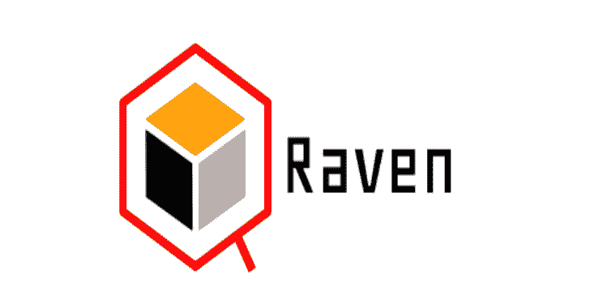

# Raven:高级网络威胁地图(简化、可定制、响应迅速)

> 原文：<https://kalilinuxtutorials.com/raven/>

**渡鸦**–高级网络威胁地图(简化、可定制、响应迅速。它使用 D3.js 搭配 TOPO JSON，拥有 247 个国家，~10 万个城市，可以在隔离环境**下使用，无需外部查找！**。

**特性**

*   使用 D3.js(不是 Anime.js)
*   主动威胁地图(实时和回放)
*   每次攻击的 IP、国家、城市和端口信息
*   国家/地区的攻击统计数据(仅已知攻击)
*   响应界面(移动、拖动、放大和缩小)
*   为国家和城市定制选项
*   界面上列出了 247 个国家(不是 174 个)
*   优化世界地图，加快渲染速度
*   包括 IP 查找、端口信息
*   随机模拟(IP、国家、城市)
*   可在线或离线使用(静态)
*   主题选择器模块

**数据**

你有不同的选项**`ip``name`**和`**coordinates**`

*   `**ip**`私有或公共 ip - >这些 IP->`**0.0.0.0**`或`**8.8.8.8**`中的任何一个作为`**{'from':'0.0.0.0','to':'8.8.8.8'}**`
*   `**name**`城市、州、国家- >这些格式中的任何一种- > `**seattle,wa,us**`或`**0,us**`作为`**{'from':'seattle,wa,us','to':'0,in'}**`
*   `**coordinates**`经纬度为`**{'from':['-11.074920','-51.648929'],'to':['51.464957','-107.583864']}**`

**方法 1——嵌入并与之互动**

// **你只需要在你的项目中嵌入这个 iframe。
<iframe id = " raven-iframe " src = " src/raven . html " frame border = " 0 " width = " 100% " height = " 100% " scrolling = " auto ">
//然后，用你的自定义设置运行初始化脚本——就这样！
script type = " text/JavaScript ">
document . getelementbyid(' raven-iframe ')。addEventListener("load "，function(){
var raven _ options = {
' world _ type ':null，
'selected_countries': []，
'remove_countries': ['aq']，
'height': window.innerHeight，
'width': window.innerWidth，
' backup _ background _ color ':' # 212222 '，
' orinal _ country _ color ':' # 737373 '，【T13 ' 'init_all(raven_options)
窗口['raven']。init _ world()
})；
//之后可以绘制任何想要的数据
raven . add _ to _ data _ to _ table(' name '，{'from':'seattle，wa，us '，' to':'delhi，in'}，{'line':{'from':null，' to':null}}，2000，['line '，' multi-output '，' single-output'])** 

**绘图数据(功能)**

**raven . add _ marker _ by _ name()//按国家或城市名称绘制信息
raven . add _ marker _ by _ ip()//按 IP 地址绘制数据
raven . add _ marker _ by _ coordinates()//按坐标绘制数据
marker _ object//An object { ' from ':，' to':""}参见示例
colors _ object//An object { ' line:{ ' from ':" # ff 0000 '，' to': 'FF0000'}}此线条的颜色**

**标绘数据(如线，从- >到)**

**raven . add _ marker _ by _ name({ ' from ':' Seattle，wa，us '，' to':'delhi，in'}，{'line':{'from':null，' to':null}}，2000，[' line '])
raven . add _ marker _ by _ IP({ ' from ':' 0 . 0 . 0 . 0 . 0 '，to ':' 0 . 0 . 0:53 ' }，{'line':{'from':'#FF0000 '，' to '::**

**绘图数据(作为点)**

raven . add _ marker _ by _ name({ ' from ':' portland，or，us '，' to':null}，{'line':{'from':null，' to':null}}，2000，[' point '])
raven . add _ marker _ by _ IP({ ' from ':' 8 . 8 . 8 . 8 '，' to':null}，{ ' line ':{ ' from ':# ff 0000 '，' to ':' # ff 0000 ' } }，1000，['

**绘制数据+添加到输出表(函数)**

**raven . add _ to _ data _ to _ table()//Plot info 并将它们添加到输出表中
方法//Name，IP 或坐标
marker _ object//An object { ' from ':，' to':""}参见示例
colors _ object//An object { ' line:{ ' from ':" # ff 0000 '，' to': 'FF0000'}}这条线的颜色介于 2 个点之间——(如果为空，那么将随机选取一种颜色)
超时//动画时间**

**绘图数据+** **将其添加到输出表中(如行，从- >到)**

**raven . add _ to _ data _ to _ table(' name '，{'from':'seattle，wa，us '，' to':'delhi，in'}，{'line':{'from':null，' to':null}}，2000，['line '，' multi-output '，' single-output '])
raven . add _ to _ data _ to _ table(' IP '，{ ' from ':' 0 . 0 . 0 . 0 . 0 '，' to ':' 0 . 3389 ' } .**

**绘制数据+添加到输出表(作为点)**

**raven . add _ to _ data _ to _ table(' name '，{'from':'seattle，wa，us '，' to':'delhi，in'}，{'line':{'from':null，' to':null}}，2000，['line '，' multi-output '，' single-output '])
raven . add _ to _ data _ to _ table(' IP '，{ ' from ':' 0 . 0 . 0 . 0 . 0 '，' to ':' 0 . 3389 ' } .**

**方法 2–嵌入，使用 websocket 绘图**

**渡鸦地图**

你只需要在你的项目中嵌入这个 iframe。
iframe id = " raven-iframe " src = " src/raven . html " frame border = " 0 " width = " 100% " height = " 100% " scrolling = " auto ">
script type = " text/JavaScript ">
document . getelementbyid(' raven-iframe ')。addEventListener("load "，function(){
var raven _ options = {
' world _ type ':null，
'selected_countries': []，
'remove_countries': ['aq']，
'height': window.innerHeight，
'width': window.innerWidth，
' backup _ background _ color ':' # 212222 '，
' orinal _ country _ color ':':' # 737373 '，【T12'已单击 init_all(raven_options)
窗口['raven']。init_world()
窗口['乌鸦']。fetch _ data _ from _ server()
})；

**绘制数据–使用 web socket ws://localhost:5678**发送 json 对象

**{
"函数": "标记"、
"方法":" ip "、
"对象":{
:"从":" 0.0.0 "、
"到":" 0.0.0"
}、
"颜色":{
"行":{
"从":" #977777 "、
"到":" #17777 "、
。**

**绘制数据并添加到表格–使用 web socket ws://localhost:5678**发送 json 对象

**{**
" **函数": "表格"、
"方法": "名称"、
"对象":{
"从":" 0，我们"、
"到":" 0，br"
}、
"颜色":{
"行":{
"从":" #977777 "、
"到":" #17777 "，
}。**

**运行模拟(隔离)**

**sudo d** ocker build -t 模拟。&&sudo docker run-p 5678:5678-p 8080:8080-it 模拟

[**Download**](https://github.com/qeeqbox/raven)