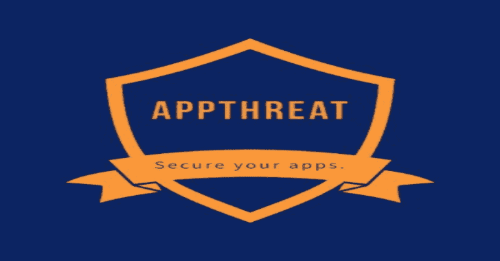
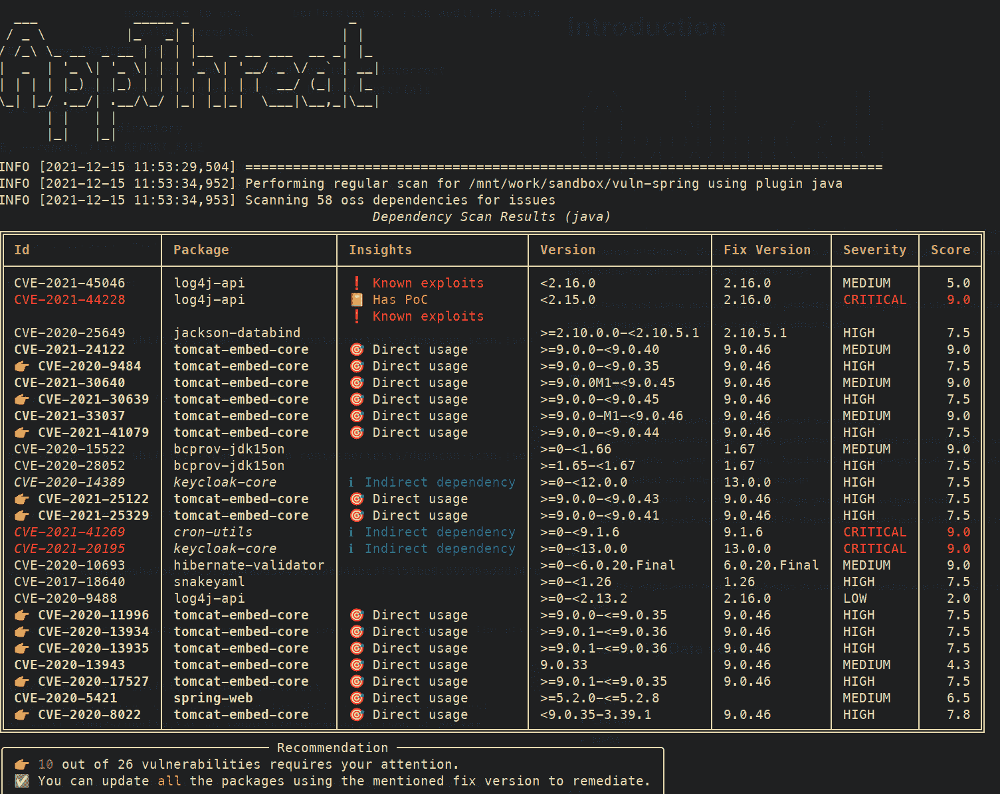

# Dep-Scan:针对项目依赖性的完全开源安全审计

> 原文：<https://kalilinuxtutorials.com/dep-scan/>

[](https://blogger.googleusercontent.com/img/a/AVvXsEhZg3-mIGpOoLce5R2oBc-BgX-o30bKTFCo5hkUvfLAXV89flNIW6ZV-ZBdO2dkTCjwLevl8Rj6K-bzlNgi66wvxRKn6uFFCCd8fxAmbYHlMOzQuuOecA6VtQLQIiVYiZYKpZoSWs-uNViKH0EYpkXJ_B8owmqVqe2Jb_R278sJMtzV9Q2NRK_R-v3-=s728)

**dep-scan** 是一款完全开源的安全审计工具，可根据已知的漏洞、建议和许可证限制对项目依赖性进行审计。本地存储库和容器图像都支持作为输入。该工具非常适合具有内置构建中断器逻辑的 CI 环境。

如果您刚刚遇到这个 repo，那么最好的起点可能是检查父项目 slscan，它包括 depscan 以及许多其他工具。

**特色**

*   使用 CVE 洞察进行本地回购和基于集装箱图像的扫描[1]
*   软件包漏洞扫描在本地执行，速度非常快。不使用服务器！
*   按软件包组建议最佳修复版本(请参见建议模式)
*   对依赖混淆攻击和维护风险执行深度包风险审计(参见风险审计)

**注**

*   [1]扫描中仅包括容器映像中与应用程序相关的包。操作系统包尚未包括在内。

[](https://github.com/AppThreat/dep-scan/blob/master/docs/depscan-latest.png)

**漏洞数据来源**

*   OSV
*   NVD
*   开源代码库
*   NPM

**用法**

dep-scan 非常适合在持续集成(CI)期间使用，也可以作为本地开发的工具。

**配合 ShiftLeft 扫描使用**

dep-scan 与 scan 集成在一起，后者是一款免费的开源 SAST 工具。要启用这个特性，只需将`**depscan**`传递给`**--type**`参数。有关更多信息，请参考扫描文档。

* * *

**–键入 python、depscan、credscan**

这种方法应该适用于 scan 支持的所有 CI 环境。

**本地扫描项目(Python 版)**

sudo NPM install-g @ app threat/cdx gen
pip install app threat-deps can

这将安装两个名为`**cdxgen**`和`**scan**`的命令。

您可以使用各种选项直接调用 scan 命令。

**CD
deps can–src $ PWD–report _ file $ PWD/reports/deps can . JSON**

选项的完整列表如下:

**用法:deps can[-h][–no-banner][–Cache][–Sync][–risk-audit][–PRIVATE-NS PRIVATE _ NS][-t PROJECT _ TYPE][–BOM BOM]-I SRC _ DIR[-o REPORT _ FILE]
[–no-error]
-h，–帮助显示此帮助消息并退出
–no-banner 不显示横幅
–缓存特定平台中的缓存漏洞信息 user _ data _ DIR
–同步接收应该先调用缓存。
–建议为每个已识别的漏洞建议合适的修复版本。
–风险审计执行包装风险审计(慢速操作)。仅限 Npm。
–PRIVATE-NS PRIVATE _ NS
执行 oss 风险审计时使用的私有名称空间。默认情况下，私有包在公共注册中心不可用。接受逗号
分隔的值。
-t PROJECT_TYPE，–TYPE PROJECT _ TYPE
如果自动检测不正确，则覆盖项目类型
–使用 CycloneDX 格式的给定软件物料清单(SBoM)文件检查 bom。使用 cdxgen 命令生成一个。
-i SRC_DIR，–SRC SRC _ DIR
源目录
-o REPORT_FILE，–REPORT _ FILE REPORT _ FILE
带有目录
的报告文件名–无错误**出错时继续以防止构建中断

**本地扫描容器(Python 版本)**

扫描集装箱`**shiftleft/scan-slim**`的`**latest**`标签

**deps can–无错误–缓存–src shift left/scan-slim-o container tests/deps can-scan . JSON-t docker**

将`**license**`包含到类型中，以执行许可证审核。

**deps can–无错误**–**-cache–src shift left/scan-slim-o container tests/deps can-scan . JSON-t docker，license**

您还可以使用 docker 或 podman save 命令保存容器图像，并将归档文件传递给 depscan 进行扫描。

**docker save-o/tmp/scan slim . tar shift left/scan-slim:latest
pod man save–format OCI-archive-o/tmp/scan slim . tar shift left/scan-slim:latest
deps can–no-error–src/tmp/scan slim . tar-o reports/deps can-scan . JSON-t docker**

**支持的语言和包格式**

dep-scan 在内部使用 cdxgen 命令为项目创建软件物料清单(SBoM)文件。这然后被用于执行扫描。

cdxgen 支持以下项目和包依赖格式。

| 语言 | 包装格式 |
| --- | --- |
| 节点. js | 包-锁. json，pnpm-锁. yaml，纱.锁，拉什. js |
| Java 语言（一种计算机语言，尤用于创建网站） | maven (pom.xml [1])，gradle (build.gradle，。kts)、scala (sbt) |
| 服务器端编程语言（Professional Hypertext Preprocessor 的缩写） | composer.lock |
| 大蟒 | setup.py，requirements.txt [2]，Pipfile.lock，poetry.lock，bdist_wheel，。whl |
| 去 | 二进制，go.mod，go.sum，Gopkg.lock |
| 红宝石 | Gemfile.lock，gemspec |
| 锈 | 货物。汤姆，货物。锁 |
| 。网 | 。csproj，packages.config，project.assets.json，packages.lock.json |
| 坞站/ oci 图像 | 所有支持的语言，不包括操作系统包 |

**注**

dep-scan 的 docker 映像目前没有捆绑生成 bom 所需的合适的 java 和 maven 命令。要解决这一限制，您可以–

*   从包含 java、maven 和 gradle 正确版本的虚拟机中使用基于 python 的执行。
*   通过本地调用`**cdxgen**`命令生成 bom 文件，随后通过`**--bom**`参数将其传递给`**dep-scan**`。

**与 CI 环境的集成**

**与 Azure DevOps 的集成**

参考这个例子 yaml 配置来集成 dep-scan 和 Azure 管道。构建步骤将执行扫描并以内联方式显示报告，如下所示:


**与 GitHub 动作集成**

使用此操作，此工具可以与 GitHub 操作一起使用。

这个 repo 同时用 sast-scan 和 dep-scan 进行自检！检查此报告的 GitHub 工作流文件。

*   **name:Self dep-scan
    uses:app threat/dep-scan-action @ master
    env:
    VDB _ HOME:$ { { GITHUB . workspace } }/db
    GITHUB _ TOKEN:$ { { secrets。GITHUB_TOKEN }}**

## **通过环境变量定制**

以下环境变量可用于定制行为。

*   VDB _ HOME–用于缓存数据库的目录。对于基于 docker 的执行，该目录应该作为卷从主机挂载
*   NVD _ 开始 _ 年份–默认值:2018 年。支持到 2002 年
*   GITHUB _ PAGE _ COUNT–默认值:2。最多支持 20 个

**GitHub 安全顾问**

要从 GitHub 下载安全顾问，需要一个具有以下范围的个人访问令牌。

*   阅读:包

**导出 GITHUB_TOKEN=""**

**套餐风险审计**

`**--risk-audit**`参数启用包装风险审计。目前，此模式仅支持 npm 和 pypi 包。许多风险因素被识别并被分配权重以计算最终风险分数。超过最大风险分值(`**config.pkg_max_risk_score**`)的包裹会显示在表格中。

使用`**--private-ns**`指定私有包名称空间，当私有包在公共 npm/pypi 注册表上可用时，应检查该名称空间是否存在依赖性混淆类型问题。

示例使用下面的参数检查带有名称空间@appthreat 和@shiftleft 的私有包是否意外地成为公共包。

```
**--private-ns appthreat,shiftleft** 
```

| 风险类别 | 默认重量 | 理由 |
| --- | --- | --- |
| pkg_private_on_public_registry | four | 私有包可在公共注册表上获得 |
| 包 _ 最小 _ 版本 | Two | 少于 3 个版本的软件包代表了一个极端，它们要么是超级稳定的，要么是相当新的。应用特殊的试探法来忽略旧的稳定包 |
| 模 _ 创建 _ 分 _ 秒 | one | 修改时间和创建时间相差不到 12 小时。这表明上传有一个必须立即纠正的缺陷。有时，这种快速更新也可能是恶意的 |
| 最近 _ 现在 _ 分钟 _ 秒 | Zero point five | 最新版本与当前时间相差不到 12 小时。根据软件包的不同，这样的最新版本可能是需要的，也可能是不需要的 |
| 最近 _ 现在 _ 最大 _ 秒 | Zero point five | 超过 6 年的软件包版本正在使用中。这种包可能有已知的或尚未发现的易受攻击的依赖项 |
| pkg_min_maintainers | Two | 软件包的维护者少于 2 人。许多开源项目只有 1 或 2 个维护者，所以使用特殊的试探法来忽略旧的稳定包 |
| 分组 _ 最小 _ 用户 | Zero point two five | 包中的 npm 用户少于 2 个 |
| pkg _ 安装 _ 脚本 | Two | 软件包运行自定义的安装前或安装后脚本。这通常是恶意的，也是 npm 的一个缺点。 |
| pkg _ 节点 _ 版本 | Zero point five | 软件包支持过时版本的节点，如 0.8、0.10、4 或 6.x。此类项目可能存在原型污染或与关闭相关的漏洞 |
| pkg _ 范围 | 4 或 0.5 | 在应用程序中直接使用的包(必需的范围)的权重为 4。可选套餐得分为 0.25 |
| 反对 | one | 最新版本已弃用 |

风险公式参见`**pkg_query.py::get_category_score**`方法。

**自动调整**

一个名为`**created_now_quarantine_seconds**`的参数用于识别安全通过隔离期(1 年)的包裹。某些风险，如`**pkg_min_versions**`和`**pkg_min_maintainers**`，对于过了检疫期的包裹来说是被抑制的。这种调整有助于减少噪音，因为恶意软件包不可能在注册表中存在一年以上而不被发现。

**配置权重**

所有参数都可以通过使用环境变量来定制。例如:

导出 PKG 最小版本=4 以增加并将最小版本类别设置为 4。

[**Download**](https://github.com/AppThreat/dep-scan)