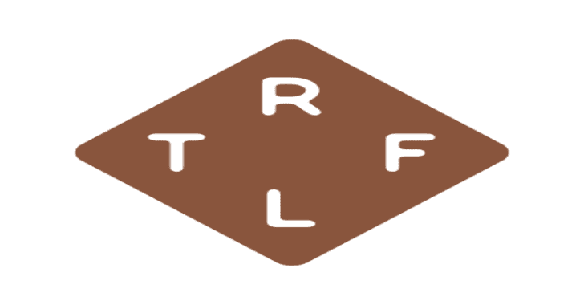
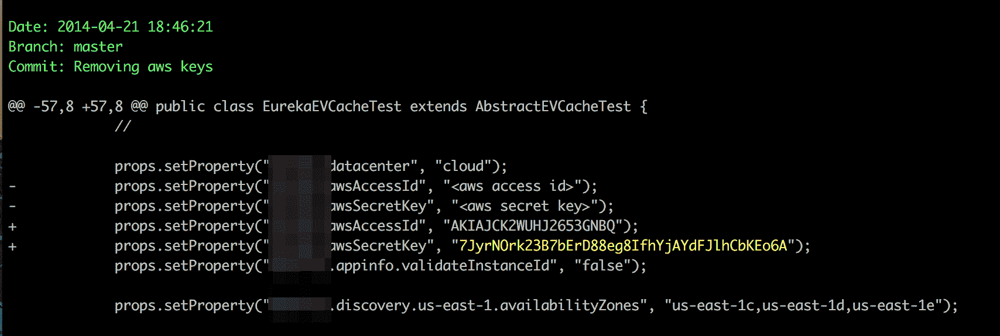

# truffleHog:在 Git 存储库中搜索高熵字符串和秘密

> 原文：<https://kalilinuxtutorials.com/trufflehog/>

truffhog 之前通过在 git diffs 上运行熵检查来运行。这个功能仍然存在，但是增加了高信号正则表达式检查，还增加了抑制熵检查的能力。

**松露猪–正则表达式–熵=假 https://github.com/dxa4481/truffleHog.git**

或者

**truffhog file:///user/dxa 4481/code projects/truffhog/**

使用`**--include_paths**`和`**--exclude_paths**`选项，还可以通过在文件中定义正则表达式(每行一个)来匹配目标对象路径，从而将扫描限制在 Git 历史中的对象子集。要进行说明，请参见下面的包含和排除文件示例:

*include-patterns.txt:*

**src/
以“#”开头的行被视为注释并被忽略
gradle/
正则表达式必须匹配整个路径，但可以使用 python 的正则表达式语法进行
不区分大小写的匹配和其他高级选项
(？我)。*。(properties|conf|ini|txt|y(a)？ml)$(。* /)？id_[rd]sa$**

*exclude-patterns.txt:*

**(。 */)？。类路径$。*。jmx$
(。 */)？测试/(。* /)？资源/**

这些过滤器文件可以通过以下方式应用:

**truffhog–include _ paths include-patterns . txt–exclude _ paths exclude-patterns . txt file://path/to/my/repo . git**

使用这些过滤器，在根级`**src**`目录中的文件中发现的问题将被报告，例如，除非它们具有`**.classpath**`或`**.jmx**`扩展名，或者如果它们在 **`src/test/dev/resources/`** 目录中被发现。使用`**-h**`或`**--help**`选项调用`**trufflehog**`时，会提供额外的使用信息。

这些特性有助于减少噪音，并使工具更容易推入 devops 管道。

**安装**

**皮普安装松露猪**

## 定制的

可以使用下面的标志`**--rules /path/to/rules**`添加定制的正则表达式。这应该是以下格式的 json 文件:

**{
"RSA 私钥":"——开始 EC 私钥——"
}**

可以添加子域枚举、s3 存储桶检测和其他非常有用的正则表达式。

你也可以随意贡献你认为对社区有益的高信号正则表达式。像 Azure keys、Twilio keys、Google Compute keys 这样的东西是受欢迎的，前提是可以构造高信号的正则表达式。

trufflehog 的基本规则集来源于 https://github . com/dxa 4481/truffhogreexes/blob/master/truffhogreexes/regexes . JSON

要明确允许特定的秘密(如仅用于本地测试的自签名密钥)，您可以提供以下格式的允许列表`**--allow /path/to/allow**`:

**{
" local self signed test KEY ":"——BEGIN EC PRIVATE KEY —-\ nfoobar 123 \ n————END EC PRIVATE KEY—",
" git Cherry pick SHAs ":" regex:Cherry pick from。*，
}**

注意，以`**regex:**`开头的值将被用作正则表达式。没有这个的值将是文字值，有一些自动转换(例如，灵活的换行符)。

## 它是如何工作的

该模块将检查每个分支的整个提交历史，检查每个提交的差异，并检查秘密。这是正则表达式和熵的结果。对于熵检查，truffleHog 将评估 base64 字符集和十六进制字符集的 shannon 熵，用于每个 diff 中由这些字符集组成的超过 20 个字符的文本的每个 blob。如果在任何时候检测到大于 20 个字符的高熵字符串，它将被打印到屏幕上。

## 使用 Docker 运行

首先，输入包含 git 存储库的目录

**cd /path/to/g** it

要使用 docker 映像启动 trufflehog，请运行以下命令

**坞站运行–RM-v " $(pwd):/proj " dxa 4481/trufflehg file:///proj**

`**-v**`将当前工作目录(`**pwd**`)挂载到 Docker 容器中的`**/proj**`目录

`**file:///proj**`引用容器中完全相同的`**/proj**`目录(在 docker 文件中也被设置为默认工作目录)

[**Download**](https://github.com/trufflesecurity/truffleHog)