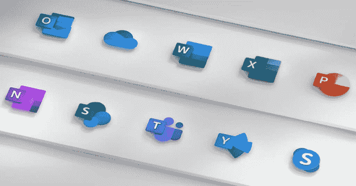

# 365Inspect:一个 PowerShell 脚本，可自动对 Microsoft Office 365 环境进行安全评估

> 原文：<https://kalilinuxtutorials.com/365inspect/>

**365 *Inspect*** 需要 Microsoft Online、Azure AD(我们建议安装 AzureADPreview 模块)、Exchange 管理、Microsoft Graph、Microsoft Intune、Microsoft Teams 和 Sharepoint 管理的管理 PowerShell 模块。

365*Inspect*. PS1 PowerShell 脚本将验证已安装的模块。

如果您没有安装这些模块，系统将提示您安装它们，如果您同意，脚本将尝试安装。否则，您应该能够在管理 PowerShell 提示符下使用以下命令安装它们，或者按照以下参考资料中的说明进行安装:

**安装模块名 MSOnline
安装模块名 azure read preview
安装模块名 ExchangeOnlineManagement
安装模块名微软。在线. SharePoint.PowerShell
安装-模块-名称微软。图
安装模块名微软团队
安装模块名微软。图. Intune**

一旦以上安装完成，使用你的浏览器或者使用 *git 克隆*从 Github 下载 365 *Inspect* 源代码文件夹。

因为您将使用管理权限运行 365 *Inspect* ，所以您应该将它放在一个逻辑位置，并确保该文件夹的内容只有管理用户可以读写。如果您打算将 365 *Inspect* 安装在频繁执行或作为自动化过程的一部分使用的位置，这一点尤为重要。

# 用法

要运行 365 *Inspect* ，请打开 PowerShell 控制台并导航至您下载 365 *Inspect* 的文件夹:

**CD 365 检查**

您将通过在 PowerShell 命令提示符中执行主脚本文件 365Inspect.ps1 来与 365 *Inspect* 进行交互。

所有 365 *检查*要求检查您的 O365 租户是通过具有适当权限的 O365 帐户访问的，因此大多数命令行参数与被评估的组织和身份验证方法有关。

365 *检查*的执行如下:

**。\ 365 inspect . PS1-OrgName-out path-Auth**

例如，要通过在支持 MFA 的浏览器中输入您的凭据来登录:

**。\ 365 inspect . PS1-OrgName my company-out path..\365_report -Auth MF** A

365 *Inspect* 仅可与指定的检查员模块一起运行，或者相反，排除指定的模块。

例如，要通过在支持 MFA 的浏览器中输入您的凭据来登录:

**。\ 365 inspect . PS1-OrgName my company-out path..\ 365 _ report-Auth MFA-selected inspectors inspectors 1，inspectors 2**

或者

**。\ 365 inspect . PS1-OrgName my company-out path..\ 365 _ report-Auth MFA-exclude 督察督察 1、督察 2、督察 3**

要进一步分解参数:

*   *OrgName* 是您的 O365 实例的核心组织或“公司”的名称，它将被检查。
    *   如果您不知道您的组织名称，可以导航到 O365 中所有 Exchange 域的列表。最顶层的域名应该命名为*域名* .onmicrosoft.com。在该示例中，*域名*是您的组织名称，应该在执行 365 *检查*时使用。
*   *OutPath* 是一个文件夹的路径，365 *Inspect* 生成的报告将放在这个文件夹中。
*   *Auth* 是一个选择器，应该是文字值“MFA”、“CMDLINE”或“ALREADY_AUTHED”中的一个。
    *   *Auth* 控制 365 *Inspect* 如何对所有 Office 365 服务进行认证。
    *   Auth MFA 将生成一个图形弹出窗口，您可以在其中键入您的凭据，甚至为启用 MFA 的帐户输入 MFA 代码。
    *   *Auth ALREADY_AUTHED* 指示 365 *Inspect* 在扫描前不要认证。如果您在 PowerShell 提示符下执行 365 *Inspect* ，并且已经拥有所有描述的服务的有效会话，比如您已经执行了 365 *Inspect* ，那么这可能更好。
*   *SelectedInspectors* 是您希望与 365 *Inspect* 一起运行的检查员的姓名。如果选择了多个检查员，则必须用逗号分隔。将只运行指定的检查员。
*   *ExcludedInspectors* 是您希望阻止 365 *Inspect* 运行的检查员的姓名。如果选择了多个检查员，则必须用逗号分隔。将运行所有模块，包括其他模块。

当您使用 *-Auth MFA* 执行 365 *Inspect* 时，可能会产生几个图形登录提示，您必须按顺序登录。这是 Exchange、SharePoint 等的正常行为。具有独立的管理模块，每个模块需要不同的登录会话。如果您只是登录所要求的次数，365 *检查*应该开始执行。这是有趣的反义词，我们正在寻找一种解决方法，但不用说，我们觉得花一分钟查看 MFA 代码的结果是值得的。

随着 365 *Inspect* 的执行，它将稳定地打印状态更新，指示哪个检测任务正在运行。

365 *检查*可能需要一些时间来执行。这个时间与测试环境的规模和复杂性成比例。例如，一些检查任务涉及扫描所有用户的帐户配置。对于拥有 50 名用户的组织来说，这可能几乎是即时发生的，也可能需要整整几分钟(！idspnonenote)才能完成。)对于一个拥有 10000 人的组织来说。

# 输出

365 *Inspect* 创建 out_path 参数中指定的目录。这个目录是整个 365 *Inspect* 检查的结果。它包含四个值得注意的项目:

*   *Report.html*:描述由 365 *检查*识别的 O365 安全问题的图形报告，列出错误配置的 O365 对象，并提供补救建议。
*   *名为【Inspector-Name】*的各种文本文件:这些是来自 Inspector 模块的原始输出，包含一个错误配置的 O365 对象列表(每行一个项目)，这些对象包含所描述的安全缺陷。例如，如果模块 Inspect-FictionalMFASettings 要检测所有未设置 MFA 的用户，则报告 ZIP 中的文件“Inspect-FictionalMFASettings”将每行包含一个未设置 MFA 的用户。只有在发现超过 15 个受影响对象的情况下，此信息才会转储到文件中。如果发现的受影响对象少于 15 个，这些对象将直接列在主 HTML 报告正文中。
*   *Report.zip* :整个目录的压缩版本，用于在某些 inspector 模块生成大量结果的情况下方便地分发结果。
*   *日志目录* : 365 *检查*将脚本执行过程中遇到的任何错误记录到日志目录中带有时间戳的日志文件中

# 必要的特权

365 *Inspect* 无法正常运行，除非你认证的 O365 账号有适当的权限。365 *检查*至少需要以下内容:

*   全局管理员
*   SharePoint 管理员

我们意识到这些是非常宽松的角色，不幸的是，由于使用了 Microsoft Graph，我们被 Microsoft 限制使用较低的权限。应用程序和云应用程序管理员角色(用于授予委托权限和应用程序权限)被限制授予对 Microsoft Graph 或 Azure AD PowerShell 模块的权限。https://docs . Microsoft . com/en-us/azure/active-directory/roles/permissions-reference #应用程序-管理员

# 开发检查员模块

365 *Inspect* 被设计成易于扩展，希望它能够让个人和组织在内部使用他们自己的 365 *Inspect* 模块，或者为 O365 社区发布这些模块。

所有 365 个 *Inspect* 的检查员模块都存储在。\检查员文件夹。

创建检查器模块很简单。检查员有两个文件:

*   *modulename . PS1*:inspector 模块的 PowerShell 源代码。应该返回受特定问题影响的所有 O365 对象的列表，用字符串表示。
*   *ModuleName.json* :关于检查员本身的元数据。例如，调查结果名称、描述、补救信息和引用。

PowerShell 和 JSON 文件名必须相同，以便 365 *Inspect* 识别这两个文件属于同一个文件。在 365 *Inspect* 的内置模块套件中有很多例子，但我们在这里也举一个例子。

示例. ps1 文件，BypassingSafeAttachments.ps1:

定义一个我们稍后会调用的函数。
365Inspect 的内置模块都遵循这种模式。
功能 Inspect-bypassingsafe attachments {
查询 O365 环境的某个元素进行检查。注意，我们不需要向 Exchange
进行认证就可以在这个模块中获取这些传输规则；假设主 365Inspect 线束已经让我们登录。
$ safe _ attachment _ bypass _ rules =(Get-transport rule | Where { $ _。SetHeaderName-eq " X-MS-Exchange-Organization-skipsafeatchmentprocessing " })。身份
如果一些被解析的 O365 对象被发现有这个模块正在检查的安全缺陷，
返回一个表示这些对象的字符串列表。这就是报告中“受影响的对象”字段的内容。
If(＄safe _ attachment _ bypass _ rules。count-ne 0){
return $ safe _ attachment _ bypass _ rules
}
如果解析的 O365 对象中没有一个被发现有该模块正在检查的安全缺陷，则
返回$null 表示 365Inspect 没有发现该模块的安全缺陷。
return $null
}
返回调用 inspector 函数的结果。
返回检查-旁路安全附件

举例。json 文件，BypassingSafeAttachments.json:

**{
"FindingName ":"不要绕过安全附件过滤器"，
"Description ":"作为交换，可以创建绕过安全附件检测功能的邮件传输规则。上面列出的规则绕过了安全附件功能。请考虑重新审视这些规则，因为根据上下文，绕过安全附件功能(即使是部分发件人)可能会被认为是不安全的，或者可能是受到危害的迹象。，
“修正”:“导航到 Exchange 管理中心中的邮件流- >规则屏幕。寻找违规的规则，并开始评估谁创建了它们，以及它们是否是您的组织继续运行所必需的。如果不是，就删除这些规则。”、
"AffectedObjects ":"、
" References ":[
{
" Url ":" https://docs . Microsoft . com/en-us/Exchange/security-and-compliance/Mail-Flow-Rules/Manage-Mail-Flow-Rules "、
"Text ":"管理 Exchange Online 中的邮件流规则"
}、
{
" Url ":" https://www . undocumentated-Features . com/2018/05**

一旦你把这两个文件放到。\inspectors 文件夹中，它们被认为是 365 *Inspect* 模块清单的一部分，并将在下次执行 365 *Inspect* 时运行。

您已经创建了 BypassingSafeAttachments 检查器模块。仅此而已！

365 *Inspect* 将抛出一个非常响亮和丑陋的错误，如果你的模块中的某些东西不工作或不遵循 365 *Inspect* 约定，所以监视命令行输出。

[**Download**](https://github.com/soteria-security/365Inspect)