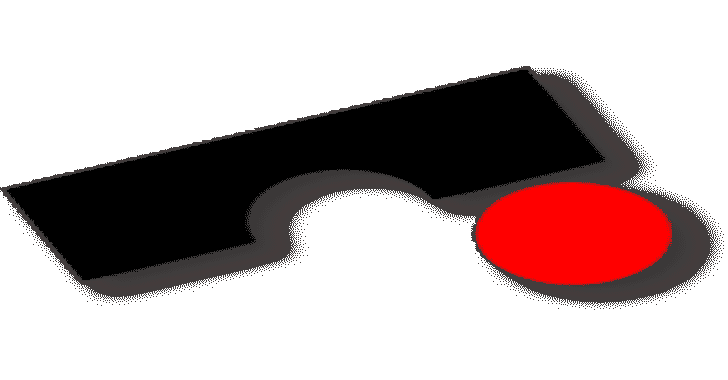

# FormatFuzzer:高效、高质量生成和解析二进制输入的框架

> 原文：<https://kalilinuxtutorials.com/formatfuzzer/>

**FormatFuzzer** 是一个框架，用于*高效、高质量地生成和解析二进制输入。*它使用一个*二进制模板*来描述二进制输入的格式，并生成一个*可执行文件*来生成并解析给定的二进制格式。例如，从 GIF 的二进制模板中，`**FormatFuzzer**`产生一个 GIF 生成器——也称为 *GIF fuzzer* 。

由`**FormatFuzzer**`产生的生成器非常高效，每秒产生数千个有效的测试输入——与基于突变的模糊器形成鲜明对比，后者的大部分输入都是无效的。由`**FormatFuzzer**`生成的输入独立于被测程序(或者实际上，任何程序)，所以你也可以在黑盒设置中使用它们。然而，`**FormatFuzzer**`还集成了 AFL++以产生有效的输入，其目的也是为了最大化覆盖率。在我们的实验中，这种“两全其美”的方法优于所有其他设置；详见我们的论文。

FormatFuzzer 使用的二进制模板来自 010 编辑器。有超过 170 个二进制模板，它们或者可以直接用于`FormatFuzzer`或者适合其使用。开箱即用，`FormatFuzzer`产生 AVI、BMP、GIF、JPG、MIDI、MP3、MP4、PCAP、PNG、WAV、ZIP 等格式；我们每周都在扩展这个列表。

欢迎投稿！访问 FormatFuzzer 项目页面，提出想法和问题，或添加拉动式请求。关于`FormatFuzzer`如何工作以及如何比较的细节，请阅读我们的论文了解更多信息。

**虎子**

FormatFuzzer 可从 FormatFuzzer 项目页面获得。您可以从 releases 页面下载并解包最新版本。

对于最新最棒的，你也可以克隆它的 git 库:

**git 克隆 https://github.com/uds-se/FormatFuzzer.git**

所有进一步的操作都发生在它的主文件夹中:

**光盘格式化器**

**先决条件**

要运行 FormatFuzzer，您需要以下内容:

*   python3
*   一个带有 GNU 库(特别是`**getopt_long()**`)如`**clang**`或`**gcc**`的 C++编译器
*   Python 包`**py010parser**`、**、`six`、**和`**intervaltree**`
*   一个`**zlib**`库(用于压缩功能)
*   一个`**boost**`库(用于校验和功能)

如果您计划编辑构建和配置脚本(`**.ac**`和`**.am**`文件)，您还需要

*   GNU autoconf
*   GNU 自动制造

**在 Linux 上安装需求(Debian 软件包)**

**sudo apt 安装 git g++ make automake python 3-pip zlib 1g-dev libboost 1.71-dev
pip 3 安装 py010parser six intervaltree**

**MAC OS 上的安装要求(带 Xcode &自制)**

**xcode-select-install
brew install python 3 automake boost
pip 3 install py 010 parser six interval tree**

**仅安装 Python 包(所有操作系统)**

在所有系统上，使用`**pip**`:

**pip 安装 py010parser
pip 安装六个
pip 安装 intervaltree**

**大楼**

注意:所有的构建命令都要求你和这个`**README**`文件在同一个文件夹中。尚不支持在该文件夹之外构建模糊化器。

**方法一:使用 build.sh 脚本**

有一个`build.sh`脚本可以自动完成所有的构建步骤。简单地跑

**。/build.sh gif**

创建一个 GIF fuzzer。

这适用于`**templates/**`中提供的所有文件格式；如果有一个文件`**templates/FOO.bt**`，那么`**./build.sh FOO**`将建立一个 fuzzer。

**方法二:使用 Make**

有一个`**Makefile**`(来源于`**Makefile.am**`)可以自动化所有的构建步骤。(需要`**GNU make**`。)先做

**触摸配置 Makefile.in**

然后

**。/配置**

然后

**制作 gif-fuzzer**

创建一个 GIF fuzzer。

这适用于`**templates/**`中提供的所有文件格式；如果有一个文件`**templates/FOO.bt**`，那么`**make FOO-fuzzer**`将建立一个 fuzzer。

**方法三:手动步骤**

如果上述`**make**`方法不起作用，或者如果您想要更多的控制，您可能必须手动进行。

**第一步:将二进制模板文件编译成 C++代码**

运行`**ffcompile**`编译器，将二进制模板编译成 C++代码。它有两个参数:`**.bt**`二进制模板，和一个要生成的`**.cpp**` C++文件。

**。/ff compile templates/gif . Bt gif . CPP**

**第二步:编译 C++代码**

使用以下命令创建一个模糊器`**gif-fuzzer**`。首先，编译通用命令行驱动程序:

**g++-c-I .-STD = c++ 17-g-O3-Wall fuzzer . CPP**

(`**-I** .`表示`**bt.h**`文件的位置；`**-std=c++17**`设定了 C++标准。)

然后，编译二进制解析器/编译器:

**g++ c-I .-STD = c++ 17-g-O3-wall gif . CPP**

最后，将二进制解析器/编译器与命令行驱动程序链接起来，以获得可执行文件。如果您使用任何额外的库(如`**-lz**`)，请确保在这里也指定这些库。

**g++-O3 gif . o fuzzer . o-o gif-fuzzer-LZ**

**运行模糊器**

FormatFuzzer 可以作为特定格式的独立解析器、生成器或赋值器运行。此外，它还可以被 AFL++等通用模糊化器调用，以将那些特定于格式的功能集成到模糊化过程中(参见下面关于 AFL++集成的部分)。

生成的 fuzzer 将一个*命令*作为第一个参数，后面是该命令的选项和参数。

最重要的命令是`fuzz`，用于产生输出。它的参数是以适当格式生成的文件。

以下列方式运行发电机

**。/gif-fuzzer fuzz output.gif**

创建随机二进制文件`output.gif`，或者

**。/gif-fuzzer fuzz out 1 . gif out 2 . gif out 3 . gif**

创建三个 GIF 文件`**out1.gif**`、`**out2.gif**`和`o**ut3.gif**`。

请注意，我们提供的`**gif.bt**`模板已经增加了特殊功能，使得有效文件的生成更加容易。如果您使用未经修改的原始`**.bt**`模板文件，您可能会在生成过程中收到警告并创建无效文件。

**运行解析器**

您还可以使用`**parse**`命令，将 fuzzer 作为二进制文件的*解析器*来运行。如果你想测试二进制模板的准确性，或者如果你想改变一个输入(见下面的“决策文件”)，这是很有用的。

要运行解析器，请使用

**。/gif-fuzzer parse input.gif**

如果无法成功解析`input.gif`，您将会看到错误消息。

**决策文件**

在解析时，您还可以将所有解析决策(即采用了哪些解析选项)存储在一个*决策文件*中。这是一个字节序列，列举了所采取的决策。每个字节代表一个解析决策。一个字节值`**0**`意味着采用了第一个选项，一个字节值`1`意味着采用了第二个选项，依此类推。

您可以在解析输入时生成这样一个决策文件:

**。/gif-fuzzer parse–decisions input . dec input . gif**

这里，`**input.dec**`存储为解析“input.gif”所做的决定。

当*生成*输入时，也可以使用这样的决策文件。然后模糊器将做出与解析过程中发现的完全相同的决定。以下命令使用解析“input.gif”时确定的决策生成一个新的 GIF 文件:

**。/gif-fuzzer fuzz–decisions input . dec input 2 . gif**

如果一切正常，两个文件应该是相同的:

**cmp input.gif input2.gif**

通过*改变*一个决策文件(例如替换单个字节)，您可以创建*类似于*被解析的原始文件的输入。这对于与特定的测试策略和模糊化器(如 AFL)接口很有用，在 AFL 中，您可以使用`gif-fuzzer`等作为从决策文件到二进制文件的*翻译器*, AFL 会改变决策文件，测试中的程序会在翻译后的二进制文件上运行。与直接改变二进制文件(AFL 通常会这样做)相比，这种方法的优势在于总是有有效的输入——从而更快地达到覆盖率。

**AFL++整合**

除了格式特定的模糊化器，如`**gif-fuzzer**`，FormatFuzzer 还可以编译成格式特定的共享库，如`**gif.so**`(为此，只需运行 **`./build.sh gif`或`make gif.so`)。**这些共享库可以由 AFL++等通用模糊器加载。

要用 FormatFuzzer 运行 AFL++，只需按照我们的 AFL++修改版上的说明进行操作。我们支持不同的模糊策略，包括:

*   AFL+FFMut:使用 FormatFuzzer 运行 AFL++以提供特定于格式的智能变异。
*   AFL+FFGen:使用 FormatFuzzer 作为特定于格式的生成器，而 AFL++对其决策种子进行变异。

**创建和定制二进制模板**

要编写自己的`.bt`二进制模板(从而为这种格式创建高效的模糊器/解析器)，请阅读 010 编辑器手册中的模板和脚本介绍一节。

在许多情况下，您正在寻找的格式的模板(或类似的模板)可能已经存在。看看 010 编辑器二进制模板集合，看看是否有你可以使用的东西，或者你的格式可以基于它。

注意，存储库中提供的`.bt`文件通常以解析文件的*为目标。它们*也可以用于*生成*文件；但是他们通常缺乏输入的哪一部分是必需的确切信息。**

 *在这一节中，我们将讨论一些定制`**.bt**`文件的方法，以便与`**FormatFuzzer**`配合使用。

例如，对于 gif 格式，文件 templates/gif-orig.bt 显示了原始的二进制模板，该模板仅设计用于解析，而文件 templates/gif.bt 是能够生成有效 GIF 的修改版本。通过比较这两个文件，我们可以看到，要实现这一点，只需进行少量的更改。

如果您已经通过运行`**make gif-fuzze**r`或使用`**ffcompile**`工具创建了一个`**gif-fuzzer**`，那么您已经获得了一个 C++文件`**gif.cpp**`，它包含了 GIF 生成器和解析器的一个实现。这有助于了解您对二进制模板所做的更改是如何转化为可执行代码的。下一节将介绍 C++代码的更多细节。

GIF 二进制模板利用*前瞻*函数`**ReadUByte()**`和`**ReadUShort()**`来前瞻文件中的下一个字节的值，然后将它们解析到一个结构字段中。在生成时，我们允许这些函数接收一个额外的参数，该参数指定一组已知的值来选择我们要预测的字节。此外，我们还允许指定一组已知的全局值，以便在调用特定的前瞻函数时使用，例如 **`ReadUByte()`。**那些都存储在 **`ReadUByteInitValues`** 向量中。

默认情况下，我们的翻译过程`**ffcompile**`试图挖掘已经在与前瞻字节的比较中使用的感兴趣的值，并将它们用作已知值的全局集合。跑步时

**。/ff compile templates/gif . Bt gif . CPP**

打印的消息显示识别的前瞻函数，以及挖掘的感兴趣的值:

**已完成创建 cpp 生成器。
找到 Lookahead 函数:
ReadUByte
ReadUShort
挖掘出的有趣值:
GlobalColorTableFlag:[' 1 ']
LocalColorTableFlag:[' 1 ']
read ubyte:[' 0x3B '，' 0x2C']
ReadUShort: ['0xF921 '，' 0xFE21 '，' 0x f121 '，' 0xFF21']
签名:['"GIF"']**

然而，对于 GIF 生成，最好在每次调用函数时单独指定一组已知的好值。所以我们定义了一个空数组(大小为 0)

**const local ubyte readineinit values[0]；**

为了覆盖全局`**ReadUByteInitValues**`的集合，并且对于每个对`**ReadUByte()**`的调用，我们使用一个额外的参数来指定用于该特定位置的一组好的值。二进制模板语言也足够强大，允许根据运行时条件做出选择。例如，在下面的代码中，我们展示了为一个`ReadUByte()`调用选择合适的值是如何依赖于我们正在生成的当前 GIF 版本的。GIF 版本`89a`允许字节有一个额外的可能值(0x21)。

**if(GifHeader。Version == "89a")
本地字节值[] = { 0x3B，0x2C，0x 21 }；
else
本地 UBYTE 值[] = { 0x3B，0x2C }；
while (ReadUByte(FTell()，values)！= 0x3B) {
…
}**

GIF 二进制模板所需的其余编辑是类似的。例如，对于每个 struct 字段也可以指定一组已知的好值。例如，这指定了`Version`字段的正确值:`87a`和`89a`。

**char 版本[3] = { {"87a"}，{ " 89a " } }**

**理解生成的 C++代码**

出于调试目的，以及为了理解如何进行适当的更改来改进您的生成器和解析器，理解所生成的 C++代码的一些内部工作方式可能是有用的。理想情况下，您应该能够编辑二进制模板文件，直到它们可以用于生成高概率的有效文件，这样您就不必编辑生成的 C++代码。

C++代码为二进制模板中定义的每个`**struct**`和`**union**`创建一个类，也为本地类型创建一个类，比如`**int**`。

在构造时，当初始化一个变量时，我们可以定义一组这个变量可以采用的已知值。例如，构造函数调用

**char _ array _ class cname(cname _ element，{ "IHDR "，"文本"，" PLTE "，" cHRM "，" sRGB "，" iEXt "，" zEXt "，"时间"，" pHYs "，" bKGD "，" sBIT "，" sPLT "，" acTL "，" fcTL "，" fdAT "，" IHDR "，" IEND " })；**

将指定 17 个好值用于变量`**cname**`。但是这通常是不够的，因为适当的块类型的选择是上下文相关的。因此，我们还允许在生成新块时指定一组好的值。例如，这个调用可以用来为第一个块生成一个`**chunk**`的实例，它必须具有 IHDR 类型。

**GENERATE(chunk，:g->chunk . GENERATE({“IHDR”}，false))；**

在生成第二个组块时，我们可能会使用这一长串介于 IHDR 组块和 PLTE 组块之间的可能组块:

**GENERATE(chunk，:g- > chunk.generate({ "iCCP "，" sRGB "，" sBIT "，" gAMA "，" cHRM "，" pHYs "，" sPLT "，" tIME "，" zTXt "，" tEXt "，" iTXt "，" eXIf "，" oFFs "，" pCAL "，" sCAL "，" acTL "，" fcTL "，" fdAT "，" fRAc "，" gIFg "，" gIFt "，" gIFx "，" sTER" }，true))；**

然后，生成器将统一选择一个已知良好的值用于新实例。我们还允许选择一个邪恶的值，它不是已知的好值，概率为 1/128。使用`set_evil_bit`方法可以随时启用或禁用该功能。

生成器采取的所有随机选择都是通过调用`rand_int()`方法来完成的。

**long long rand_int(无符号 long long x，STD::function parse)；**

当将程序作为生成器运行时，该方法通过从随机缓冲区读取字节来对从 0 到 x-1 的整数进行采样。当作为解析器运行程序时，该方法使用`parse()`函数来找出哪些随机字节必须出现在随机缓冲区中，以便生成目标文件，然后将这些字节写入随机缓冲区。`parse`函数接收文件当前位置的缓冲区作为参数，然后必须返回当前对`rand_int()`的调用必须返回的值，以生成精确的文件配置。

[**Download**](https://github.com/uds-se/FormatFuzzer)*