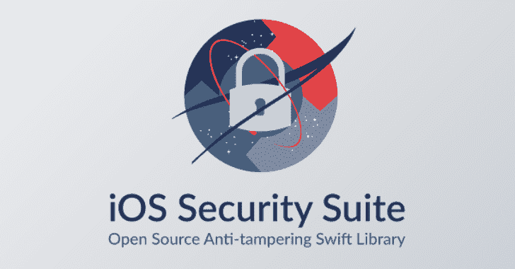

# iOS 平台安全和防篡改 Swift 库

> 原文：<https://kalilinuxtutorials.com/iossecuritysuite/>

%20(1).png)

**iOS 安全套件**是一个高级易用的平台安全&防篡改库，纯 Swift 编写！如果您正在为 iOS 开发，并且希望根据 OWASP MASVS 标准第 8 章保护您的应用程序，那么这个库可以为您节省大量时间。

ISS 检测的内容:

*   越狱(甚至是全新指标的 iOS 11+！
*   附加调试器
*   如果应用程序在仿真器中运行
*   设备上运行的常见逆向工程工具

## 设置

有 4 种方法可以开始使用 IOSSecuritySuite

### 1。添加源

将`**IOSSecuritySuite/*.swift**`文件添加到您的项目

### 2。用 CocoaPods 设置

`**pod 'IOSSecuritySuite'**`

### 3。设置迦太基

`**github "securing/IOSSecuritySuite"**`

### 4。使用 Swift 软件包管理器进行设置

**。包(URL:" https://github . com/securing/IOs security suite . git "，from: "1.5.0")**

### 更新 Info.plist

将 ISS 添加到您的项目后，您还需要更新您的 main Info.plist。越狱检测模块中有一个检查，它使用`**canOpenURL(_:**)`方法，并要求指定将被查询的 URL。

**key>lsapplicationquerieschemes
array>
string>cy dia
string>unsetimus
string>sileo
string>zbra
string>filza
string>activator
/array>**

## 如何使用

### 越狱检测器模块

*   如果你只想知道设备是越狱还是被监禁，最简单的方法返回真/假

**if IOs security suite . amijailbroken(){
print("此设备已越狱")
} else {
print("此设备未越狱")
}**

**冗长的**，如果你也想知道哪些指标被确定

**let jailbreakStatus = IOs security suite . amijailbrokenwithfailmessage()
if jailbreakStatus . jailbroken {
print("此设备已越狱")
print("因为:(jailbreakStatus . fail message)")
} else {
print("此设备未越狱")
}**

失败消息是包含逗号分隔指示符的字符串，如下例所示:`**Cydia URL scheme detected, Suspicious file exists: /Library/MobileSubstrate/MobileSubstrate.dylib, Fork was able to create a new process**`

*   **冗长的&可过滤的**，如果你也想例如识别过去越狱，但现在被监禁的设备

**let jailbreakStatus = IOs security suite . amijailbrokenwithfailedchecks()
if jailbreakStatus . jailbreakd {
if(jailbreakStatus . failed checks . contains { $ 0 . check = =。existenceOfSuspiciousFiles })&&(jailbreakstatus . failed checks . contains { $ 0 . check = =。suspiciousfilescanboepened }){
print("这是真正的越狱设备")
}
}**

## 调试器检测器模块

**let amide bugged:Bool = IOs security suite . amide bugged()**

**完全拒绝调试器**

**IOs security suite . deny debugger()**

**仿真器检测器模块**

**let runin emulator:Bool = IOs security suite . amiruninemulator()**

## 实验特性

### 运行时钩子检测器模块

**let amIRuntimeHooked:Bool = amIRuntimeHook(dyldWhiteList:dylds，detectionClass: SomeClass.self，selector:# selector(some class . some function)，isClassMethod: false)**

**符号挂钩拒绝模块**

**//如果我们要拒绝 Swift 函数的符号挂钩，我们必须传递该函数的代码名称
denySymbolHook(" $ S10 foundation 5 nslogyyss _ S7 CVaR rg _ pdtF ")//拒绝 NSLog 函数的挂钩
NSLog(" Hello Symbol Hook ")
denySymbolHook(" abort ")
abort()**

**MSHook 检测器模块**

**//函数声明
func some Function(takes:Int)->Bool {
return false
}
//定义 FunctionType : @convention(thin)表示“瘦”函数引用，使用 Swift 调用约定，没有特殊的“self”或“context”参数。
type alias FunctionType = @ conventi on(thin)(Int)->(Bool)
//获取我们要验证的函数的指针地址
func getSwiftFunctionAddr(_ function:@ escaping FunctionType)->UnsafeMutableRawPointer {
return unsafeBitCast(function，to:UnsafeMutableRawPointer . self)
}
let func addr = getSwiftFunctionAddr(some function)
let amIMSHooked = IOs**

**文件完整性验证模块**

**//如果 IOSSecuritySuite.amITampered([.bundleID(" biz . securing . frameworkclienttapp ")，
。mobile provision(" 2976 c 70 b 56 e 9 AE 1e 2 c8 e b 231 bf6 b 0 cf F12 bbbd 0 a 593 f 21846d 9 a 004 DD 181 be 3 ")，
。machO("IOSSecuritySuite "，" 6 d8d 460 b 9 a 4 ee 6 c 0 f 378 e 30 f 137 ceba F2 ce 12 BF 31 a2 eef 3729 c 36889158 aa 7 fc ")]。结果{
打印(“我被篡改了。”)
}
else {
print("我没有被篡改。")
}
//手动验证一个加载的 dylib
的 SHA256 哈希值 if let hash value = iossecuritysuite . getmachofilehasvalue(。custom(" iosecuritysuite "))，hash value = = " 6d8d 460 b 9 a 4 ee 6 c 0 f 378 e 30 f 137 ceba F2 ce 12 BF 31 a2 eef 3729 c 36889158 aa 7 fc " {
print("我没有被篡改。")
}
else {
print("我被篡改了。")
}
//检查主可执行文件的 SHA256 哈希值
//提示:如果 let hash value = IOs security suite . getmachofilehasvalue(.默认)，hash value = = " your-application-executable-hash-value " {
print("我没有被篡改。")
}
else {
print("我被篡改了。")
}**

[**Download**](https://github.com/securing/IOSSecuritySuite#update-infoplist)