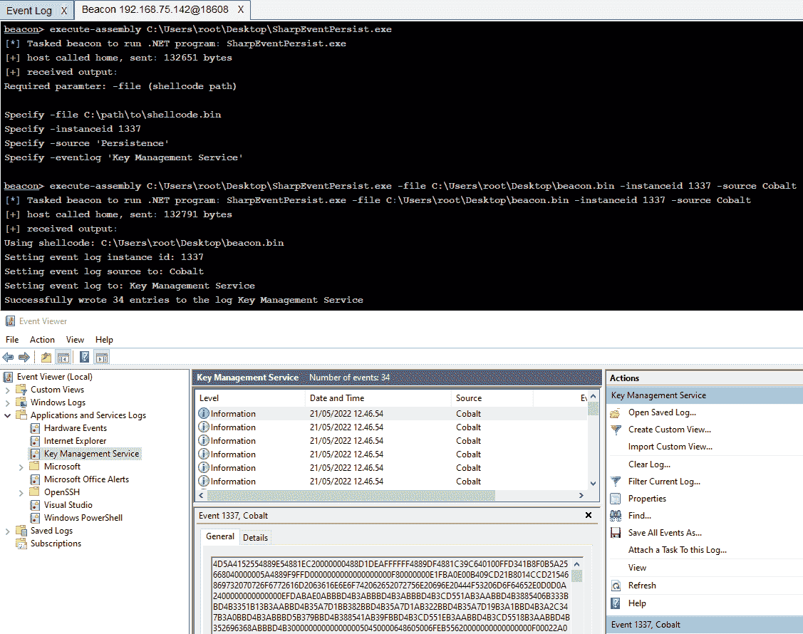

# SharpEventPersist:通过从事件日志中写入/读取外壳代码来实现持久性

> 原文：<https://kalilinuxtutorials.com/sharpeventpersist/>

.png)

**shareventpersist**是通过从事件日志中写入/读取外壳代码来实现的持久性。

## 用法

SharpEventPersist 工具采用 4 个区分大小写的参数:

*   -文件“C:\path\to\shellcode.bin”
*   -instanceid 1337
*   -源持久性
*   -事件日志“密钥管理服务”。

外壳代码转换为十六进制并写入“密钥管理服务”，事件级别设置为“信息”，来源为“持久性”。
运行 SharpEventLoader 工具从事件日志中获取外壳代码并执行。理想情况下，这应该被转换成一个动态链接库，并在程序启动时加载。
如果没有使用默认值运行，记得在加载器中更改事件日志名称和 instanceId。

默认值将留下以下工件:

*   一个名为“Persistance”的新密钥将被写入 HKEY _ LOCAL _ MACHINE \ SYSTEM \ current control set \ Services \ event log \ Key Management Service。
*   这个新的“Persistance”键没有默认键“KmsRequests”所支持的提供者 GUID 或类型。这可用于建立检测。

[**Download**](https://github.com/improsec/SharpEventPersist)