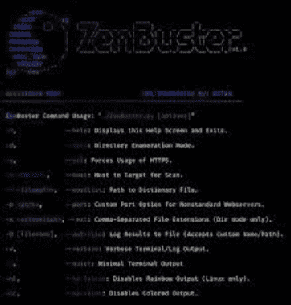

# Zenbuster:多线程 URL 枚举/强力工具

> 原文：<https://kalilinuxtutorials.com/zenbuster/>

%20(1).png)

***ZenBuster** 是扎克格里芬* (@0xTas)用 Python 编写的多线程、多平台的 URL 枚举工具。

我写这个工具是为了加深我对 Python 的熟悉，并帮助增加我对网络安全工具的理解。ZenBuster 可能不是同类工具中最快或最全面的。然而，它使用简单，相当灵活，在实践中只比其他“可靠的”工具(如 Gobuster)慢一点点。就我个人而言，我一直在使用它来帮助我解决 TryHackMe 等平台上的 CTF 挑战，并发现我的实现非常可靠。

**该软件旨在用于 CTF 挑战赛，或由安全专业人员收集其目标的信息:**

*   它能够枚举子域和 URI 资源(目录/文件)。
*   两种枚举方法都需要使用合适的单词表或字典文件。
*   **功能包括:**
    *   主机名格式支持标准、IPv4 和 IPv6。
    *   支持将结果记录到带有 *-o【文件名】*的文件中。
    *   用 *-p* 为非标准 web 服务器指定自定义端口。
    *   目录模式下可选文件扩展名为 *-x* 。
    *   安静模式，通过 *-q* 减少干扰输出。
    *   使用 *-nc* / *-nl* 可以禁用颜色以减少干扰输出。
    *   用 *-ic* 添加到要忽略的 http 状态代码列表中(默认为 5xx，404)。
    *   **在 Python 和 3.10 版本上测试，有版本> = 3.6** 的理论支持

# 装置

首先，确保安装了 Python 版本 **> =** 3.6，然后使用以下命令克隆存储库:

`**git clone https://github.com/0xTas/zenbuster.git**`

接下来，`**cd zenbuster**`。

### 依赖关系

ZenBuster 依赖 3 个外部库来运行，建议安装这些库时使用:

`**pip install -r requirements.txt**`

将要安装的模块及其用途如下:

1.  Python 请求
    *   每个枚举请求的主干。否则，脚本将无法运行。
2.  术语颜色
    *   启用彩色终端输出。非关键，如果没有颜色，脚本仍然可以运行。
3.  colorama(仅适用于 Windows)
    *   启动 Windows 终端以接受 ANSI 颜色代码(来自 Termcolor)。非关键。

这些依赖项可以手动安装，使用 requirements.txt 的`**pip**`，或者在第一次运行时通过与脚本的交互。

# 用法

安装完依赖项后，您可以通过以下方式运行程序:

### 在 Linux 上(+Mac？)

**`./zenbuster.py [options]`或`python3 zenbuster.py [options]`**

### 在 Windows 上

`**python zenbuster.py [options]**`

### 选项

| 短旗 | 长标志 | 目的 |
| --- | --- | --- |
| -h | 救命 | 显示帮助屏幕并退出 |
| -d | –dirs | 启用目录枚举模式 |
| 构成名词复数 | -ssl | 在请求中强制使用 HTTPS |
| -v | –冗长 | 将详细信息打印到终端/日志 |
| 问 | 安静 | 直到最终结果的最小终端输出 |
| -数控 | –无色 | 禁用彩色终端输出 |
| -荷兰 | –no-lolcat | 禁用 lolcat 打印的横幅(仅限 Linux) |
| -ic | –忽略代码 | 要从结果中排除的状态代码列表。 |
| `-u <hostname>` | –主机 | 扫描的目标主机 |
| -w | –wordlist | 单词表/词典文件的路径 |
| -x | –分机 | 以逗号分隔的文件扩展名列表(仅限 dir) |
| -p | –端口 | 非标准 web 服务器的自定义端口选项 |
| -o[文件名] | –文件外 | 将结果记录到文件中(接受自定义名称/路径) |

### 用法举例

`**./zenbuster.py -d -w /usr/share/wordlists/dirb/common.txt -u target.thm -v**`

`**python3 zenbuster.py -w ../subdomains.txt --host target.thm --ssl -O myResults.log**`

`**zenbuster -w subdomains.txt -u target.thm --quiet -ic 400, 403**`(同。bashrc 别名)

[**Download**](https://github.com/0xTas/zenbuster)