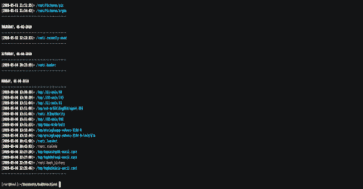

# modDetective:基于修改时间按时间顺序排列文件的工具，用于调查最近的系统活动

> 原文：<https://kalilinuxtutorials.com/moddetective/>

modDetective 是一个小的 Python 工具，它根据修改时间按时间顺序排列文件，以便调查最近的系统活动。这可用于 CTF 的，以查明升级和攻击媒介可能存在的位置。

要以最有用的形式查看该工具，请尝试运行如下命令: **`python3 modDetective.py -i /usr/share,/usr/lib,/lib`。**这将忽略 */usr/lib* 、 */usr/share* 和 */lib* 目录，它们往往没有任何感兴趣的内容。还要注意，默认情况下“动态”目录被忽略( */proc* 、 */sys* 、 */run* 、 */snap* 、 */dev* )。

# mod detective 在做什么？

modDetective 的操作非常简单。它只是遍历文件系统，范围由用户指定的选项决定(-i 表示忽略，意味着该工具将遍历除-i 选项中指定的目录之外的每个目录，而-e 表示独占，意味着该工具将只遍历指定的目录)。一边走，一边获取每个文件的修改时间，然后对这些修改时间进行排序，以便按时间顺序输出。

此外，在输出中，您可能会看到一些文件以红色突出显示。这些文件被称为“用户活动的指示器”，因为最近对这些文件的修改表明用户当前是活动的。截至目前，这些文件包括*。swp* 文件，*。bash_history* ，*。python_history* 和。 *viminfo* 。随着我想出更多表明当前用户活动的文件，这个列表将会扩展。

# 要求

modDetective 目前只支持 python3python2 兼容性将很快完成(因此缺少 f 字符串)。标准库应该没问题。

[**Download**](https://github.com/itsKindred/modDetective)